#CS 341

[Course summary chart on Google Drive](https://docs.google.com/document/d/1DycNQ2iYa0_BgTZpA3YKKwLG28L35k3Fz6TjlbiWxHI/edit) 

##Sept 14

Learn

- most of the content will be there
- find course slides there
- syllabus

Piazza will be used for discussion

Mark breakdown

- (25%) Midterm is Friday, Oct. 23, 2015, 6:30–8:00 PM
- (25%) 5 assignments due 4pm Thursdays, late assignments (within 24h) has 25% penalty

There's a required textbook that's a good reference book, so probably buy it (used)

- you probably don't actually need it though, you're only responsible for content talked about in class (textbook is more of a suppliment)

#Introduction

ANALYSIS

Analysis of an algorithm: correctness and efficiency

Correctness: Sometimes we want a formal proof that an algorithm works

Efficiency can be measured in a few ways:

- asymptotic complexity - order notation
- exact number of computations, we can see for two algorithms with the same asymptotic complexity which is actually better
- average case vs worst case
- is the algorithm the most efficient? is there a lower bound (proof) on the complexity?
- are there problems that cannot be solved efficiently? (need a lower bound proof) - this is the unsolvable NP-completeness problem
- are there problems that cannot be solved by any algorithm? (like the halting problem) - these problems are termed "undecidable"

DESIGN

Design: strategies to create new algorithms to be correct and efficient and easy to understand

We'll be talking about:

- divide-and conquer
- greedy
- dynamic programming
- depth-first and breadth-first search

### Intro Examples

FIRST EXAMPLE: Find the max in a list

- we can prove things *correct* mathematically, often with induction
- loop invariant: at the end of each loop [some claim] - then we prove that with induction
- we analyze and find that the *complexity* is theta(n) since there's a clear loop
- more *exactly* there are n-1 comparisons
- how can we prove that n-1 comparisons is the lower bound?

proof of optimal solution (not in slides)

- model an algorithm using a graph G that has vertices 1...n
- compare A[i] and A[j] creates an edge of G
- now suppose there are at most n-2 comparisons
- therefore G has at most n-2 edges
- therefore G is not connected - let C1 and C2 be the two connected components in G
- therefore there is no way to decide if the max element is in C1 or in C2

SECOND EXAMPLE: Max-Min (find max and min in a list)

- you can prove this by induction if you wanted
- complexity is linear
- 2n-2 comparisons
- since linear was optimal for max, it can't be any lower for max+min, so linear is optimal for max-min
- the number of comparisons (2n-2) is not optimal though
- we can be more efficient by processing elements two at a time, comparing them, and then updating max and min with the smaller and larger value respectively
- this takes 3 comparisons per 2 elements, instead of 4, and now we have 3n/2-2 comparisons
- three at a time? four at a time? no improvement
- proof that 3n/2-2 is lowest bound for number of comparisons uses directed graphs, adversary argument (4-5 page proof and beyond the scope of this course)

THIRD EXAMPLE: 3SUM (insert inappropriate giggles)

- the trivial brute force way is O(n^3), WLOG we can assume i<j<k to make it a little more efficient
- we can show the lower bound is also OMEGA(n^3) so the algorithm is theta(n^3)
 - we can find the lower bound efficiency by thinking about how many times the 'if' statement is executed
 - we remember that we're looking at all combos of i, j, k and i<j<k (all unique groups of 3 indices between 1 and n) 
 - this is n choose 3
- on the slides we show two improvements we can make to optimize the algorithm 
- first improvement is to sort first, find i and then j, and then use binary search to find k  - this is O(logn\*n^2)
 - note we can search just from j+1 to n since i<j<k 

##Sept 16

3SUM CONTINUED

- second improvement is to find i, then look for j and k linearly, meeting somewhere in the middle to find the pair that works (or doesn't work) - this is O(n^2)

e.g.

	 i   j                   k
	-11 -10 -7 -3  2  4  8  10    S = -11

	 i       j               k
	-11 -10 -7 -3  2  4  8  10    S = -8

	 i          j            k
	-11 -10 -7 -3  2  4  8  10    S = -4

	 i             j         k
	-11 -10 -7 -3  2  4  8  10    S = 1

	 i             j     k    
	-11 -10 -7 -3  2  4  8  10    S = -1

	 i                j  k    
	-11 -10 -7 -3  2  4  8  10    S = 1

	 i               jk       
	-11 -10 -7 -3  2  4  8  10    S = 1

	j = k so while loop breaks and i increments

Analysis:

- formal proof of correctness is kinda annoying and left as an exercise
- complexity: for loop with n-2 iterations, while loop has O(n) iterations with each iteration taking O(1) time
- showing that the while loop has O(n) iterations:
 - consider the value k-j
 - initially, k=n --- j = i+1 >= 2 --- k-j <= n-2
 - in each iteration, j<-j+1 or k<-k-1 or both
 - so, k-j decreases by at least 1 each iteration
 - since the loop terminates when k-j = 0 or -1, there are at most n-1 iterations

Beyond this course

- there are subquadratic algorithms for this problem
- there's one that's O(n^2(log(logn))^2/(logn)^2)

### Review from CS 240

TERMINOLOGY

Problems

- Problem: Given a problem instance I for a problem P, carry out a particular computational task
- Problem Instance: Input for the specified problem
- Problem Solution: Output (correct answer) for the specified problem
- Size of a problem instance: Size(I) is a positive integer which is a measure of the size of the instance I
 - note for an integer k, Size(k) is log(k) since it takes that many bits to encode

Algorithms and Programs

- Algorithm: a step-by-step process (e.g., described in pseudocode) for carrying out a series of computations, given some appropriate input --- we think about complexity or growth rate
- Algorithm solving a problem: An Algorithm A solves a problem P if, for every instance I of P, A finds a valid solution for the instance I in finite time
- Program: A program is an implementation of an algorithm using a specified computer language --- we think about running time

Running Time

- Running Time of a Program: T\_M(I) denotes the running time (in seconds) of a program M on a problem instance I
- Worst-case Running Time as a Function of Input Size: T\_M(n) =   max run time of program M on instances of size n 
- Average-case Running Time as a Function of Input Size: T\_avg(n) = (sum of all run times of program M over all instances of size n)/(number of instances of size n)

We focus on complexity - here are some really mathy definitions

- Worst-case complexity of an algorithm: Let f : Z+ → R. An algorithm A has worst-case complexity f(n) if there exists a program M implementing the algorithm A such that T\_M(n) ∈ Θ(f(n)).
- Average-case complexity of an algorithm: Let f : Z+ → R. An
algorithm A has average-case complexity f(n) if there exists a program M implementing the algorithm A such that T^avg\_M(n) ∈ Θ(f(n))

Running Time vs Complexity:

- Running time 
 - can only be determined by implementing a program and running it on a specific computer
 - is influenced by many factors, including the programming language, processor, operating system, etc.
- Complexity (AKA growth rate) 
 - can be analyzed by high-level mathematical analysis
 - is independent of the above-mentioned factors affecting running time.
 - is a less precise measure than running time since it is asymptotic and it incorporates unspecified constant factors and unspecified lower order terms
 - If algorithm A has lower complexity than algorithm B, then a program implementing algorithm A will be faster than a program implementing algorithm B for sufficiently large inputs (though not necessarily for small inputs)

ORDER NOTATION

O-notation (<=)

- f(n) ∈ O(g(n)) if there exist constants c > 0 and n\_0 > 0 such that 0 ≤ f(n) ≤ c\*g(n) for all n ≥ n\_0
- g(n)is worst case time of f(n)
- to figure out what n\_0 is, find an intersection point --- remember n\_0 has to be a natural number
- note that this means if something is O(n) it's also O(n^2)

Ω-notation (>=)

- f (n) ∈ Ω(g(n)) if there exist constants c > 0 and n\_0 > 0 such that 0 ≤ c\*g(n) ≤ f(n) for all n ≥ n\_0
- opposite of O-notatoion - g(n) is best case time of f(n)

Θ-notation (=)

- f (n) ∈ Θ(g(n)) if there exist constants c1, c2 > 0 and n\_0 > 0 such that 0 ≤ c1\*g(n) ≤ f (n) ≤ c2\*g(n) for all n ≥ n\_0
- grows at same rate

o-notation (<)

- f (n) ∈ o(g(n)) if for ALL constants c > 0, there exists a constant n\_0 > 0 such that 0 ≤ f(n) < c\*g(n) for all n ≥ n\_0

ω-notation (>)

- f (n) ∈ ω(g(n)) if for ALL constants c > 0, there exists a constant n\_0 > 0 such that 0 ≤ c g(n) < f (n) for all n ≥ n\_0

Preferred notation

- you can say f(n) is O(g(n))
- you can say f(n) ∈ O(g(n)) -- we use ∈ because O(g(n)) is a set of functions with run time <= the run time of g(n)
- the text uses f(n) = O(g(n)) but this doesn't really make sense, so this is not preferred (but you probably won't lose marks)

Example 1:

	f(n) = n^2-7n-30   g(n) = n^2
	Show f(n) ∈ O(g(n))

	we want to show 0 <= n^2 - 7n - 30 <= cn^2 for some c>0, n_0>0

	note that n^2 - 7n - 30 = (n-10)(n+3)
	so 	n^2 - 7n - 30 >= 0 if n >=10

	let c = 1
	then n^2 - 7n - 30 <= 1*n^2 for n >= 0

	so if n_0 = max{0, 10} = 10, then both inequalities hold

	then 0 <= n^2 - 7n - 30 <= cn^2  for c = 1, n > 10

Example 2:

	f(n) ∈ Ω(g(n))

	here we want 0 <= cn^2 <= n^2 - 7n - 30 for some c>0, n_0>0

	1) pick an 'appropriate' value for c
	2) determine n_0

	If we want this inequality to be satisfied, c must be less than 1. So let's say c = 0.5

	we want 0.5n^2 <= n^2 - 7n - 30
	n^2 <= 2n^2 - 14n - 60
	n^2 - 14n - 60 >= 0
	take n_0 to be the larger root and then this will always hold

Technique for order notation:

Tip #1: We can use limits (and sometimes **l'hopitals rule**), find lim to inf of f(n)/g(n)

- if limit is 0, g is bigger
- if limit is inf, f is bigger
- if limit is constant, they're equal

Example 3:

 	f(n) = (ln(n))^2  g(n) = n^(1/2)

 	  lim n->inf (ln n)^2 / n^(1/2) 
 	= lim n->inf 2(ln n) / n*1/2*n^(-1/2)
 	= lim n->inf 4(ln n) / n^1/2
 	= lim n->inf 4 / n*1/2*n^(-1/2)
 	= lim n->inf 8/n^(1/2)
 	= 0

 	therefore (ln n)^2 is o(sqrt(n))

 	more generally, (ln n)^c is o(n^delta) for any c>0, delta>0

Example 4:

	f(n) = n^2 - 7n - 30
	g(n) = n^2

	  lim n->inf n^2-7n-30/n^2
	= lim n->inf (1 - 7/n - 30/n^2)
	= 1

	so f(n) is theta(g(n))

Example 5:

	f(n) = (3+ (-1)^n) * n
	g(n) = n

	f(n) = 4n if n is even
	     = 2n if n is odd

	lim n->inf f(n)/g(n) does not exist

	but f(n) is in theta(g(n))

	we want to show c1 * g(n) <= f(n) <= c2 * g(n) for some c1, c2
	let c1 = 2, c2 = 4, and... we're done

Example 6:

	f(n) = n * abs(sin(n*pi/2)) + 1
	g(n) = sqrt(n)

	abs(sin(n*pi/2)) = 0 if n is even, 1 if n is odd

	f(n) = 1 if n is even, n+1 if n is odd

	g(n) = sqrt(n)

	complexity of f, g are not comparable

Relationships between Order Notations (these make immediate sense if you think about the mathematical inequalities)

- f(n) ∈ Θ(g(n)) ⇔ g(n) ∈ Θ(f(n)) --- ie if f < g, g > f
- f(n) ∈ O(g(n)) ⇔ g(n) ∈ Ω(f(n)) 
- f(n) ∈ o(g(n)) ⇔ g(n) ∈ ω(f(n))
- f(n) ∈ Θ(g(n)) ⇔ f(n) ∈ O(g(n)) and f(n) ∈ Ω(g(n)) 
- f(n) ∈ o(g(n)) ⇒ f(n) ∈ O(g(n))
- f(n) ∈ ω(g(n)) ⇒ f(n) ∈ Ω(g(n))

Algebra of Order Notations

- Maximum rules: Suppose that f(n) > 0 and g(n) > 0 for all n ≥ n0
 - O(f (n) + g(n)) = O(max{f (n), g(n)}) 
 - Θ(f (n) + g(n)) = Θ(max{f (n), g(n)}) 
 - Ω(f (n) + g(n)) = Ω(max{f (n), g(n)})
- Summation rules (applies to finite sums)
 - O(sum f(i)) = sum O(f(i))
 - theta(sum (f(i)) = sum theta(f(i))
 - omega(sum (f(i)) = sum omega(f(i))
 - e.g. sum i=1..n O(i) = O(sumi=1..n i) = O(n(n+1)/2) = O(n^2)

## Sept 21

### Formulae

####Sequences

 - we talked about arithemetic, geometric, arithmetic-geometric, harmonic sequences
 - a, d, r > 0
 - geometric depends on value of r (<, >, or = 1)
 - sum i=1..n i^c is theta(n^c(+1))
 - sum i=1..inf 1/i^2 = pi^2/6 which is theta(1)

Example of computing Arithmetic-Geometric sequence:

	  1x2 + 3x2^2 + 5x2^3 + ... + (2n-1)*2^n
	= 1x2 + 1x2^2 + 1x2^3 + ... + 1x2^n
	   +    2x2^2 + 2x2^3 + ... + 2x2^n
	          +     2x2^3 + ... + 2x2^n
	          ............
	              ............. + 2x2^n 

	whoa! now each row is a geometric sequences, compute each sum separately
	  2^(n+1) - 2
	+ 2(2^(n+1) - 4)
	+ 2(2^(n+1) - 8)
	...
	+ 2(2^(n+1) - 2^n)
	=    [sum of the 2*2^n+1] 
           - [the 2 in the first line] 
           - [all the other values subtracted * 2 - note this is another geometric sequence]
	= (2n-1)*2^(n+1) - 2 - 2(2^(n+1) - 4)

####There's a slide with misc. formulae

Proving a^(log\_b(c)) + c^(log\_b(a))

- let x = log\_b(c) so b^x = c
- let y = log\_b(a) so b^y = a
- we want to show a^x is equivalent to c^y
- a^x = (b^y)^x = b^yx = b^xy = (b^x)^y = c^y

**Exercise: Prove log\_b(a) = log\_c(a)/log\_c(b)

why is this formula useful?

- replace a by n and b, c are constant
- then log\_c(n) = lob\_c(b) \* log\_b(n)
- log function = constant \* log function
- so log\_c(n) = theta(log\_b(n))
- this shows that all log functions have the same growth rate
- this formula is also helpful for changing base of logarithms (like with your calculator if there's no button for your base)

Note that n! is theta(n^(n+1/2)\*e^-n)

- this is theta((n/3)^n\*sqrt(n)) which is quite bad
- derived from sterling's formula
- ln(n^(n+1/2)\*e^-n) = (n+1/2)ln(n) - n  which is nlogn
- all we need to know is ln(n!) is theta(nlogn)

###Complexities sorted by increasing growth rate

- polynomial growth (good):
 - theta(1)
 - theta(logn)
 - theta(sqrtn)
 - theta(n)
 - theta(n^c) c>1, constant
- not polynomial or exponential, beyond scope of course
 - theta(n^(sqrtn\*logn)) graph isomorphism
 - theta(e^(c \* (logn)^(1/3) \* (loglogn)^(2/3))) number field seive (factoring)
- exponential growth (bad)
 - theta(1.01^n)
 - theta(2^n)
 - theta(c^n)
 - theta(n!)
 - ...
 - theta(n^n)

###Techniques

For algorithm analysis

- Use theta-bounds throughout the analysis and thereby obtain a theta-bound for the complexity of the algorithm.
- Prove a O-bound and a matching omega-bound separately to get a theta-bound. Sometimes this technique is easier because arguments for O-bounds may use simpler upper bounds (and arguments for omega-bounds may use simpler lower bounds) than arguments for theta-bounds do.

For Loop Analysis

- Identify elementary operations that require constant time (denoted theta(1) time)
- The complexity of a loop is expressed as the sum of the complexities of each iteration of the loop.
- Analyze independent loops separately, and then add the results: use “maximum rules” and simplify whenever possible.
- If loops are nested, start with the innermost loop and proceed outwards. In general, this kind of analysis requires evaluation of nested summations.

Example 1:

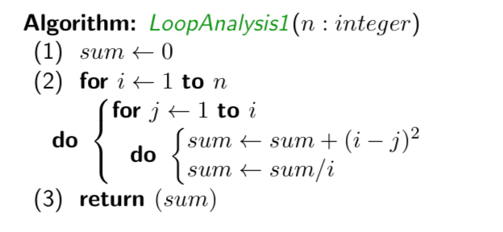

- each iteration of the inner for loop takes theta(1)
- i iterations of inner for loop so theta(i) for inner for loop
- outer loop is sum i=1..n theta(i) = theta(sumi=1..n i) = theta(n^2)
- so we have theta(1) + theta(n^2) that we just calculated + theta(1) which is theta(n^2)

Second example with separate computation of upper and lower bounds

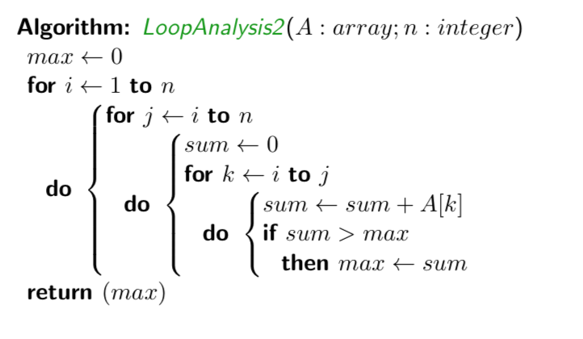

- algorithm
 - i = 1..n
 - j = i..n
 - k = i..j
- upper bound (more iterations than algorithm)
 - i = 1..n
 - j = 1..n
 - k = 1..n
 - easy O(n^3)
- lower bound
 - note that 1 <= i <= k <= j <= n always
 - let i = 1..n/3
 - let j go from 2n/3 + 1 .. n
 - let k go from n/3 + 1 .. 2n/3
 - this is a subset of the iterations of the algorithm
 - we get omega(n^3/26) aka omega(n^3)

Second example with just finding the theta running time

- innermost loop 
 - k=i..j
 - j-i+1 iterations (don't forget +1!)
 - time = theta(j-i+1)
- total time is sum i=1..n sumj=i..n theta(j-i+1) = theta(sumi=1..n sum j=1..n (j-i+1)) = ...... = theta(n^3)

##Sep 23

Third loop analysis 

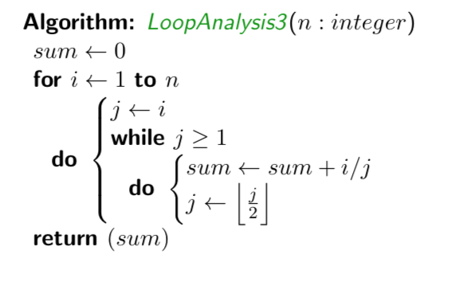

- each iteration of the whole loop takes theta(1) time
- for a given value of i, the while loop requires log\_2(i) iterations
- so inner while loop takes theta(log(i)) time
- so overall complexity is sum i=1..n theta(log(i))
- = theta(sum i=1..n logi)
- = theta(log of product i=1..n i)
- = theta(logn!)
- = theta(nlogn) - given in the formulae slide

###Divide and Conquer

####Recurrence relations

Defining it

- recurrence relation: a formula that expresses a general term a\_n in
terms of one or more previous terms a\_1,...,a\_(n-1)
- also specifies initial values starting at a\_1
- solving a recurrence relation means finding a formula for a\_n that does not
involve any previous terms 
- there are many methods of solving recurrence relations
 - guess-and-check 
 - recursion tree method (looked at a lot in this class)

Guess and Check

1. Tabulate first few values using the recurrence relation
2. Guess that the solution an has a specific form, involving undetermined constants.
3. Use first few terms to determine specific values for the unspecified constants.
4. Use induction to prove your guess for an is correct.

Guess and Check example

- T(0) = 4, T(n) = T(n-1) + 6n - 5 if n>=1
- first few: 4, 5, 12, 25
- we graph it and guess prabola
- so try to find constants a, b, c in an^2 + bn + c
- there are three unknowns, so we need three equations (use first three terms)
 - c = 4
 - a + b + c = 5
 - 4a + 2b + c = 12
 - we find a = 3, b = -2, c = 4

then we need to prove:

	initial case n = 0: 
	T(0) = 4 (given)
	3*0^2 - 2*0 + 4 = 4
 
 	induction assumption: formula is correct for n = j-1 (j>=1)
 	T(j) = T(j-1) + 6j - 5 (recurrence relation)
 	     = 3(j-1)^2 - 2(j-1) + 4 + 6j -5 (from assumption)
 	     = ... (math)
 	     = 3j^2 - 2j + 4
 	therefore by the principle of mathematical induction, the formula is true for all n>=0

Recursion Tree Method

- we assume n = 2^j
- consider the sequence T(1), T(2), T(4), T(8) ...
- we have a tree T(n) with root cn and two children which are T(n/2)
- this works based off of something we see in Mergesort
 - T(n) = 2T(n/2) + cn if n>1 is a power of 2, and T(n) = d if n=1
- similarily T(n/2) = 2T(n/4) + c(n/2)
- the 'value' of a tree is the sumof values of each node

Example: n = 2^j

	imagine a tree:
	root:       n = 2^j,   level is j,   #nodes is 1,   node value is c*2^j 
	next level: n = 2^j-1, level is j-1, #nodes is 2,   node value is c*2^(j-1)
	....
	near end :  n= 2^1,    level is 1,   #nodes is 2^(j-1), node value is c*2 
	last row:   n=2^0=1 ,  level is 0,   #nodes is 2^j, node value is d

using this:

- #nodes \* node value (total value) at each level is c\*2^j for every level except d\*2^j on the last level
- therefore, T(2^j) = j\*c\*2^j + d\*2^j
- ^ this is an exact formula and it is a mathematical proof!
- if n = 2^j, j = log\_2(n)
- T(n) = dn + logn\*c\*n
- T(n) is theta(nlogn)

####Master Theorem

- provides a formula for the solution of many recurrence relations typically encountered in the analysis of algorithms.

The following is a simplified version of the Master Theorem:

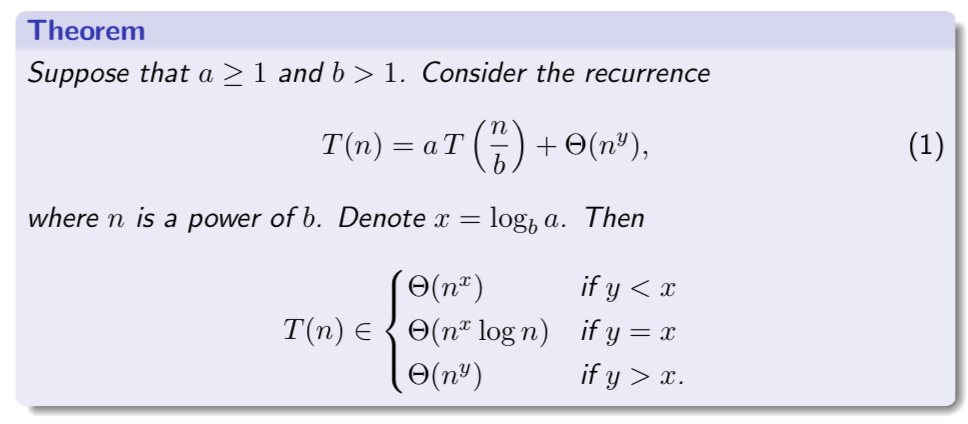

y is a real number >=0

Example:

- T(n) = 2T(n/2) + theta(n)
- a=3
- b=2
- so x=log\_2(3) =approx 1.59
- y = 1
- so x > y
T(n) = theta(n^log\_2(3)) =approx theta(n^1.59)

Example (mergesort):

- a = 2
- b = 2
- y = 1
- x = log\_2(2) = 1
- x = y, so
- T(n) = theta(nlogn) like we got before

Proof of the theorem:

- we can make a chart like before

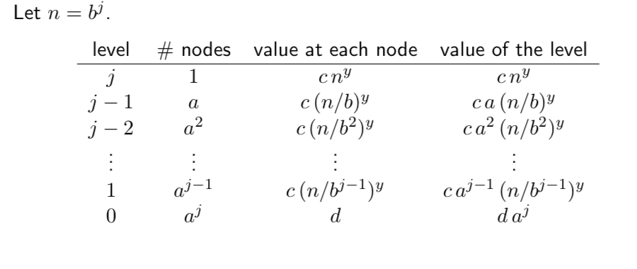

- T(n) is a lot more complicated now, but we can make a nice sum out of it, which turns out to be a simple geometric sequence
- we can also clean up how many variables there are, getting rid of a and b (see slides)
- three cases:
- r > 1:
 - sum i=0..j-1 r^i is theta(r^j)
 - then T(n) = theta(dn^x + c\*n^y\*r^j) 
 - r^j = b^(x-y)^j = (b^j)^(x-y) = n^(x-y)
 - so we have theta(n^x + n^y\*n^(x-y)) = theta(n^x + n^x) = theta(n^x)
- we won't do the others

Complexity of T(n):

- heavy leaves means that 
 - the value of the recursion tree is dominated by the values of the leaf nodes.
 - y < x so r>1 -- T(n) is theta(n^x)
- balanced means that
 - the values of the levels of the recursion tree are constant (except for the last level)
 - y=x so r=1 -- T(n) is theta(n^x\*logn)
- heavy top means that
 - value of the recursion tree is dominated by the value of the root node
 - y>x so r < 1 -- T(n) is theta (n^y)

##Sep 28

Modified genereal version of Master Theorem

- can use wehen we don't have +n^y 

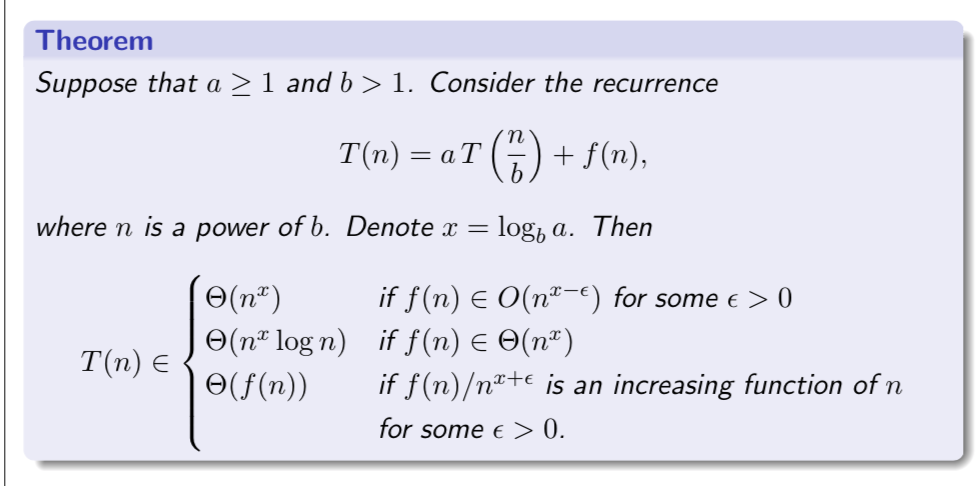

Example: T(n) = 3T(n/4) + nlogn

- a = 3, b = 4, so x = log\_4(3) approx= 0.793
- we will apply case 3 of the modified general version of the MT because:
- f(n)/n^(x+epsilon) = nlogn / n^(0.793-epsilon) = n^(0.207-eps) \* logn
- let epsilon = 0.1
- then f(n) / n^(x-eps) = n^1.07logn which is clearly an increasing function of n
- so T(n) is theta(nlogn)

Example: T(n) = 2T(n/2) + nlogn

- we can't use MT to solve this recurrence
- since a=2, b=2, x = log2(2) = 1, cases 1 and 2 don't apply
- case 3? 
 - f(n)/n^(x-epsiolon) = nlogn/n^(1+eps) = logn/n^eps 
 -  which is not an increasing fucnction for any epsilon > 0
 - logn is o(n^epsilon) for any epsilon > 0 because lim n->inf of logn/n^eps = 0
- so MT cannot be applied!

We can solve this recurrence using the recursion tree method!

- let n = 2^j
- T(n) = 2T(n/2) + nlog\_2(n)
- t(1) = 1 (base case - this comes from initial condition given that T(1) = 1)
- tree:
 - level j has 1 node, value nlogn or 2^j\*j
 - level j-1 has 2 nodes, value 2^(j-1)\*(j-1)
 - level j-2 has 4 nodes, value 2^(j-2)\*(j-2)
 - ...
 - level 1 has 2^(j-1) nodes, value 2^1\*1
 - level 0 has 2^j nodes, value 1
- values on the levels are j\*2^j, (j-1)\*2^j, (j-2)\*2^j, ... 2^j and level 0 is also 2^j
- T(2^j) = 2^j[j + j-1 + j-2 + ... + 1] + 2^j = 2^j \* [j(j+1)/2 + 1]
- since n = 2^j, j = log\_2(n) so T(n) is theta(n\*log^2(n))

Example: T(n) = T(floor(n/2)) + T(floor(n/3)) + n

- base cases: T(1) = 1, T(2) = 2
- this isn't in a form where we can use the master theorem
- we'll guess T(n) <= cn for all n >= 1, and c>0 is a constant
- we will specify an appropriate value for c later

we will prove this by induction on n

	base case: T(1) = 1 <= c*1 and T(2) = 2 <= c*2
	
	Induction assumption: T(n) <= cn for all n < m

	We now prove that T(m)  <= cm

	T(n) = T(floor(m/2)) T(floor(m/3)) + m 	(from rec rel) 
	<= c*floor(m/2) + c*floor(m/3) + m  	(from assumption)
	<= cm/2 + cm/3 + m
	= c(5/6)m + m 
	= m(5c/6 + 1)
	<= ? cm

	This will be true if 5c/6 + 1 <=c
	                iff  1 <= c/6
	                iff  c >= 6

	so if c = 6 then the proof is valid and we have T(n) <= 6n for all n>=1 by induction

Recursion tree approach

- first level has one node that is n
- second level has values n/2 and n/3 which total to 5/6 n
- third level has n/4 and n/6 and n/6 and n/9 totals to 25/36n = (5/6)^2 n
- each level has (5/6)^(level-1) * n
- computing the infinite sum of n(1 + 5/6 + (5/6)^2 + ... infinitely)
- this is a geometric sequence with ratio 5/6 < 1
- so the sum is 6n, so T(n) <= 6n
- notice this is not that accurate/rigorous because we took out the floor function, and the tree might not go on forever in certain places, etc.

###The Divide-and-Conquer Design Strategy

Definitions

- divide: Given a problem instance, construct one or more smaller problem instances(subproblems). Usually, we want the size of these subproblems to be small compared to the size of the instance, e.g., half the size.
- conquer: solve each subproblem recursively, obtaining solutions
- combine: Given the solutions, use an appropriate combining function to find the solution to the original problem 
 - the combine part is often the hardest part to think of

Example: merge sort

- divide: splitting A into subarays (first half and second half)
- conquer: run mergesort on left and right half
- combine: after halfs are sorted, use function merge to merge the two sorted arrays into a single sorted array.

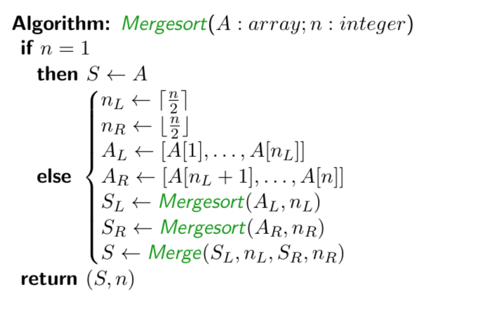

- divide takes theta(n), conquer takes theta(T(ciel(n/2)) + T(floor(n/2))) and combine takes theta(n)
- this gives us a recurrence relation

Sloppy and Exact Recurrence Relations

- It is simpler to replace the theta(n) term by cn, where c is an unspecified constant. The resulting recurrence relation is called the exact recurrence
 - The Master Theorem provides the exact solution of the recurrence when n = 2^j (it is in fact a proof for these values of n).
 - We can express this solution (for powers of 2) as a function of n, using theta-notation.
- If we then remove the floors and ceilings, we obtain the so-called
sloppy recurrence
- The exact and sloppy recurrences are identical when n is a power of two. Further, the sloppy recurrence makes sense only when n is a power of two.
- It can be shown that the resulting function of n will in fact yield the complexity of the solution of the exact recurrence for all values of n.
- This derivation of the complexity of T(n) is not a proof, however. If a rigourous mathematical proof is required, then it is necessary to use induction along with the exact recurrence.

The Max-Min Problem

- Let’s design a divide-and-conquer algorithm for the Max-Min problem. 
- Divide: Suppose we split A into two equal-sized subarrays, AL and AR.
- Conquer: We find the maximum and minimum elements in each subarray recursively, obtaining maxL, minL, maxR and minR.
- Combine: Then we can easily “combine” the solutions to the two subproblems to solve the original problem instance: max = max{maxL,maxR} and min = min{minL, minR}
- The recurrence relation describing the complexity of the running time is T (n) = 2T (n/2) + theta(1)
- The master theorem shows that T(n) is theta(n)
- we can also count the exact number of comparisons done by the alogirthm, obtaining the (sloppy) recurrence C(n) = 2C(n/2) + 2, C(2) = 1
 - for n a power of 2, the solution is C(n) = 3n/2 - 2, so the divide and conquer alogirhtm is optimal for these values of n (see slide 26)

##Sep 30

###Non-dominated points problem

- Given two points (x1, y1), (x2, y2) in the Euclidean plane, we say that (x1, y1) dominates (x2, y2) if x1 > x2 and y1 > y2
- Problem Instance: a set of n points in a plane
- Problem Question: find all non dominated points in the set (all the points that are not dominated by any other point)
- this has a trivial theta(n^2) algorithm to solve it, based on comparing all pairs of points in S. Can we do better? (of course we can)
- think of this visually - the non dominated points will form a staircase -- (think of a staircase from top left to bottom right, each point is the edge of a stair) -- all dominated points are lower or left of the points of the staircase, so they're under the staircase

Using divide and conquer:

- Suppose we pre-sort the points in S with respect to their x-co-ordinates. This takes time theta(n log n).
- Divide: Let the first n/2 points be denoted S1 and let the last n/2 points be denoted S2.
- Conquer: Recursively solve the subproblems defined by the two instances S1 and S2.
- Combine: Given the non-dominated points in S1 and the non-dominated points in S2, how do we find the non-dominated points in S?
 - Observe that no point in S1 dominates a point in S2.
 - Therefore we only need to eliminate the points in S1 that are dominated by a point in S2. This can be done in time O(n).

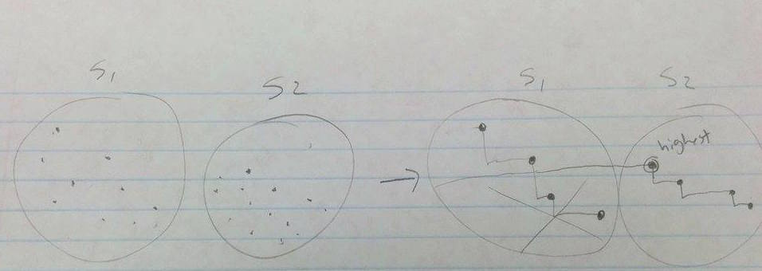

Complexity:

- presort O(nlogn)
- T(n) = 2T(n/2) + O(n) 
 - the while loop to merge is the O(n), also note this is a sloppy relation
 - we recognize this as O(nlogn) from the Master Theorem
- so overall is O(nlogn) to sort + O(nlogn) for D+C = O(nlogn)

###Closest Pair problem

- Instance: a set Q of n distinct points in the Euclidean plane
- Find: Two distinct points that are closests to each other
- brute force is quadratic (compare points to all others), let's do better
- we divide and find the closest pair on the left and closest on the right (deltaL, deltaR)
- when we combine, we determine if there is a pair of points (one on the left, one on the right) that are closer than either of our closest pairs so far). There are potentially n/2 \* n/2 = n^2/4 such pairs to check, which takes quadratic time which we're trying to avoid
- let delta be the min of deltaL and deltaR - we only wish to consider points where x coord is within delta of the vertical splitting line - the 'critical strip' of width 2delta
- if there is a pair of points, one from each subproblem, whose distance is less than delta, then both points will be in this critical strip
- so we discard all points that are not in the critical strip. the points that remain are 'candidate points'. how many points are there? there could be all n points!
- next step is to sort candidate points on the y axis

Lemma: suppose the list of candidate points R are sorted with respect to y coordinates. Suppose that R[j] and R[k] have distance less than delta, where j < k. Then k <= j+7

- rectangle R that is width of strip and height delta, divided into 8 squares of side delta/2

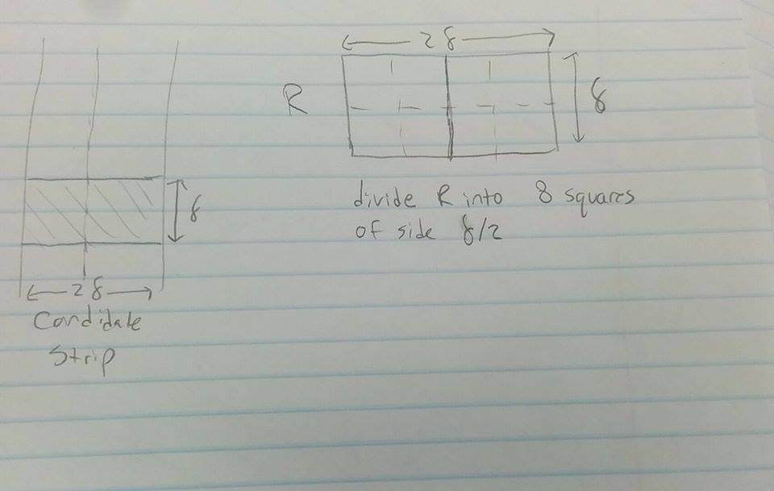

- two points in the same square can be at most the distance of the diagonal apart - that value is delta/2 * root2 < delta - but this is impossible because we're on one side of the middle line of the critical section where the smallest distance was delta
- so only one point max per square
- so R[j+8] is above the rectangle (because there are at most one point per square) so its distance from R[j] is more than delta
- so now we can say checking the strip is O(n) because each iteration of the inner loop (finding the pair for a point) is constant (only 8 times)

Complexity:

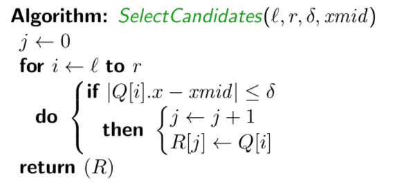

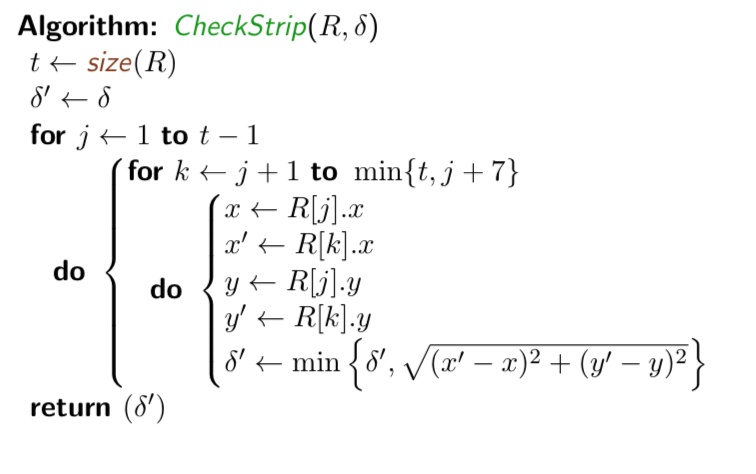

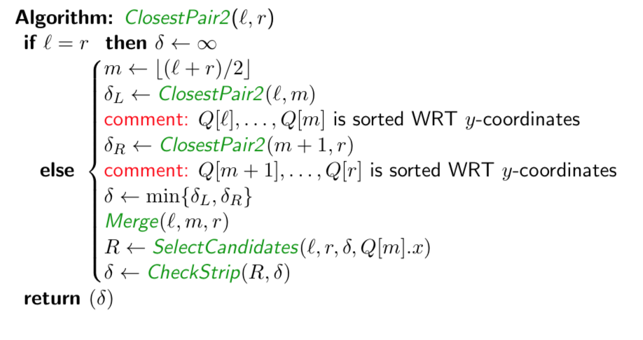

- presorting is O(nlogn)
- T(n) = 2T(n/2) + O(n) to select candidates + O(nlogn) to sort by y + O(n) to check strip
- simplifying, T(n) = 2T(n/2) + O(nlogn)
- from last lecture, we know T(n) is O(n(logn)^2)
- can we improve this? can we get O(nlogn)? 
- we'd need recurrence to be T(n) = 2T(n/2) + O(n), so we'd need to eliminate the sort y in the recursive part of the algorithm
- two approaches: 
 - perform sorting y as a precomputation. so we have to think about sorted in the x way and y way in different place and be careful - it's a bit messier to code actually
 - or replace sorting by a merge of two sorted lists that we get from the recurrence call, and merging is just O(n)
  - think of it as precondition that Q[l] ... Q[r] is sorted by x coordinates, and post condition that Q[l] ... Q[r] is sorted by y coordinate (part of the work the algorithm does)
  - if l = r, it is trivially true. if l < r, the sublists are sorted -> so we can merge in linear time and get the post condition

##Oct 5

###Multiprecision Multiplication

Usually we think of integer multiplication as taking theta(1) time - this assumes that integers are a fixed size, e.g. 32 bits

We are interested in the bit complexity 

- determining the complexity as a function of k, the number of bits in the binary representation
- size(X) = k = # bits (not the value of X)
- in binary k = log\_2(X), and X approx= 2^k

Multiprecision Multiplication

- instance: two k-bit positive numbers x and y
- question: compute the 2k bit positive integer z = xy

"grade school" multiplication

- in base 10 
- we'd have two numbers times each other
- multiply one digit at a time
- shift result over a digit on each line as we move through the digits of the second number
- in binary, it's the same as base 10

Time to add everything together

- we do a k-1 shifts over k rows, so there are numbers with up to 2k-1 digits (if you consider the space on the end to be 0s, since a k bit integer can be shifted k-1 to the left)
- so to add these integers, each addition has <=k integers, each of which has <=2k-1 bits, so time is O(k^2)

Divide and Conquer

Finding the algorithm

- x = x\_l x\_r (divide digits in half with left and right parts) = 2^(k/2)x\_l + x\_r (the 2^(k/2) is to shift the first half)
- y = y\_l y\_R (divide digits in half) = 2^(k/2)y\_l + y\_r
- e.g. in base 10:
 - x = 4655 = 10^2\*46 + 55
 - y = 1232 = 10^2\*12 + 32
- xy = (2^(k/2)\*x\_l + x\_r)(2^(k/2)\*y\_l + y\_r)
- xy = 2^k(x\_l)(y\_l) + 2^(k/2)\*(x\_l\*y\_l + x\_r\*y\_l) + x\_r\*y\_r
- this gives us 4 subproblems (x\_l\*y\_l, x\_l\*y\_r, x\_r\*y\_l, and x\_r\*y\_r), each with size k/2, then shifting and adding

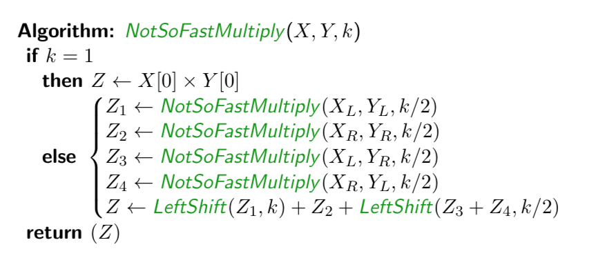

Run time

- assume k is a power of 2, we use a recurrence relation
- T(k) = 4T(k/2) + theta(k)
- the theta(k) is from the additons of k digit numbers (maybe shifted up to k more) 
- MT: a=4, b=2, y=1, x = log\_b(a) = log\_2(4) = 2
- x > y so T(k) is theta(k^x) = theta(k^2)
- no improvement over gradeschool algorithm!

Improvement? try reducing number of subproblems from 4 to 3

- T(k) = 3T(k/2) + theta(k)
- so T(k) would be theta(k^log\_2(3)) = theta(k^1.59) -- (this was an example from a previous lecture)

Reducing subproblems

- let's make xlyr + xryl from 2 subproblems to a single subproblem
- how about (xl + xr)(yl + yr) - xlyl - xryr
- = xlyl + xlyr + xryl + xryr - xlyl - xryr (some stuff cancels)
- = xlyr + xryl 
- so now we only have three subproblems: (xl + xr)\*(yl + yr), xl\*yl, and xr\*yr

Doing better? (outside the scope of this course)

- Toom Cook came up with a way to split x and y into 3 parts and do 5 multiplications (this is not that intutiive and we didn't say how to do it) and it's theta(k^log\_3(5)) which is approx theta(k^1.47)
- in 1971, Schontage-Strussen came up with an O(k\*logk\*loglogk) algorithm based on fast fourier transform
- in 2007, Furer came up with O(klogk\*2^O(log\*(k))
 - log\* is the inverse of the ackerman function and grows realllly slowly

###Matrix Multiplication

Matrix multipliation

- A = (a\_ij) B = (b\_ij) C = (c\_ij)
- c\_ij = sum k=1..n (a\_ik \* b\_kj) = (row i of A)\*(col j of B)
- here: multiplication of integers takes theta(1) time
- To compute c\_ij we need n multiplications and n-1 additions - theta(n) time
- n^2 entries in C -> total time is theta(n^3)

Problem Decomposition

- remember math 136? great, neither do I
- there's a property that's hard to type out, but see slide 82, where you can divide the matrices into four sections of n/2 by n/2 matrices, and do some multiplication and addition, and then put them back together to get the same thing as if you did the multiplication all together - so pretty much a divide and conquer thing
- T(n) = 8T(n/2) + theta(n^2)
 - n^2 comes from four additions of n/2 by n/2 matrices
- MT: a=8, b=2, y=2, x = log\_2(8) = 3
- x > y so T(n) is theta(n^3)
- no improvement over naive algorithm!

Improvement

- reduce the number of subproblems from 8 to 7
- so we don't know ~how~ we got the 7 subproblems, but we can show that they work sooo :p
- verifying:
 - we want r = ae + bg
 - r5 + p4 - p2 + p6 = (a+d)(e+h) + d(g-e) - (a+b)h + (b-d)(g+h) = .... cross things out = ae + bg = r
 - I'm definitely not typing this all out, but yeah it works
- best improvment found: Coppersmith Wingrad (1990) O(n^2.376)

###Selection

Problem 

- instance: an array of n distinct integer values and an integer k between 1 and n inclusive
- find: the kth smallest integer in array A
- the problem Median is the special case of Selection where k = ciel(n/2)

Simple algorithms

- sort A then return A[k] - this is O(nlogn) no matter what k is
- modified selection sort, but only for k iterations of finding smallest element and moving it to the front - this is O(kn) which is great for small k, but quadratic for k=n/2
- modified heap sort
 - build a heap - O(n) if we do heapify all at once
 - do k deletemin operations - O(klogn)
 - total is O(n + klogn)
 - for small k this is linear for k=n/2 it's O(nlogn) (a good balance between the pros/cons of the last two algorithms and their complexities)

Our goal is a linear algorithm for any k

##Oct 7

Recall quicksort

- we have a pivot, often the last element
- restructure the array so anything bigger than pivot is after the pivot, and smaller is before
- this restructuring per pivot is O(n)
- quicksort does the restructuring, then two recursive calls on the smaller-than and larger-than parts
- the average complexity if theta(nlogn)
- worst case is if the pivot always is on the end, and that's theta(n^2)

QuickSelect

- we only have to recurse on the left side (if that's where the element we want to select is) or the right side
- if the element is in the position we want, we don't even have to recurse

Average case analysis of QuickSelect

- We say that a pivot is good if posn is in the middle half of A. The probability that a pivot is good is 1/2.
- If a pivot is good, then we're recursing on a section less than 3n/4 
- On average, after two iterations, we will encounter a good pivot. 
- so T(n) <= T(3n/4) + theta(n)
 - the theta(n) accounts for 2 restructing operations (each linear time)
- It follows from MT that the average-case complexity of the QuickSelect is linear

What we want: worst case theta(n)

- suppose n = 5 x odd# = 5(2x+1) = 10x + 5
- so we have an odd number of groups of 5 elements
- m\_i is median of each section of 5 elements B\_i
 - compute these non recursively, e.g. find min, next smallest, next smallest until m\_i
- take M to be the array of medians, and then find it's median recursively (quickselect) - THIS is the pivot
- e.g.  
 - 1 10 5 8 21 -- 34 6 7 12 23 -- 2 4 30 11 25
 - medians: 8 12 11
 - pivot is 11
- we recurse in the same way using the pivot

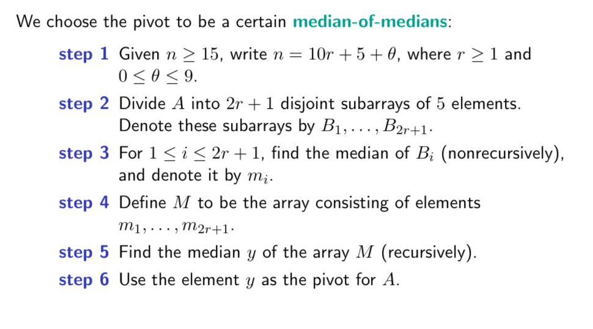
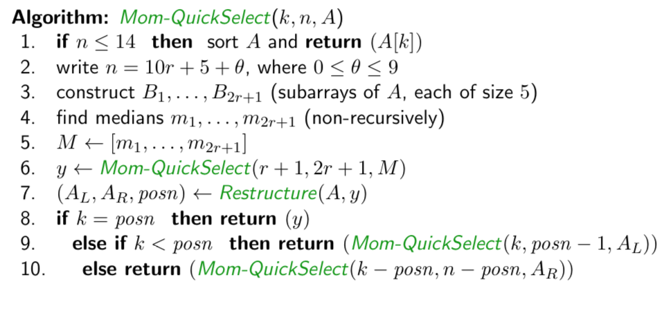

Analysis

- first we will show y, the pivot we find with this algorithm, is a 'good' pivot
- then we will use a recurrence relation to determine the *worst* complexity

Claim 1: the number of elements of A that are > y is at most 7n/10, and the number of elements of A that are < y are at most 7n/10

- assume n = 5(2r+1)
- diagram -> "conceptual aid" with 2r+1 rows of each group of 5 elements, and y is in the middle as the median of each median
- each row is a Bi sorted in increasing order from left to right
- medians are sorted in increasing order, from top to bottom
- so the top left quadrant has elements all <= y
- therefore the number of elements <=y is at least 3(r+1) 
 - the r+1 is the top half of the rows including y, and the 3 is the left half of the 5 elements, including the column with y
- the proportion of elements <=y is at least 3(r+1)/(10r+5) which is about 3/10
- therefore the proportion of elements >y is at most 7/10
- we can make the same argument for elements <y

Claim 2: T(n) <= T(n/5) + T(7n/10) + theta(n)

- the n/5 is from step 6 
- the 7n/10 is step 9 or 10 (the recursion of subset of elements)
- finding the medians and the rest takes theta(n)
- this is a sloppy recurrence
- we can do a recurrence tree
 - n with children T(n/5) and T(7n/10)
 - the n/5 node has (n/5)(1/5) and (n/5)(7/10) children 
 - similarily, we keep multiplying left by 1/5 and right by 7/10
 - so the first level sums to n(1/5 + 7/10) = 9n/10
 - second level sums to (9/10)^2 n
 - so we have a geometric sum of n(1 + 9/10 + (9/10)^2 + ... )
 - r = 9/10 < 1 so we have sum equalling 10n so it's theta(n)
- note that we're not being precise here - to be mathematically precise, T(n) <= T(floor(n/5)) + T(floor(7n+12/10)) + theta(n)
 - (I asked why it's 12, it's a messy thing about where those extra elements could lie)
 - something like the +12 comes from n = 10r + 5 + theta where 0<=theta<=9 

##Part 4 of the course: Greedy Algorithms

###Optimization Problems

- Problem: Given a problem instance, find a feasible solution that maximizes (or minimizes) a certain objective function.
- Problem Instance: Input for the specified problem.
- Problem Constraints: Requirements that must be satisfied by any feasible solution.
- Feasible Solution: For any problem instance I, feasible(I) is the set of all outputs (i.e., solutions) for the instance I that satisfy the given constraints.
- Objective Function: A function f : feasible(I) -> non-neg real numbers. We often think of f as being a profit or a cost function.
- Optimal Solution: A feasible solution X in the set of feasible(I) such that the profit f(X) is maximized (or the cost f(X) is minimized).

------
missed two days of class for a conference - [see another student's notes](http://anthony-zhang.me/University-Notes/CS341/CS341.html#section-8)

##Oct 21

###Stable Marriage problem ct'd

- the number of iterations is <= n^2, but in actually <= n^2 - n + 1 (the tight upper bound)
- average # iterations is theta(nlogn) 
- these two numbers are for interst, not proved

complexity: what is the complexity of each iteration? each while loop

What data structures should we use?

- we keep track of the matched pairs using two arrays 
 - Match1[mi] = wj, and Match2[wj] = mi IFF {mi, wj} is in Match
- to quickly identify an unengaged man, use a queue or stack (the order doesn't really matter FIFO or LIFO) to store all unegaged men - so O(1) lookup time
- each man's preference list is a linked list or array (static, created at beginning of algorithm)
- women's preferences are stored in an nxn array - each women's preference is R[wj, mi] = l if mi is the lth favourite man of wj (static, constructed at beginning of algorithm)

complexity

- with these data structures, each iteration of the loop takes O(1) time
- initialization takes theta(n^2) to construct R
- there are O(n^2) iterations, O(1) time per iteration --> O(n^2)
- so total time O(n^2)

###fibinacci numbers

- f0, f1, f2, f3 ...
- 0, 1, 1, 2, 3, 5, 8, 13, 21 ...
- recurrence relation 
 - f0 = 0
 - f1 = 1
 - f\_n = f\_{n-1} + f\_{n-2} if n >=2
- input n, compte f\_n

badfib 

- recurse to find fib(n-1) and then fib(n-2)
- think about the tree - with n-1 to the left and n-2 to the right - this is getting really big! and there's a lot of repetition
- properties of this recursion tree
 - there are f\_n leaf nodes having the value 1
 - there are f\_{n-1} leaf nodes having the value 0
 - f\_n + f\_{n-1} = f\_{n+1} leaf nodes
 - # interior nodes = #leaf-nodes -1 = f\_{n+1} - 1
 - so the total #nodes = 2f\_{n+1} - 1!
 - this is concerning because the complexity is omega(# nodes) = omega(2f\_{n+1}-1) = omega(f\_{n+1})
 - f\_n = (goldenratio^n - (-goldenratio)^(-n) / root5
  - goldenratio^n grows exponentially, the (-goldenratio)^(-n) is negligable
  - goldenratio = (1+root5)/2 approx= 1.6
- so fn is approx theta(1.6^n) which grows very fast!
- so the complexity of badfib is omega(1.6^n)

why is it so inefficient?

- we have to compute everything multiple times - each time we compute f3 we go through the whole f3 tree (e.g. when computing f4 and also when computing f5)
- better: compute f0, f1, f2, f3, ... , fn in order
- comment: we only need to keep track of the two 'last' fi's at any point in time to compute next one -> reduces storage (does not affect complexity)
- if addition takes theta(1) time, then complexity would be theta(n)

What's the problem?

- the numbers are growing exponentially quickly - need to consider "multiplicaiton arithmetic" (bit complexity) to add the k-bit integers, it takes theta(k)
- how many bits are in f\_i?
- f\_i is theta(1.6^i)
- # bits in f\_i is log\_2(1.6^i) which is theta(i)
- time to compute the addition is theta(i) 
- so overall complexity is sum i=2..n theta(i) = theta(n^2)

Algorithm: BetterFib(n)

	f[0] <- 0
	f[1] <- 1
	for i <-2 to n
		do f[i] <- f[i-1] + f[i-2]
	return f[n]

###Designing Dynamic Programming Algorithms for Optimization Problems

Optimal Structure

- Examine the structure of an optimal solution to a problem instance I, and determine if an optimal solution for I can be expressed in terms of optimal solutions to certain subproblems of I.

Define Subproblems

- Define a set of subproblems S(I) of the instance I, the solution of which enables the optimal solution of I to be computed. I will be the last or largest instance in the set S(I).

Recurrence Relation

- Derive a recurrence relation on the optimal solutions to the instances in S(I). This recurrence relation should be completely specified in terms of optimal solutions to (smaller) instances in S(I) and/or base cases.

Compute Optimal Solutions

- Compute the optimal solutions to all the instances in S(I). Compute these solutions using the recurrence relation in a bottom-up fashion, filling in a table of values containing these optimal solutions. Whenever a particular table entry is filled in using the recurrence relation, the optimal solutions of relevant subproblems can be looked up in the table (they have been computed already). The final table entry is the solution to I.

####0-1 Knapsack problem

- instance: an array of profits, array of weights, and capacity M - all +ve integers
- feasible solution: an ntuple [x1, ... xn] where each xi is 0 or 1 and the sum of wi\*xi <= M
- find: a feasible solution that maximizes the sum of pi\*xi

thinking about the problem:

- consider what it means if xn is 0 or 1
- case xn = 0
 - let X' be the solution to the subproblem consisting of the first n-1 items
 - then X = [X, 0]
- case xn = 1
 - subproblem: first n-1 objects with capacity M' = M - w\_n
 - optimal solution X = [X', 1]
- the subproblem profit(x) = profit(X') + p\_n

##Oct 26

reviewing from last time:

- suppose X = [x_1 ... x_i] is the optimal solution to instance I
- we have two cases:
- case 1:
 - if x_n=0, then X' = [x_2, ...., x_{n-1}] is an optimal solution to the instance consisting of the first n-1 items with capacity M
 - profit(X) = profit(X')
- case 2:
 - if x_n = 1, then X' is an optimal solution to the instance consisting of the first n-1 items with capacity M - W\_n
 - profit(X) = profit(X') + p_n
- we pick whichever case gives us the better answer
- subproblems: define P[i,m] 1 <= i <= n, 1 <= m <=M
 - the first i items, with some capacity between 1 and M

recurrence relation: 

- P[i,m] = max{P[i-1, m], P[i-1, m-w_i]+pi}
 - this is the min of when x_i = 0 and when x_i = 1
 - this is also assuming i >= 2,  and m >= w_i
- P[i,m] = P[i-1, m] if i >= 2 and m < wi
- P[i,m] = p_1 if i=1 and m >= w_i
- P[i,m] = 0 if i=1 and m < w_1

computing:

- compute all the optimal solutions P[i,m]
- table of values P[i, m] 1 <= i <=n, 1 <= m <=M
- fill in the table one row at a time (i=1,2,...,n)
 - note the first row is all the base cases
- fill in each row from left to right
- each entry can be computed in theta(1) time
- the final answer is the last element in the last row - bottom right of the table, at i=n, m=M
- note: we only need to compute the entry P[n,M] in the last row (and none of the rest of that row)
- we technically don't need every entry in every row (only m and m-w_i, for each m from the last row) but we're just going to compute them all cause it's easier

how do we determine the optimal solution X?

- assume we have already computed the table P[i,m]
- remember P[n,M] = max{P[n-1, M], P[n-1, M-w_n]+pn}, where it's the first value if x_n = 0 and the second if x_n = 1
- so we can look in the previous table to see if it's equal to P[n-1, M] to decide if x_n = 0 or 1
- we continue in the same way, tracing back - this takes theta(n)

so total complexity is theta(nM), assuming theta(1) time additon

Example:
	
	M = 30

	i =       1   2   3   4   5   6
	---------------------------------
	weights   2   3   5   8   13  16
	profits   1   2   3   5   7   10

	    m = 0 1 2 3 4 5 6 7 8 9 10 ...... 30
	-----------------------------------------
	i = 1 : 0 0 1 1 1 1 ..................1
        2 : 0 0 1 2 2 3 ..................3
        3 : 0 0 1 2 2 3 3 4 5 5 6 ........6
        4 :
        5 :
        6 :                               18

    This is a good exercise to fill out the table and do a traceback 

Is this a poly-time algorithm?

- the 0-1 backpack is NP-hard, which means there is no poly time algorithm known to solve it

###polytime algorithm

- a polynomial time algorithm is O((size(I))^c), for some c>0 where c is a constant
- size(I) = # bits required to store I
 - for 0-1 knapsack, I = w1, ... , wn, p1, ..., pn, M
 - so the size of I is sum log2(wi) + sum log2(pi) + log2(M)
 - M is exponentially large compared to log2(M)
 - so this algorithm has complexity theta(nM) which is exponentially large compared to the number of bits 

backtracking solution (recursive)

 - this is theta(2^n), practical if n is small
 - we don't discuss backtracking algorithms in this course

###Coin Changing

- Instance: a list of coin denominations d1...dn and a positive integer T (target sum)
- Find: a tuple of non-negative integers a1...an such that T = sum ai*di and N= sum ai is minimized
- 0 <= a_n <= floor(T/dn)
- optimal solution consists of j coins of denomination dn along with an optimal solution using the first n-1 denominations for target T - jdn
 - compute this for all j, take the min

subproblems:

- 1 <= i <= n
- 0 <= t <= T
- N[i, t] first i denomations with target t

recurrence:

- N[i,t] = min{N[i-1, t-j*di] + j : 0 <= j <= floor(t/di)}
 - j is the #coins of denomination di, 0 <= j <= floor(t/di)
 - this is if i<=2
- N[i,t] = t if i=1 (because we've decided d1 = 1)

traceback to compute the # coins of each denomination in the optimal solution:

- A[i,t]'s (# coins in denomination di in the optimal soluiton) makes the trace back more efficient - we can fill it out as we go

note: this is not polytime for the same reason as knapsack

##Oct 28

###Longest common subsequence

- instance: two sequences x1,...,xm and y1,...,yn over some finite alphabet T
- find: a maximum length sequnce Z that is a subsequence of both X and Y
- the order of letters have to be the same in both sequences, but they don't have to be a substring

e.g. 

- x = gdvegta
- y = gvcekst
- LCS = gvet

define LCS(X,Y) to be the length of the longest common subsequence of X and Y

optimal structure:

- x = (x_1 ... x_m) 
- x' = (x_1 ... x_{m-1})
- y = (y_1 ... y_n) 
- y' = (y_1 ... y_{n-1})
- if x_m = y_n, then LCS(X, Y) = 1 + LCS(X', Y') - aka we're including x_m=y_n in the LCS
- if x_m != y_n then there are these possiblities:
 - case 1: suppose x_m is the last element in the LCS (so y_n is not the last element) - then LCS(X,Y) = LCS(X,Y')
 - case 2: suppose y_n is the last element in the LCS (so x_m is not the last element) - then LCS(X,Y) = LCS(X',Y)
 - case 3: suppose neither xm nor yn is the last element in the LCS -- then LCS(X,Y) = LCS(X', Y')
- so LCS(X,Y) = max{LCS(X,Y'), LCS(X', Y), LCS(X', Y')}
- note that LCS(X', Y') <= LCS(X, Y') and is also <= LCS(X', Y), so the third case is redundant and LCS(X, Y) = max{LCS(X,Y'), LCS(X', Y)}

define subproblems:

- we consider all prefixes of X and Y: (x1...xi) for 1 <= i <= m and (y1,...,yj) for 1<=j<=n
- let c[i,j] denote the length of LCS of (x1,...,xi) and (y1,...,yj)
- c[i,j] = 1 + c[i-1, j-1] if x_i = y_j and i>=1 and j>=1
- c[i,j] = max{c[i-1, j], c[i, j-1]} if x_i != y_j and i>=1 and j>=1
- c[i,j] = 0 if i=0 or j=0

the chart:

- each entry needs the ones directly above, directly left, and diagonal up/left
- so we can fill it out by rows left to right starting at top row, or go by columns top to bottom, starting at left, we could even do diagonals in a way to still have the right information
- the answer is bottom right
- complexity will be theta(mn)

Traceback- 3 cases:

- case UL (upperleft)
 - x_i = y_j
 - it was included in the LCS
 - so we decrement i and j
- case L
 - j decrements
- case U
 - i decrements

example:

 			        g    d    v    e    g    t    a
		   j = 0    1    2    3    4    5    6    7

	i = 0      0*   0    0    0    0    0    0    0    
	g   1      0   UL1*  L1*  L1   UL1  UL1  L1   L1
	v   2      0    U1   U1   UL2* L2   L2   L2   L2
	c   3      0    U1   U1   U2*  U2   U2   U2   U2
	e   4      0    U1   U1   U2   UL3* L3*  L3   L3
	k   5      0    U1   U1   U2   U3   U3*  U3   U3
	s   6      0    U1   U1   U2   U3   U3*  U3   U3
	t   7      0    U1   U1   U2   U3   U3   UL4* L4*

to backtrace, follow arrows from bottom right (I added astrixes)

###Minimum Length Triangulation

- instance: n points q1 ... qn that form a convex n-gon P
- version 1: find a triangulation of P such that the sum S_c of the length of the n-3 chords is minimized
- version 2: find a triangulation of P such that the sum S_p of the perimeters of the n-2 triangles is minimized

triangulation:

- n-3 chords (non-intersecting) between vertices
- this makes n-2 disjoint triangles
- convex means the angles are all <180

how many triangulations of an n-gon are there?

- triangle - 1
- 4 sides - 2 triangulations (across each diagonal)
- 5 sides - 5
- 6 sides - 14
- 7 sides - 42
- 8 sides - 132
- 9 sides - 429
- 10 sides - 1430
- this is a famous sequence of numbers - the catalan numbers - (2n choose n)/(n+1)
- this grows exponentially! we want to avoid this

we're going to consider version 2 of the triangle. for a given k we have

- the triangle q1-qk-2n
- the polygon q1 ... qk
- the polygon qk ... qn
- the polygons are subproblems

subproblems:

- what subproblems will we need to solve?
- each subproblem consists of a polygon where vertices are consecutive vertices in the original polygon
- how many subproblems are there? n choose 2 which is theta(n^2)

recurrence relation

- see slides, this was kinda rushed at the end

TODO(put screenshot)

## Nov 2

###Graphs

A graph is a pair G = (V, E)

- V is a set whose elements are called vertices
- E is a set whose elements are called edges
- Each edge joins two distinct vertices
- An edge can be represented as a set of two vertices, e.g., {u, v}, where u != v. We may also write this edge as uv or vu
- often we say n = # vertices and m = # edges, and clearly m <= (n choose 2)

directed graph or digraph

- directed edges or arcs
- an arc is an ordered pair (u,v) from u (the tail) to v (the head)
- we allow u = v
- here m <= n^2 (where m is number of arcs)

Adjacency Matrices

- nxn matrix A = (a_{u,v}) 
- is indexed by V such that a_{u,v} = 1 if {u,v} is an edge, and 0 otherwise
- there are 2m entries of A equal to 1
- for a digraph, a__{u,v} = 1 if (u,v) is an arc, 0 otherwise, and there are m entries equal to 1

There was an example on the board but I don't wanna draw it

here's an example I found on Google:

Adjacency Lists

- n linked lists
- for each vertex u, there's a linked list Adj[u] of all adjacent vertices to u
- in an undirected graph, for edge uv there would be v in Adj[u] and u in Adj[v]
- in a directed graph, every edge corresponds to a node in only one adjacency list
- list is better than matrix because it saves space and time - the matrix has lots of 0s, the list doesn't have that waste

### Breadth First Search in undirected graph

- begins at a specified vertex s
- the search “spreads out” from s, proceeding in layers
- first, all the neighbours of s are explored
- next, the neighbours of those neighbours are explored
- this process continues until all vertices have been explored. A queue is used to keep track of the vertices to be explored

Notes for algorithm:

- π(v) = "predecessor" of v
- colour[v] can be white or gray or black
 - A vertex is white if it is undiscovered
 - A vertex is gray if it has been discovered, but we are still processing its
adjacent vertices
 - A vertex becomes black when all the adjacent vertices have been processed
- If G is connected, then every vertex eventually is coloured black.

def BFS(G,s):

	for each v in V(g):
		colour[v] = white
		π(v) = empty list
	colour[s] = gray
	InitializeQueue(Q)
	Enqueue(Q, s)

	while Q is not empty:
		u = Dequeue(Q)
		for each v in adj[u]:
			if colour[v] = white
				colour[v] = gray
				π(v) = u
				Enqueue(Q, u)
		colour[u] = black

we did an example but it's hard to draw out, since the colour states keep changing

observation - when we explore an edge {u, v} starting from u

- if v is white, then uv is a tree edge (hangs down) and π[v] = u is the predecessor of v in the BFS tree
- otherwise, uv is a cross edge (goes across the 'tree' of the graph - pictures showing this to come later)
- The BFS tree consists of all the tree edges.
- Every vertex v != s has a unique predecessor π[v] in the BFS tree.

###Single source shortest path problem (via BFS)

problem

- source s
- find the shortest paths from s to v, for all vertices v
- length (# edges) of path is as small as possible

code

- same as BFS, but 
- after we set colour[s] to gray, we make dist[s] = 0
- after setting v to gray and u as v's predecessor, make dist[v] = dist[u] + 1
 
Now let's prove this actually works- we want to prove:

- If {u, v} is any edge, then |dist[u] - dist[v] <= 1
- If uv is a tree edge, then dist[v] = dist[u] + 1.
- dist[u] is the length of the shortest path from s to u - this is also called the distance from s to u

The path of the proof

- Lemma 1: if u is discovered before v, then dist[u] <= dist[v]
- Lemma 2: If uv is any edge, then |dist[u] - dist[v] <= 1
- Theorem: For any vertex v, dist[v] = length of the shortest path from s to v
- the proof is actually quite long and complicated, but we'll go over it to give you the idea

define layers:

- L_i = {v : dist[v] = i}
- properties of L_i : v is in L_i iff 
  - uv is an edge
  - u is in L_{i-1}
  - there is no vertex u' in L_j where j < i-1 and u'v is an edge

 Lemma 1 can be proven using the characterization of the Li's

 Lemma 2: proof by contradiction

 - suppose uv is an edge, but dist[v] >= dist[u] + 2
 - let dist[u] = d, say v is in adj[u]
 - if v is white, then dist[v] = dist[u] + 1 (contradiction)
 - if v is not white, then it was already been discovered 
 - say v was discovered from u'
 - u' was discovered before u, so dist[v] <= dist[u] by lemma 1 (contradiction)

 Theorem: let delta(v) be the distance from s to v. Then delta(v) = dist[v]
 
 Proof

 - delta(v) <= dist[v]
 - there is a path of length dist[v] from s to v
 - show delta(v) >= dist[v] by induction on delta(v)

--- we ran out of time, but the complete proofs are in this repo (BFS-shortest-distances.pdf) ---

##Nov 4

Bipartite graphs

 - a graph is bipartite if we can separate vertices into two groups X and Y, and all edges have one endpoint in X and one endpoint in Y (we can think about giving the vertices different colours)

###Theorem: a graph is bipartite iff it doesn't contain an odd cycle (an odd # of vertices connected in a polygon)
 
proof => 

	prove the contrapositive - if G has an odd length cycle, it's not bipartite

 	let's say it is bipartite
 	let v1 v2 ... v2k+1 v1 be the vertices in an odd length cycle
 	WLOG let's say v1 is red, then v2 is blue, v3 is red ... v2k+1 is red 
 	... but v1 is also a red and connected to v2k+1 so contradiction

proof <= 

	prove the contrapositive: assume G is not bipartite, show it contains an odd length cycle
 	
 	WLOG assume G is connected. Let s be any vertex
 	
 	Define X = {v: dist[v] is even}
 		   Y = {v: dist[v] is odd}

 	G is not bipartite, so there is an edge uv with u,v in X or u,v in Y

 	so dist[u] and dist[v] are both even or both odd, 
 	so by Lemma 2 (from the last proof) dist[u] = dist[v]
 	let's call this distance d

 	two paths of length d:
 	u, u1 (π[u]), u2 (π[u1]), ..., s=u\_d (π[u\_d-1])
 	v, v1 ..... similarily ... s=v\_d

 	so we have u and v different, 
 	and at some point before or at s we hit a common vertex and that makes a cycle of odd length

 	more specifically - let j = min{i: ui = vi}
 	u u1 ... uj = vj vj-1 .... v1 v u is a cycle of length 2j+1 (odd)

 	we can find this cycle efficiently using our BFS algorithm

###Depth-first search of a directed graph

- A depth-first search uses a stack (or recursion) instead of a queue
-  predecessors and colour vertices are defined the same as in BFS
- It is also useful to specify a discovery time d[v] and a finishing time f[v] for every vertex v - we increment a time counter every time a value d[v] or f[v] is assigned
- We eventually visit all the vertices, and the algorithm constructs a depth-first forest
- we have an adjacency list, same as before (this time for directed graph)

TODO(screenshot of code on the slides)

we did an example, but again it's hard to show because colours keep getting changed - but go through it on your own and make sure you know how to do this algorithm

we find a tree, and might not hit all vertices because it's a directed graph, and then look from remaining vertices which might make more trees - this makes a forest

four kinds of edges:

- uv is tree edge if u = pi(v)
- forward edge if not tree edge and v is a descendant of u in a tree in depth-first forest 
- backwards edge if u is descendent of v in a tree in the depth first forst
- any other edge is a cross edge - an edge joining vertices in two different trees in the forest is a cross edge, but we can also have cross edges joining two vertices in the same tree

there was a pic on the board I don't want to copy but [this picture shows how it works](https://upload.wikimedia.org/wikipedia/commons/thumb/5/57/Tree_edges.svg/2000px-Tree_edges.svg.png)

tree edge colouring:

- d[u] < d[v] < f[v] < f[u]
 - we discover u before we discover v, and finish u after finishing v
- v is white when the edge uv is processed, so u is the predecessor of v

forward edge colouring:

- we have u goes to v1 and v, but v1 also has a path to v
- start by processing u-v1
- visit v1, v2, v ...
- .. then back up through recursive calls
- process uv, v is black
- d[u] < d[v] < f[v] < f[u]
- same sequence of discovery times as tree edge, but v is black

##Nov 9

continuing describing edges....

back edge

- v->v1->v2->u->v
- d[v] < d[u] < f[u] < f[v]
- when we process uv, v is grey because we processed it first

cross edge

- 1->2->v and 1->3->u with the 1->2->v processed first
- d[v] < f[v] < d[u] < f[u]
 - note these intervals are disjoint
- u->v is then a cross edge, v is black when we process u->v

### Topological Orderings and DAGs

- directed acyclic graph (DAG) contains no directed cycle
- a directed cycle is when we have x1->x2->...->xn->x1
 - x1->x2<-x3->x1 is not directed because the direction of x3->x2 is the opposite way
- a directed graph has topological ordering, or topological sort, if there is a linear ordering of all the vertices such that u < v whenever uv is an edge

** example on the board, I took a picture, TODO(add to notes)**

Lemma: Every DAG has a vertex of indegree (edges coming in) 0

- Proof: assume there is no vertex of indegree 0 (prove the graph has a directed cycle)
- let v1 be any vertex - there is an arc v2v1, there is an arc v3v2, there is an arc v4v3 ... etc
- eventually vi = vj for some j > i
- consider the first repetition of this type - then vj -> vj-1 -> vj-2 -> ... ... -> vi = vj is a directed cycle

Theorem: D has a topological ordering iff D is a DAG

- Proof: => by contrapositive
 - suppose D has a directed cycle v1v2...vkv1
 - start at v1 without loss of generality, continue to vk, vk then goes to v1 which does not respect the ordering
- Proof: <= Assume D is DAG (find a top ordering)
 - let v1 be a vertex of indegree 0 (exists by lemma)
 - take v1 to be the first vertex in the ordering
 - remove v1 and all incident edges
 - let v2 be a vertex of indegree 0 in this smaller graph - this won't create a directed cycle so it's still a DAG so lemma still holds
 - repeat this process -> gives a topological ordering

We will find a more efficient algorithm to construct top orderings based on DFS

Lemma: D is a DAG iff a DFS of D has no back edges

- Proof: => by contrapositive
 - assume D has a back edge 
 - the back edge by definition makes a directed cycle
- Proof: <= by contrapositive
 - let C = v1v2...vlv1 be a directed cycle
 - WLOG, assume v1 is the first discovered vertex in C
 - v1 is discovered before vi for i = 2...l
 - claim: vlv1 is a backedge
  - rememember that v1 is discovered before vl -  so vlv1 is a backedge or a cross edge (from chart on slide 142)
 - what colour is v1 when we discovered the edge vlv1?
  - it's not finished yet, since we're still coming around the cycle
  - so it's grey and f[vl] < f[v1]
 - so it's a back edge

using DFS

- we did an example on the board
- do DFS -> if there is any back edge, quit and say it's not a DAG
- if no back edge, reverse order of finishing times yields the top ordering
- how do we recognize when we encounter a back edge vw? 
 -answ: w is gray
- we could run DFS then sort the array f in reverse order theta(nlogn)
- more efficient: when we finish an item, put it on stack, then pop stack n times to reverse order at the end - this is theta(n)
- DFS algorithm is theta(n+m) - recall m is #edges and m <= n^2
 - n for stack
 - m for DFS

 *** TODO (code on slides) ***

##Nov 11

graph terminology

- connected graph: any two vertices are joined by a path
- disconnected graph: connected components which are maximal connected subgraph
- a digraph is strongly connected iff for any vertices u, v there is a directed path from u to v and a directed path from v to u
- strongly connected components: maximal strongly connected subgraphs

example on the board

TODO(insert pic)

- c3 is the 9 vertex
- c4 is the 10 vertex

component graph: 

	c1  <- c2    c3 <- c4
	  ^----------|

The componenent graph is a DAG

- proof: assume there is a direced cycle in the component graph
- then some vertex in c1 goes to some vertex in c2 and similarily for c2 to c3 .... cn to c1
- but then c1 and c2 and c3 ... cn make a strongly connected component - this contradicts the maximality of c1, c2, c3, c4

When we do depth first search:

- For a strongly connected component C, define f[C] = max{f[v] : v in C} and d[C] = min{d[v] : v in C}
 - f/d are finish/discover times
- interestingly enough, if Ci, Cj are strongly connected components, and there is an arc from Ci to Cj in the component graph, then f[Ci] > f[Cj]

Proof of above theorem (f[Ci] > f[Cj])

- two cases, depending on order of where we start depth first search
 - case 1: d[Ci] < d[Cj]
 - case 2: d[Ci] > d[Cj] 
- case 1: let u be the first discovered vertex in Ci
 - all vertices in ci and cj are visited in recursive calls made from DFSvisit(u)
 - for any v in ci and cj (that isn't u), we have d[u] < d[v] < f[v] < f[u]
 - so f[Ci] > f[Cj]
- case 2: suppose we visit cj fist
 - we know ci has an arc to cj, but because the component graph is a DAG we can never get from fj to ci
 - the recursive calls from cj will never include any vertex in ci
 - so d(cj) < f(cj) < d(ci) < f(ci)
 - so f[Ci] > f[Cj]

Lemma: Let S be any fixed vertex. Then G is strongly connected iff there are directed paths from s to v and from v to s, for all other vertices v

- => is trivial by definition of strongly connected, so we'll just show <=
- <= let u and v be any two vertices
 - there's a directed path from s to u (path1) and u to s (path2)
 - there's a directed path from s to v (path3) and v to s (path4)
 - so path2 and path3 maek a path from u to v, and path 4 and 1 make a path from v to u

Algorithm to determine if G is strongly connected:

1. pick a vertex S
2. run DFSvisit(S)
3. if there is a white vertex QUIT (G is not strongly connected)
4. otherwise, reverse the direction of every edge of G, forming a new graph H
5. run DFSvisit(S) in H
6. if there is a white vertex QUIT (G is not strongly connected)

if all vertices are black (guarenteed if no white vertices) then G is strongly connected

An Algorithm to Find the Strongly Connected Components

1. Perform a depth-first search of G, recording the finishing times f[v] for all vertices v
2. Construct a directed graph H from G by reversing the direction of all edges in G.
3. Perform a depth-first search of H, considering the vertices in decreasing order of the values f[v] computed in step 1.
4. The strongly connected components of G are the trees in the depth-first forest constructed in step 3

TODO(example of DFS on board, I actually took a pic this time)

order of reverse finishing times: 1, 2, 4, 3, 5, 7, 6

TOOD(pic of H)

Correctness that we find the strongly connected components

- G and H have the same strongly connected components (SCC)
- let us be the first vertex visited in step 3 (u has thehighest finishing time in DFS of G)
- let C be the SCC containing u, lte C' be any other SCC
- in G, f[c] > f[c'],so there is an edge from C' to C in the component graph of G (contrapositive from last bullet on slide 146, proved earlier this class)
- therefore there is no edge from C to C' in H
- this continues to apply to other components

##Nov 16

terminology:

- a tree on n vertices is a connected (undirected) graph containing no cycles - it has n-1 edges
- spanning trees is a subgraph that is a tree, "spanning" means it contains all the vertices in G
- there is a unique path between any two vertices in a tree
- Minimum Spanning Tree: if edges have weights, a minimum spanning tree is a spanning tree that minimizes the total weight of the edges in the spanning tree

Kruskal’s Algorithm to find min spanning tree

- algorithm
 - sort edges by increasing weight
 - keep a set of edges
 - for each edge (from least to most weight) see if we can add it to our set without making a cycle, add if we can
- so at any point, we have a forest of vertex-disjoint trees
- initially we have n trees, one vertex per tree
- whenever we choose an edge to add to the forest, we are merging two trees - so #trees is reduced by one
 - proof - in the case where we join two different trees there's no cycle, if both end points of the edge are in the same tree adding the edge will create a cycle (you can draw this to see)
- at the end of the algorithm we'll have chosen n-1 edges, and have a single tree

at any point in time, each tree has a unique 'leader' vertex

- define a function find where find(v) is the leader vertex for a tree that contains v
- to implement find, we use an auxilary array L
 - for any v, L[v] = some vertex v (not just any vertex, we'll explain more in a sec) in the tree that contains v
 - L[v] = v iff v is leader vertex for that tree
- conceptually we have a tree defined by L, where every edge is directed towards the leader (not necessarily edges in the graph)
 - he drew a picture of directed branches all leading up to the same vertex, so at the bottom there's w, and L[w] is a vertex it directs towards, and L[L[w]] is one higher, and L[L[L[w]]] is at the top (we call it u)
 - and v is the bottom of another branch, and L[v] is it's 'parent' and L[L[v]] is also u, and doesn't direct to anything
 - for any v - v, L[v], L[L[v]], ... eventually ends at leader vertex
 - find(v) connects the sequence v, L[v], L[L[v]].... until the leader vertex, say u, is reached. Not that L[u] = u

How do we do the cycle test efficiently?

- given an edge uv, check if find(u) is not equal to find(v) -- then we can add the edge to the tree

Making L:

- initialize L[v] = v for all v
- every time we merge two trees by adding an edge, say uv
 - we had find(u) = u' and find(v) = v'
 - we can make L[u'] = v' or L[v'] = u'

TODO(insert pic of graph)

looking at edges in order of weight:

		x   :  a  b  c  d  e  f  g  h  i
		L[x]:  a  b  c  d  e  f  g  h  i     look at gh, can add, share find(h)
		       a  b  c  d  e  f  h  h  i     look at fg, can add, share find(g) 
		       a  b  c  d  e  h  h  h  i 	 look at ci, can add, share find(i)
		       a  b  i  d  e  h  h  h  i     look at ab, can add, share find(b)
		       b  b  i  d  e  h  h  h  i     look at cf, can add, share find(h)
		       b  b  i  d  e  h  h  h  h     look at gi, find(g) == find(i) == h, so discard
		       etc.

notes:
- note that we can't just do table lookup because we only update one find value on each join
- the idea isi that we keep track of the depths of the trees and direce the leader of the tree with lower depth to the leader of the tree of higher depth (when they're the same the choice is arbitrary)
- this is so our resulting tree has the least possible depth - and the depth will be the complexity of find()
- find is a logn operation
- presort is theta(mlogm) where m is number of edges
- O(m) iterations - O(logn) per iteration
so total runtime is O(mlogn)

Prim’s Algorithm (idea)

- We initially choose an arbitrary vertex u_0 and define A = {e}, where e is the minimum weight edge incident with u_0
- A is always a single tree, and at each step we select the minimum weight edge that joins a vertex in V_A to a vertex not in VA
 - Remark: V_A denotes the set of vertices in the tree A
- for any vertex v not in V_A
 - N[v] = u, where {u,v} is a min weight edge such that u is in V_A
 - W[v] = weight of the edge N[v] v
 - assume the weight of uv is infinity is uv is not an edge (so we never pick that)

see code on the slides

Andy's notes from when I left for an interview

- we want to find minimum weighted edge from V_A to V\V_A
- example: consider the graph is Kurstal's algorithm
 - let u_0 = a, V_A = {a}
 - choose edge ab, V_A = {a,b}
 - choose edge bc, V_A = {a,b,c}
 - choose edge ci, V_A = {a, b, c, i}
- initialization:
 - N[V] = u_0
 - w[v] = w(u_0,v)
- update:
 - we have a previous best edge from any vertex v' to V_A, compare that to the weight of the v' to the vertex we just added (v) - pick the lesser of w[v] and w[v']
- complexity
 - initialization: theta(n)
 - while loop - O(n) iterations, finding v is linear search, for loop is O(n)
 - so total O(n^2)
- improvements:
 - use a priority queue (minheap) to store w values
 - this can reduce complexity to O(mlogn), which is better only when m is small compared to n^2, or sparse graphs

##Nov 18

we can prove the correctness of Krustal's and Prim's algorithm by proving the general version of the algorithm

definitions:

- cut: a paritition of the vertices so that we have (S, V\S) and neither set is empty
- Let (S, V \S) be a cut in a graph. An edge e is a **crossing edge** with respect to the cut (S, V \S) if e has one endpoint in S and one endpoint in V \S - also known as a bridge
- A cut (S, V \S) **respects** the set of a set of edges A provided that no edge in A is a crossing edge

A General Greedy Algorithm to Find an MST

	A is empty set
	while A's size is < n-1:
		let (S, V \S) be a cut that respects A
		let e be a min weight crossing edge
		A <- A U {e}
	return A

Krushal and Prim are both special cases of the general algorithm

- for Kushal
 - e is a min weight edge joining two trees T1 and T2
 - so S = T1 and V\S is everything else (T2 and potentially other trees)
- for Prim, S is the tree we have so far, V\S is has the rest of the vertices including the one we pick to add the next edge

Correctness Proof:

- let A = {e_1, e_2, ..., e_n-1} wher the edges are chosen in that order
- assume all edge weights are distinct
- we will prove by induction that {e1, ..., ej} is a subset of edges of a MST for j=0, 1, ..., n-1 
- where j=n-1 this says that A is a MST

induction:

	base case: j=0 is trivial

	IH: {e_1, ..., e_{j-1} is contained in a MST. 

	Prove that {e1, ..., ej} is contained in a MST

	Assume that the MST T does not contain e_j. Note that e1, ... e_{j-1} are in T

	There is a cut (S,V\S) such that ej is the min crossing edge.
	T is connected, so it contains a crossing edge for this cut. If it's not ej, let's call it e'.
	But, w(ej) < w(e') since ej is the min weight crossing edge

	Define T' = T\{e'} U {ej}
	T' is a spanning tree with smaller weight - contradiction!

### Shortest Path Problems

1. Given u, v find the shortest path from u to v (and by shortest we actually mean min weight)

2. 'Single Source' - Given a source u_0, find the shortest paths from u_0 to v for all v (n-1 paths) - we use this to solve 1

3. 'all pairs' - find shortest path from u to v for all pairs of u to v (extension of 2)

Dijkstra’s Algorithm (Main Ideas)

- single source
- requires that all edge weights are non negative
- S is a subset of vertices such that the shortest paths from u_0 to all vertices in S are known; initially, S = {u0}
- For all vertices v in S, D[v] is the weight of the shortest path Pv from u0 to v, and all vertices on Pv are in the set S
- For all vertices v not in S, D[v] is the weight of the shortest path Pv from u0 to v in which all interior (not endpoint) vertices are in S
- For v != u0, π[v] is the predecessor of v on the path Pv.
- At each stage of the algorithm, we choose v in V \S so that D[v] is
minimized, and then we add v to S
- Then the arrays D and π are updated appropriately

pseudo code on slides

initialization: 
 - S = {u_0}
 - D[v] = w(u_0, v)
 - T[v] = u_0
 - if uv is not an edge then w(u, v) is infinity

say we have the set S, and path P from u_0 to v has weight D[v]

 - supose there is a path P' from u_0 to v such that wt(P') < wt(P)
 - decompose P' into two parts: P1 from u_0 to v' and P2 from v' to v (v != v')
 - wt(P') = wt(P1) + wt(P2)
 - >= D[v'] + wt(P2)
 - >= D[v] + wt(P2) -- since v has the min D-value
 - = wt(P) + wt(P2)
 - >= wt(P) but since all edge weights are >=0 --> contradiction

Updating step

- preview best previoius path wt =  D[v']
- compare with v where we have weight w(v,v') + D[v]

comparing updating step to Prim's algorithm

- Prim: if w(v, v') < W[v'] then W[v'] <- w(v, v')
- Dijkstra: if D[v] + w(u, v') < D[v'] then D[v'] <- D[v] + w(v,v')

complexity

- O(n^2) "straightforward"
- O(mlogn) for priority queue

Bellman-ford algorithm solves single-source shortest path problem allowing negative weight edges
 - but there cannot be negative weight directed cycles 
 - a negative weight cycle is where the total weight of a cycle is negative --> so we could loop around this infinitely and get an infinitely low path - trying to force us not to cycle like this becomes pretty difficult
 - compelxity O(mn)

shortest paths in DAGs single source shortest path problem can be solved in time O(m+n) based on topological sort

All pairs shortest path (negative weight edges are okay, negative weight cycles aren't)

0) run Bellmanford with every possible sort O(mn^2) ---- slowest
1) slide 162 O(n^4)
2) side 163 O(n^3logn)
3) slide 164 O(n^3) <- Floyd-Warshall ---- fastest

FloydWarshall:

- define D_m[i,j] to denote the weight of the min weight path from i to j in which all interior vertices are in {1...m}
- previous best path was 1 ... interior ... j with weight D_{m-1}[i, j]
- now considering m as a new interior vertex, the candidate path is i ... m ... j
- break it into two disjoint (since there are no negative weight cycles) pieces
 - 1 to m (weight D_{m-1}[1,m])
 - m to j (weight D_{m-1}[m,j])
- see pseudo code on slides

##Nov 23

Decision problems
- Decision Problem: Given a problem instance I, answer a certain question “yes” or “no”
- Problem Solution: Correct answer (“yes” or “no”) for the specified problem instance. I is a yes-instance if the correct answer for the instance I is “yes”. I is a no-instance if the correct answer for the instance I is “no”
- Algorithm Solving a Decision Problem: An algorithm A is said to solve a decision problem  Π provided that A finds the correct answer (“yes” or “no”) for every instance I of  Π in finite time
- Polynomial-time Algorithm: An algorithm A for a decision problem  Π is said to be a polynomial-time algorithm provided that the complexity of A is O(nk), where k is a positive integer and n = Size(Π)
- The Complexity Class P denotes the set of all decision problems that have polynomial-time algorithms solving them. We write  Π is in P if the decision problem  Π is in the complexity class P.

Let's look at some algorithms:

- cycle problem: does G contain a cycle? (decisionp problem)
 - use DFS, only tree edges -> no, if any back/forward/cross edges -> yes
 - complexity is n+m, size(I) is theta(n+m)
 - polytime
- hamiltonian cycle (passes through every vertex exactly once) - does one exist in G?
 - unknown if ham cycle is in P - "probably not" -> NP-complete
- rational knapsack
 - we change the problem from before to "is there an ntuple" -> now it's a decision problem
 - recall we can use a greedy algorithm to solve rational knapsack optimization in poly time
 - so we can solve rational knapsack in poly time, get optimatl profit and answer yes or no
- 01 knapsack
 - NP complete

Intuition:

- proving a theorem might be very difficult. On the hother hand, verifying whether a purported proof is valid can often be easier than finding the proof in the first place
- We're going to look at finding a proof vs verifying a proof

Polynomial-time Turing Reductions (skipped for now)

Certificates:

- Certificate: Informally, a certificate for a yes-instance I is some “extra information” C which makes it easy to verify that I is a yes-instance (like if we ask if it's possible to make ____, the certiticate would be ___)
- Certificate Verification Algorithm: Suppose that Ver is an algorithm that verifies certificates for yes-instances. Then Ver(I,C) outputs “yes” if I is a yes-instance and C is a valid certificate for I. If Ver(I,C) outputs “no”, then either I is a no-instance, or I is a yes-instance and C is an invalid certificate.
- Polynomial-time Certificate Verification Algorithm: A certificate verification algorithm Ver is a polynomial-time certificate verification algorithm if the complexity of Ver is O(n^k), where k is a positive integer and n = Size(I).

Certificate Verification Algorithm for a Decision Problem

- A certificate verification algorithm Ver is said to solve a decision problem Π provided that 
 - for every yes-instance I, there exists a certificate C such that Ver(I,C) outputs “yes”.
 - for every no-instance I, for every certificate C, Ver(I,C) outputs “no”.

e.g. for Hamiltonian Cycle

- a certifcate for a yes-instance is a ham cycle of the graph
- to vertify the correctness of a certificate X=[x1...xn] we need to check 
 - X contains n entries
 - all entries are distinct
 - consecutive entries in X are always edges in the graph
 - XnXn is also an edge
 - this can be done in polytime O(n)

The Complexity Class NP

- the set of all decision problems that have polynomial-time certificate verification algorithms solving them )like ham cycle)
- We write Π is in NP if the decision problem Π is in the complexity class NP
- Finding Certificates vs Verifying Certificates: It is not required to be able to find a certificate C for a yes-instance in polynomial time in order to say that a decision problem Π is NP

P is in NP

- proof: 
 - suppose Π is P
 - let A be a poly-time algorithm that solves Π
 - then there is a poly-time verification algorithm for Π
 - in Ver(I,C) 
 	- run A(I)
 	- ignore C, output the answer yes or no
 - Ver is poly time - so for every C Ver(I,C) outputs yes if I is a yes instance and 'no' if I is a no instance

so P is in NP - is P equal to NP? this is an unsolved problem. people lean towards the idea that they are not equal

can we use a certificate verification algorithm for Π to solve Π?

- given an instance I for Π, suppose we generate all the possible certificates for I (of a certain length) and test them using the certificate verfication algorithm
- if at least one certificate is verified, we havea  yes-instance. if no certs are verified, then we have a no instance
- this is a valid algorithm, but it's not polynomial (exponential # of possible certificates)

Polynomial-time Reductions

- For a decision problem Π, let I(Π) denote the set of all instances of Π
- Let Iyes(Π) and Ino(Π) denote the set of all yes-instances and no-instances (respectively) of Π
- Suppose that Π1 and Π2 are decision problems
- We say that there is a polynomial-time reduction (AKA polynomial transformation) from Π1 to Π2 (denoted Π1 <=^P Π2) if there exists a function f : I(Π1) --> I(Π2) such that the following properties are satisfied:
 - f(I) is computable in polynomial time
 - if I is in Iyes(Π1) then f(I) is in Iyes(Π2)
 - if I is in Ino(Π1) then f(I) is in Ino(Π2)

e.g. clique -> vertex cover

- a clique is a subset of vertices W such that all pairs of vertices from W are edges
- a cover is a subset of vertices that involve every edge
- we want a reduction from clique to vertex cover
 - we have the instance I = (G, k) where k is the size of the clique we're looking for
 - change to instance H, l where H is complement of G (all edges not in G) and l = n-k (l is the cover size we're looking for)
- definition of complement: H is called the complement of G, because every edge of G is a non-edge of H and every non-edge of G is an edge of H.

 ##Nov 25

 clique to cover ct'd

 1. so f needs to be computable in poly time
 2. if I is a yes instance of clique, f(I) should be a yes instance of vertex cover
 3. if I is a no instance of Clique, then f(I) should be a no instance of vertex cover

example of how f works:

TODO(picture)

- here the clique is {2,3,6} and the vertex cover is {1,4,5}
- cover is all vertices not in the clique

Proof of point 2 above (yes -> yes)

- supopse G has a clique W of size k
- Claim: V\W is a vertex cover in H
- let uv be an edge in H
- we will show u is in V\W or v is in V\W
- suppose this was not the case. Then u is in W and v is in W - then uv is no an edge in G, but since u and v are both in W this contradicts that W is a clique in G

Proof of point 3 (no -> no) 

- prove the contrapositive
- assume H has a vertex cover of size n-k. Prove that G has a clique of size k
- the details of this argument is pretty much the same as previous proof

Properties of Polynomial-time Reductions

- Suppose that Π1, Π2, . . . are decision problems
- thm: If Π1 <=_P Π2 and Π2 is in P,then Π1 is in P

Proof:

- we hae f, a poly trans from Π1 to Π2 and A, a polytime algorithm to solve Π2
- how to solve Π1 in poly time? 
 - step 1: compute f(I)
 - step 2: run A(f(I))
- clearly this yeilds the corret answer (yes/no) for I
- does this run in poly time?
 - let size(I) = n
 - step 1 takes O(n^k) where k is a positive integer -- this constructs f(I)
 - step 2 - suppose A has complexity O(n^l) where l is a positive integer
 - what can we say about size(f(I)) as a function of n?
 - size(f(I)) is in O(n^k) because the amount of output you have is bounded by the time the algorithm takes -- we'd need a unit of time to output each bit
 - complexity of running A on F(I) is O(n^kl)

Another theorem

- If Π1 <=_P Π2 and Π2 <=_P Π3, then Π1 <=_P Π3

###The complexity class NPC

- "NP-complete"
- theorem: if any NP-complete problem is solvable in polynomial time, then P=NP
- equivalently, if P is no NP then P union NPC is not empty (this is contrapositive)
- if P is not NP, then we have two sets (P and NPC) disjoint within NP

NPC 

- NPC is the set of all decision problems Π that satisfy two properties:
 - Π is NP
 - for all Π' in NP, Π' <=_P Π

Proof of above theorem (if P union NPC isn't empty, then P=NP)

- we've proved P is a subset of NP, so it suffices to prove that NP is a subset of P (then P=NP)
- we have Π is in P union NPC
- let Π' be in NP -- prove Π' is in P
- Π is in NPC and Π' is in NP, so Π' <=_P Π (defn)
- Π' <=_P Π and Π is in P, so Π' is in P (theorem from previous slides)

Note

- you can go from a harder problem to an easier problem, but not an easier to a harder problem
- if Π is in P and Π' is in NPC, Π <=_P Π', but it is unlikely that Π' <=_P Π (unless P=NP)

###Satisfiability and the Cook-Levin Theorem

Proving Problems NP-complete

- suppose Π1 is NPC and Π1 <=_P Π2 and Π2 is in NP
- then Π2 is NP

Proof

- we assume Π1 is NPC, Π2 is NP, Π1 <=_P Π2
- to show Π2 is NPC weneed to show:
 - Π2 is in NP (true by assumption)
 - for any Π' in NP, Π' <=_P Π2
- Π' <=_P Π1 since Π1 is NPC and Π' is NP (defn)
- also Π1 <=_P Π2 (assumption) 
- so by transitivity Π' <=_P Π2 -- done!

CNF-Satisfiability

- Instance: A boolean formula F in n boolean variables x1, ... , xn, such that F is the conjunction (logical “and”) of m clauses, where each clause is the disjunction (logical “or”) of literals. (A literal is a boolean variable or its negation.)
- Question: Is there a truth assignment such that F evaluates to true?
- we're given a bunch of variables and clauses - we want to assign the variables true of false to try to have every clause include at least one true variable

Theorem

- CNF-Satisfiability is NPC
- we show this using 3-CNF-SAT (also NPC) and 2-CNF-SAT (is P) using the above technique 

##Nov 30

(insert slide of 4 cases of instance translation)

examples of CNF instance -> 3CNF instance

- {x1, NOTx2} --> {x1, NOTx2, c}, {x1, NOTx2, NOTc}
- {x1, NOTx3, x4} -->  {x1, NOTx3, x4}
- {NOTx1, x2, x3, NOTx5} --> {NOTx1, x2, d1}, {NOTd1, x3, NOTx5}

proving case 4 -- if I is yes -> f(I) is yes

- if it's a yes instance, at least one var is true -> WLOG suppose z1 is T
- we can assign values (T or F) to the new variables d1 ... dk-3 so that each of the k-2 constructed caluses contain at least one true literal 
 - we can make all the d_i false so that in each clause we have NOTd_i which makes it true, except the first but we know z1 is true so we're fine

proving if I is no -> f(I) is no

- contrapositive
 - assume the k-2 constructed clauses each contain a true literal
 - prove original clause contains the true literal (i.e. at least one z_i is T)
- prove contrapositive by contradiction: assume all z_i are false
 - show that at least one of the k-2 constructed clauses contains no true literal
 - this follows easily - d1 must be T for the first to be true, but then d2 must be true, ... but then NOTdk-3 is false which makes the last clause false

complexity of computing f(I) 

- I is n clauses, each m variables
- m might be exponential large compared to n
- size(I) = theta(mn) if we encode I using an mxn matrix (index rows by m clauses, index columns by the n variables) and the entries in the matrix are 0, 1, -1 (where -1 means it's not in that clause)
- polynomial means a polynomial function of size(I), which means polynomial in m and n

returning to turing reductions, which we skipped earlier

Polynomial-time Turing Reductions

- Suppose Π1 and Π2 are problems (not necessarily decision problems). A (hypothetical) algorithm A2 to solve Π2 is called an *oracle* for Π2
- Suppose that A is an algorithm that solves Π1, assuming the existence of an oracle A2 for Π2. (A2 is used as a subroutine within the algorithm A)
- Then we say that A is a Turing reduction from Π1 to Π2, denoted Π1 <=^T Π2
- A Turing reduction A is a polynomial-time Turing reduction if the running time of A is polynomial, under the assumption that the oracle A2 has unit cost running time

Travelling Salesperson as an example

- TSP-optimization
 - Input: graph, weights
 - Output: hamiltonian cycle (visits each node exactly once) that minimizes sum of weights
- TSP-optimal-value
 - same input
 - output: T - minimum value of w(H) where H is a ham cycle
- TSP-decision
 - given graph, weights, target t
 - does there exist ham cycle with w(H) <= T?

"Trivial" turing reductions 

- (if you have algorithm for problem on the right, you can solve the one of the left) 
- TSP-decision <=^T_P TSP-opt-value  - just compare the target to the weight of optimal cycle
- TSP-decision <=^T_P TSP-optimization - just compare the target to the optimal weight
- TSP-opt-value <=^T_P TSP-optimization - find the weight of the optimal cycle

"non-trivial" turing deductions

- TSP-optvalue <=^T_P TSP-decision
- TSP-optimization <=^T_P TSP-decision

TSP-optvalue <=^T_P TSP-decision

- binary search technique
- interval [lo, hi]
- we can use lo as the lower bound - our upper bound will be the sum of all edge weights
- initial call to decision solver with 'hi' - tells us if there is any ham cycle in G - if not, quit
- size of I = 
 - graph G - theta(n+m) for vertices and edges
 - weight function with size sum of log of weights - because w(e) takes log(w(e)) bits to write down in binary
- so size(I) is theta(m+n+sum(log weights))
- complexity of the reduction is theta(log(hi-lo)) which is theta(log sum of weights)
- log (sum of weights) is less than or equal to sum (log of weights) which is less than size(I) -- so it's polynomial
- Q: what if we instead did a linear search? would it be poly time?
 - complexity would be theta(hi-lo) = theta(sum of weights)
 - sum of weights is exponential large compared to size(I)
 - turing reduction, but not poly time

TSP-optimization <=^T_P TSP-decision

- step 1: compute the value T* of the optimal ham cycle -> use the previous reduction
- step 2: find a ham cycle with the weight T* 
 - idea: throw away edges one at a time if they're not part of the optimal ham cycle
 - see code on slides
- complexity: theta(m) iterations of the for loop
- size(I) is theta(m+n+sum log of weights) so it's poly time

##Dec 2

###More Satisfiability Transformations

3-CNF-SAT <=_P Clique (every vertex is connected to every other)

- instance of 3CNF - I - is array of n x's, array of m clauses (each with 3 items)
- instance of clique - f(I) - is a graph with vertices and edges, and k
- our vertices will be v^i_j where is is the clause number and j is between 1 and 3
- two vertices make an edge if they are not in the same clause (different i values), and if the vertices are not the complement of each other (like they refer to x1 and NOTx1)
- we let k = m

TOOD(picture on the board of example)

prove transformation (3 steps: show it's poly time, show yes -> yes, and show no->no)

- it is poly time
- I yes -> f(I) yes
 - suppose I is a yes instance of 3-CNF-SAT. There exists a truth assignment to the boolean variables x1..xn such that every clause contains at least one true literal.
 - pick a true literal from each clause, consider the corresponding vertices in G
 - claim: this set of vertices is a clique of size m
 - size is m yup
 - is it a clique? any two of these vertices are on different levels, so not same i value, and they bot correspond to true literals so the two literals are not negations of each other so yup
- I no -> f(I) no --- aka F(I) yes --> I yes
 - supopse we have a clique of size k
 - the clique must contain one vertex from each level
 - assign the corresponding literals the value true
 - since any two of these values are joined by an edge, we are not making any bad assignments (like x1 = T and x1 = F)

subset sum

- we have n objects, each has a size, we want to find if there's a subset so that their sum is equal to a target sum
- vertex cover instance I is graph of vertices and edges, and value k
- subset sum instance f(I) is a set of n+m sizes, and a target sum W
- construct an nxm matrix C where cij is 1 if ej is incident with vi, 0 otherwise

TODO(insert pics)

for our example

- a2 + a3 = 211211, add b0 and b1 and b3 and b4 -> get 22222 = W
- what will happen in general? 
 - start with an edge in the vertex cover
 - choose the corresponding ai's -> compute their sum
 - then include the right bj's to meet the target (anywhere with a 1, add the corresponding power of 10)
 - the halfway value is all 1s and 2s because all edges contains 1 or 2 vertices in the cover - edge with one endpoint in cover will make a 1 digit, with two endpoints in the coer will make a 2 digit
- we're not gonna show the other side of the proof (no->no)

Undecidable Problems

- A decision problem is undecidable if there does not exist an algorithm that solves it
- If a problem is undecidable, then for every algorithm A, there exists at least one instance I such that A(I) does not find the correct answer (“yes” or “no”) in finite time
- remember we proved the halting problem is undecidable this in at least one other course - we finished this course with the proof too
- if halting <=^T problem, then the problem is also undecidable
