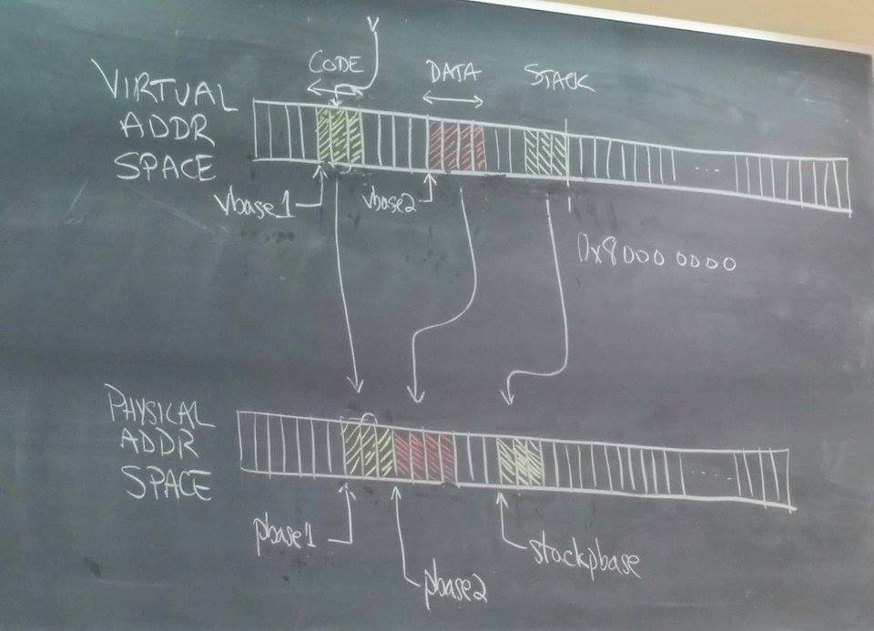

#CS 350

##[Google doc of my summary notes](https://docs.google.com/document/d/1O3com1drcWjmBeUi84OHJiMkI6o8YhH-aIk0-XDlfHA/edit?usp=sharing)

- suggestions are on, so feel free to comment about anything that looks wrong or is missing

##Sept 15: Intro

why is concurrency important?

- e.g. phone with 2-8 cores
- before they could try improving clock speed, power hungry, overheating
- could try really long pipeline to improve clock frequency, but there can be stalling and flushing which delays more stuff
- multiple cores let multiple threads run at same time to be more efficient

(then he told us a bunch of stories and it was fun)

###Intro Slides

##Sept 17

Review of executing a sequential program:

- figure out which instruction to run with PC that stores the memory address of instruction
- we store program code in a specific area of memory
 - so we don't accidentally run other stuff
 - usually code remains the same after we compile, so we can make it read only, and avoid running code we don't want to execute
 - security problem - if you can allow code executed from anywhere, people can put code in your stack, and then you execute random stuff that's bad (not important for this course)
- we have data stored in registers
- move/load/store instructions that can move stuff between registers and memory
- global variables are in program data
- local variables are stored in the stack, stack pointer 
- CPU fetches and executes

###Threads and Concurrency: slides 1-17

[Context switch example slides](https://d1b10bmlvqabco.cloudfront.net/attach/idj4uqwlfyu2uf/hbqmn85hst0c8/ieogtuuip7x/context_switch_example.pdf)

- thread 1 is running because thread 2 performed a voluntary context switch
- timer interrupt!
- PC set to interrupt handler
- save trap frame
- interrupt handling
- if we decide to switch threads, we do thread yield and thread switch, and switch frame - round robin scheduler says to go to thread 2
- restore switch frame in thread 2
- return from thread yield, and continue running thread 2

##Sept 22 and 24 and 29 (I stopped taking down dates for a bit)

Review: 

When is there context switch?

- voluntary
- involuntary
- ready queue
- thread is done running

###Threads and Concurrency: slides 18-24

###Syncronization: slides 1-9

[Concurrency example slides](https://d1b10bmlvqabco.cloudfront.net/attach/idj4uqwlfyu2uf/hbqmn85hst0c8/ievmnot7652c/concurrency_example.pdf)

- thread2 pops the element that thread1 saved, and frees it so it doesn't even exist anymore
- when we context switch back to thread1, it tries to access element->next which might fail because element's memory has been freed 
- it might not even crash it could just do bad things 
- we decrement the size of the list again (even though only one's been freed), we free again!

###Syncronization: slides 13-17

bathroom analogy

- only one person in stall at a time
- first you check if the door is locked
- if the stall is locked, you don't go in - you wait
- once they're done, they unlock
- first thing you do when you go in, you lock so no one else will come in

convert to code (building a spin lock - this one is broken though)

	while(lock == 1) {}
	lock = 1 
	....dostuff... 
	lock = 0

but what if there are multiple threads running? they both see it's unlocked and access at same time (if there's a context switch right before lock=1)

###Syncronization: slides 18-28

we have a problem - metaphor: sleeping beauty (first thread) waiting for prince (second thread)

- before sleeping beauty goes to sleep, she goes off and does some stuff
-  "I don't even know how this fairy tale goes - why do I try to do this metaphor"
- prince charming arrives, no one is there, so he leaves and continues
- sleeping beauty comes back and goes to bed - but then no prince comes to wake her up
- "we go from a fairy tale to a shakespearean tragedy. not good."

###Syncronization: slides 29-36

[Why the order for semaphore P is so important (and why it isn't FIFO)](https://d1b10bmlvqabco.cloudfront.net/attach/idj4uqwlfyu2uf/hbqmn85hst0c8/if5mj3aguwy3/synchronization_example.pdf)

## Oct 1

[Mutual Exclusion vs. Synchronization & Wait Channel Review & Semaphore Review](https://d1b10bmlvqabco.cloudfront.net/attach/idj4uqwlfyu2uf/hbqmn85hst0c8/if8ktc8gr6o2/synchronization_review.pdf)

Mutual Exclusion vs. Synchronization

- Mutual exclusion: Ensures that a shared object can only be accessed by one thread at a time
- synchronization is about establishing timing/order relationships among threads
- mutual exclusion is a type of synchronization problem, but can be solved simpler

Wait Channel Review 

- the lock is important so we don't modify the wchan structure at the same time from different places
- wakeone and wakeall aquires and releases wc_lock on their own
- wc_sleep does not acquire the lock on its own, must explicitly call wchan_lock before calling wchan_sleep (reasons for this on the slides, sumarized here)
 - wait channels are amost never used on their own
 - usually paired with a state variable that has its own lock
 - to ensure the state variable is modified together with wait channel, the thread has to always hold at least one lock, and has to release all locks before sleeping
 - so we lock the wchan before releasing the state variable lock, and therefore the wchan can't release the lock itself

Semaphore Review

- counter is never negative
- P blocks when counter is 0
- Not FIFO ordering
 - e.g. it gets woken up, put in ready queue, by the time it gets to front of queue it's blocked again
- must check sempahore count after woken up - hence while loop

###Syncronization: slides 37-48

##Oct 6

[Deadlock example](https://d1b10bmlvqabco.cloudfront.net/attach/idj4uqwlfyu2uf/hbqmn85hst0c8/iffphwfshl6o/deadlock_example.pdf)

Resource allocation graph

- resources point to threads that hold them, threads point to resources they’re waiting on 
- if there's a loop, we have deadlock

###Syncronization: slides 49-50

###Processes and the Kernel: slides 1-19

## Oct 8 

Assignment hints

- Cars inside
- Where cars inside are coming from/going
- Cars waiting
- if you can't go, you wait 
 - a single line of waiting cars on a single cv is bad - doesn't actually necessarily define order of when they can go, so inefficient
- cars can go from o->d that other cars are going, but it might not be a great idea because cars can continue going in that way and prevent other cars from going through the intersection

Recap of last class:

- a process is a bunch of threads, also has an address space so processes can't talk to each other
- there's kernel and user space, kernel is privileged
- to do something privileged, user space does a system call
 - special syscall instruction that brings you into privileged mode, takes parameters as registers
 - jumps to exception
 - sees we came from user space
 - switches stack pointer from user stack to kernel stack
 - saves trap frame

it's important to have kernel stack separate because 

- it has really privileged stuff - user accessing it would be a security vulnerability
- if the kernel messes up and runs out of stack space, it'd crash the kernel, but that's up to the kernel - if the user program can access it then it can crash the whole computer (we want it to only crash itself)

###Processes and the Kernel: slides 20-27

[system call example](https://d1b10bmlvqabco.cloudfront.net/attach/idj4uqwlfyu2uf/hbqmn85hst0c8/iffpkb0ybnn8/system_call_example.pdf)

- a thread stop running from inside a kernel, so when you switch to another thread you always will switch within the kernel

###Processes and the Kernel: slides 27-32?

## Oct 12 and 14 I was at a conference

I did meet up with Bernard for some extra info on the slides, and I put those notes on the slides

###Processes and the Kernel: slides 33?-43

###Virtual Memory: slides 1-20 //// end of midterm coverage

---- during that week we reached the end of midterm coverage ----

(I will probably update these notes later to have similar content for lectures since)

## Midterm review by IA

there are lots of [past midterms](https://www.student.cs.uwaterloo.ca/~cs350/common/old-exams/)

- W15 is an appropriate level of difficulty (we went through it all)
- S14 is also good to look at (we went through some of it)

know:

- difference between thread_fork and fork
- what a quantum is and how scheduling works
- dirty bit means writeable (but Bernard says don't worry about it since we haven't covered it yet)

be careful what base numbers are in

## Review lecture

[review slides](https://d1b10bmlvqabco.cloudfront.net/attach/idj4uqwlfyu2uf/hbqmn85hst0c8/igcoky4cl73h/CS350_Midterm_Review_F15.pdf)

- thread is defined as an abstraction of a program execution

what causes context switch:  

- thread yield (voluntary context switch)
- thread blocks on wait channel
- preemption (for fairness) - interrupt, goes into kernel, kernel decides if spending too much time, if too much the kernel calls thread yield

trapframe vs switchframe:

- trapframe is on kernel stack frame, generated by system call in common exception handler
- switchframe is saved when you context switch (thread_yield) -- also on kernel stack
- difference between switchframe and trapframe 
 - switchframe is voluntary
 - trapframe is involuntary
 - trapframe has to save temp registers (not guarenteed to be preserved after function call) because it was involuntary, switchframe doesn't

thread synchronization

- if all threads are working on different things, we don't need synchronization
- be able to define mutual exclusion and critical section
- volatile keyword: tells compiler to 
 - back off - don't optimize it because it might behave differently than expected
 - reload it each time we access it
 - store each time we modify it

enforcing mutual exclusion:

- on uniprocessor, disable interrupts - this doesn't work on multiprocessor where multiple threads are running at the same time
- spinlocks
 - test-and-set
 - compare-and-swap
 - load-link
 - (look up the difference between these 3!)
 - while(testandset) is inefficient because it keeps looping

potential problem with spinlocks:

- uses lots of resources without needing to - so much spinning
- solution: avoid spinning by going to sleep on a wait channel (what we did in A1)

###BIG HINT: review your assignments

###virtual memory will be a big part of the midterm

## Nov 3

[Assignment tips](https://d1b10bmlvqabco.cloudfront.net/attach/idj4uqwlfyu2uf/hbqmn85hst0c8/igiawxcpjsan/assignment_2b.pdf)

- this assignment lets us run multiple programs at the same time
- in the menu we use to run programs, we can't pass parameters, execv lets us pass paramters
- taking a look at runprogram:
 - it replaces data/memory/code/stack with a new program specified in first parameter
 - array is terminated by a null pointer so we can tell where it ends (b/c we don't pass length and this is C)
 - the menu has to do a lot of this work already, so a lot of this code already exists - check out runprogram
 - file systems - there are no file systems assignments in this course, so don't worry too much about how that works for now
 - as_create instead of as_copy (as_copy copies from parent, but there's no previous adress space to copy from)
 - program starts off with empty stack, pointer points to top of stack

What load elf does (don't need to know for a2 but we do for a3)

so what do we have to do?

- in the slide for execv the grey points are the ones we mostly just copy 
- parameters: path to program name, array of strings
- these parameters are pointers to somewhere in user space
 - pointer in user space could be null (don't dereference)
 - TLB still has the right address space, so that's good
 - problem: the user could send pointers to stuff in kernel space - the user can't access it, but now the kernel can access sensitive date for the user (bad!) --- use copyin/copyout to avoid this
- so count how many addresses there are, copy program path into the kernel
- when we make function calls, we pass arguments on the stack - similarily here we want to put the arguments on the stack

tips

- use USERSTACK instead of 0x8....
- check out common mistakes on the slides - and don't make them! :p
- we can't put two 4 byte things back to back in the stack, it won't recognize it as 2 different things, so we have to round up
- allocate enough space you need (backward), then write forwards (e.g. allocate 6 characters from top of stack then put h e l l o \0, ending at the top of the stack)
- TIP: get it working without argument passing first, argument passing is tricky so make sure the rest works first (pointer stuff is tricky)

