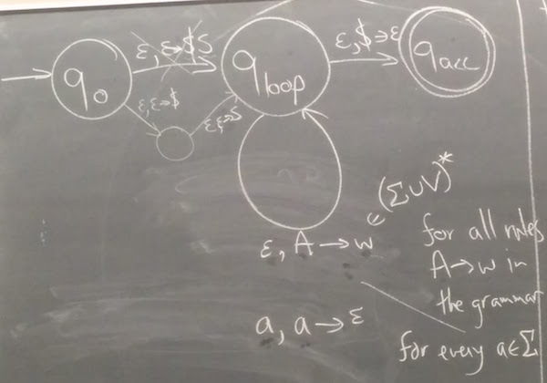
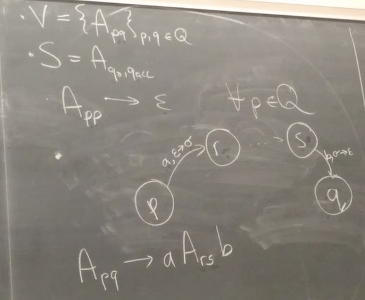
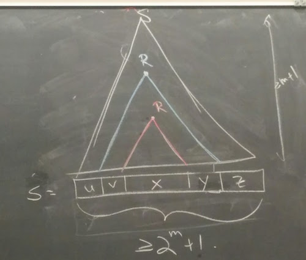
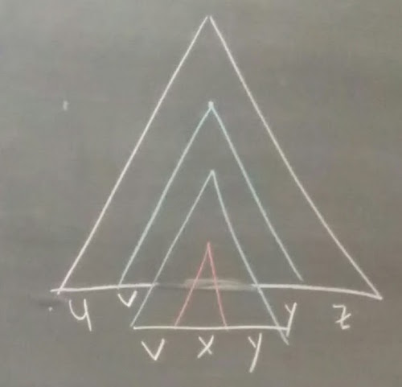
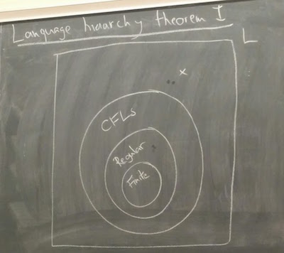
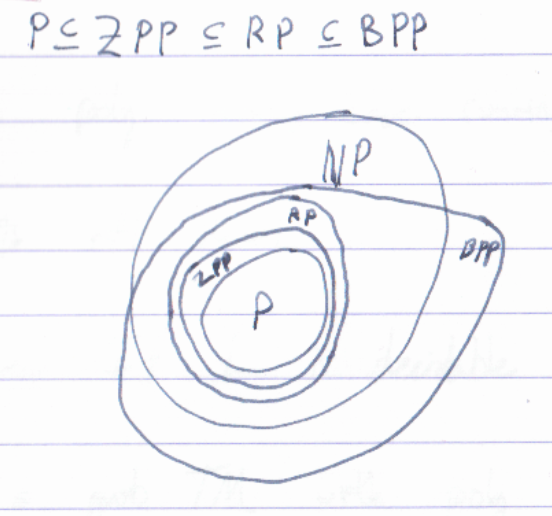
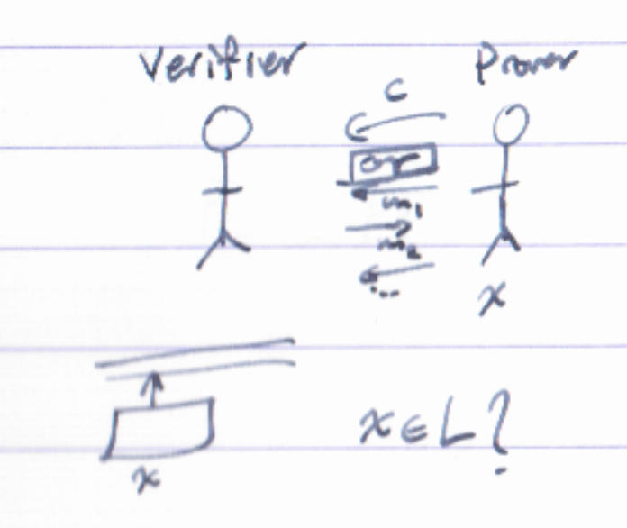

# CS 365

## Lecture 1 (Jan 3)

- Introductions
- Overview
- Languages

### Introductions

- [class website](https://cs.uwaterloo.ca/~eblais/courses/W17/CS365/)
- Instructor: Eric Blais (email: eric.blais@uwaterloo.ca) - goes by first name
- TA: Nathan Harms (email: nathan.harms@uwaterloo.ca)
- We went around the class and gave names and "why we're here"

### Overview part 1: why we're here (what does this course enable us to know)

- "this is the most ambitious material out of the whole faculty of math"
- why: to understand the fundamental capabilities and limitations of
  computers (sipser)
	- computer isn't just a machine as we think of it
	- here it means something that starts with a problem and finds the answer
	- we're here to determine which questions we can answer (there are some we
	  can *never* answer)

#### Some problems

pythagorean triples

- a^2 + b^2 = c^2
- pythagorean triples proposition: there are an infinite number of integer
	  triples (a, b, c) such that a^2 + b^2 = c^2
- proof: if (a, b, c) is a pythagorean triple, then so is (ka, kb, kc) for
	  any integer k, and (3, 4, 5) is a pythogarean triple

fermat's last theorem

- for any n > 2, a^n + b^n = c^n has NO integer solutions (a conjecture)
- found the note in the margin 30 years after he was dead
- 1637: found that it was proved true for n = 4 (by Fermat)
- 1753: proved for n = 3 (Euler)
- 1800s: new tools, n = 5, 7 (Germain, Legendre, ...)
- 1994: finally proved for all n (Wiles)

Hilbert's 10th problem

- solve Fermat's last theorem and all its natural variants (polynomial equations
  of finite degree with a finite number of variables)
- unlikely that there's some rule that determines solutions or not
- the solution required is an algorithm that you can run that tells you answer
- the solution: there is no algorithm. **the problem cannot be solved**
 - found by Davis, Putnam, Robinson, Matiyasevich

### Overview part 2: Administrivia

Assignments

- hard!
	- goal of the assignments will be to ask hard questions
	- ideal: you see the question, you think it's easy, you start work on it, you
  think you can't do it, you have an idea, you figure it out, in hindsight it
  was clear (that's the goal for assignemnts)
	- downside of this: there's no grunt work or filling the gaps on the
	  assignments - you need to be independent and do whatever of that you need
	  for yourself
	- everything builds on itself, don't let yourself fall of the edge of this
  	  is all easy --> no idea what's going on
- teamwork is encouraged!
	- teamwork does not mean copying or looking at solutions without thinking
	- work by yourself first, once you get stuck talk to each other, then write
	  your own solutions
	- details in the syllabus
	- teach each other! it will help you learn
- each assignment has 1 question to submit
	- but there'll be other questions too, they must be understood for exams
	- if you want to make sure you know the answer, go to office hours
- there are also bonus questions with bonus marks (bad work to mark ratio, but
  do them for your interest, or if you want a rec letter for grad school :p)
- the solution you submit should be edited, written clearly and neatly (not the
  first draft)
	- latex highly recommended (he'll put up a template for us)
- the top 10 out of 11 will be counted

Exams

- designed to be easy (as long as you've covered lectures + assignments)

Office hours

- Tuesdays right after class (11:30-12:30) -- I'm busy then :(
- TA will hopefully do Mondays 1-2 (tentative)

Piazza

- Eric doesn't want to use it, wants us to talk to each other
- it'll be set up for peer-to-peer but he won't be on there
- he wants us to work through doubt

Textbook

- Sipser required - fills in gaps of things we don't cover in the lectures
	- it's not all "part of the course" but it provides important context for
	  stuff we're learning and it's important to have that context
- because we're going faster, in lecture we'll be skipping sections/moving fast
- you can get the recommended text in a pdf online

Course breakdown

1. Automata Theory

2. Computability

3. Complexity theory (more focus on this than 360)

-------

### Languages

Definitions:

- an **alphabet** is a finite set of symbols
	- e.g. Σ = {0, 1}
	- e.g. {a, b, c, ... z}
	- e.g. the set of emojis
- a **string** over an alphabet Σ is a finite sequence of symbols from Σ
 	- e.g. s = `hello_world`
 	- e.g. t = `01101`
 	- e.g. u = `_t__-1`
- a **character** is **a symbol**

Notation:

- for  n >= 0, Σ^n is the set of all sequence of n symbols
- Σ* = union over n>=0 of Σ^n

Definition: A **language** L over the alphabet Σ is a set of strings over Σ
			(L is a subset of Σ*)

Main observation: any decision problem (yes/no question) can be described as a language.

- e.g. is k prime?
 	- Σ = {0, 1, 2, ..., 0}
 	- L\_prime = {2, 3, 5, 7, 11, 13, ... } (set of primes)
 	- so now the question is "is s ∈ Σ* in L\_prime?"
- e.g. is the graph G connected
	- Σ = {v\_1, v\_2, v\_3, ..., ;} --> doesn't work because infinite vertices
    and alphabets must be finite
	- can rewrite as the string v1 instead of a single symbol v\_1 (because now
    we have finite characters v and 0-9)
	- L\_conn = {v1v2;v2v3;v1v3; ...} (connected vertices)
	- another solution: Σ = {0, 1}, L\_conn = {s in Σ* : s is matrix
    representation of a connected graph}
- e.g. addition! (additive identities)
	- Σ = {0, 1, ..., 0, +, =}
	- L\_add = {0+0=0, 0+1=1, 1+1=2, ...}

Note: even though this was stated as a fact, we never "proved" it and I'm pretty
sure it's actually false.

## Lecture 2 (Jan 5)

- Finite automata
- Nondeterministic FAs

News:

- A1 is out (1 problem to submit, 3 other exercises, bonus problem)
	- if you don't have a complete solution to the bonus, still write down
   	  what you thought of, you can get part marks
	- always start assignment with acknowledgement of who you collaborated with
      (even if it wasn't anyone)
- Piazza is live
- Office hours are confirmed (M 1-2, T 11:30-12:30)

### Finite automata

Recall:

- **goal**: determine which decision problems we can solve

Thesis 1: "decision problems" <=> languages

- any challenges to this thesis? (asked to the class)
- challenge: "is a point on this given line?"" -- real numbers are limitations,
  but apparently there's a way to do this that's outside the scope of our course?
- challenge: "is this a language?"" -- languages can be infinite input, similar
  issue

Algorithm solving a problem

- black box that turns w -> w in L?
- (w for string, think of it as standing for word, so the black box turns a word
   into another word)
- the black box is a physical computer with a program that runs, you sit down
  at the keyboard and enter the input, and it responds yes or no
	- this is too complicated, hard to deal with
  	- when you sit down, you can describe the state of the computer, the RAM,
  	  CPU, registers, etc
  	- then you type a character e.g. 0, and that'd put your computer in another
  	  state, then each new character of input you give it changes the state again
    - when you press enter, if you're in an accepting state it outputs yes,
      otherwise, no

Thesis 2: "solving a language" <=> FA (finite automaton)

Definition: A **(deterministic) finite automaton** is 5-tuple (Q, Σ, δ, q0, F)

- Q: *finite* set of states
- Σ: alphabet (finite set of symbols)
- δ: transition function (given a state in Q and some symbol in Σ, outputs new
     state in Q), δ: Q x Σ -> Q
- q0: initial state (where you start)
- F: subset of Q where you output yes (accepting states)

Definition: A FA **accepts** w in Σ* iff there is a sequence of states
r\_0, r\_1, ..., r\_n (where n >= 0) in Q such that, these three conditions
hold:

- for all i in [n] := {1, 2, ..., n}, we have r\_i = δ(r\_{i-1}, w\_i)
- r\_n is in F
- r\_0 = q\_0

Definition: The language recognized (or accepted) by a finite automata M is
L = {w | M accepts w}

Definition: the empty string is denoted by ɛ

Observation: L\_ɛ = {ɛ}. L\_∅ = ∅ (empty set). **note that L\_ɛ != L\_∅**

Example: (alphabet {1, 0})

(i) L = {w | last character of w is 1}

(ii) L = {w | next to last character of w is 1} (there were some mistakes in my
dfa so I cut them out lol)

(iii) L = {w | w has same number of substrings 01 as 10}
 - e.g. 101 is in L, 1010 is not
 - the DFA iii was left as an *EXERCISE\**, someone did it in 5 states appparently

Definition: A language L is **regular** iff it is recognized by some finite automaton

### Nondeterministic finite automata

Definition: A **nondeterministic FA** is a 5 tuple  (Q, Σ, δ, q0, F) where

- Q, Σ, q0, F as before
- δ: Q x Σ ->  P(Q) where P(Q) is the set of subsets of Q (power set)

Definition: the NFA M accepts w in Σ* iff there exists
r\_0, r\_1, ..., r\_n in Q such that (for any n >= 0)

- r\_0 = q\_0
- r\_n is in F
- for all i in [n], r\_i **is in the set** δ(r\_{i-1}, w\_i)
- ie "there is at least one path that accepts"

Definition: NFA N recognizes L iff L = {w | N accepts w} (same as DFA!)

Theorem: Every language that can be recognized by an NFA is regular.

Proof sketch: Given an NFA N (Q, Σ, δ, q0, F), we can build a DFA M
(Q', Σ', δ', q0', F') that recognizes the same language.

- Q' = P(Q)
- q0' = {q0} (has to be a set)
- F' = {subsets R in Q | R union F is not empty}
- δ'(R in Q, σ in Σ) = union (over q in R) of δ(q, σ)

Need to argue that L(M) == L(N) (*EXERCISE\**: convince yourself this is true)

Definition: **ɛ-NFAs** can have transition functions on the character ɛ

- the above theorem (regular) still holds with ɛ-NFAs
- *EXERCISE\** show that every language that can be recognized by NFAs with
  ɛ-transitions is regular

## Lecture 3 (Jan 10)

### Establishing regularity

L = {w\_1 w\_2 ... w\_n: n>=2, w\_{n-1} = 1} (i.e. second last symbol is 1)

Proposition: L is regular

Proof:

here's a DFA:

- is this the end? no! we want to prove it's actually correct
- rename q0 to be q00, others q01, q10, q11, etc (like I did in lecture 1)
- if you name states like this (with no q0 anymore), you should show which is
  the starting state by adding an arrow pointing to it

Aside:

- Q = {q00, q01, q10, q11}
- Σ = {0, 1}
- δ = table with first column q, second column σ, third column δ(q, σ)
  - q00, 0, q00
  - q00, 1, q01
  - .... etc
- q0 = q00
- F = {q10, q11}

Back to the proof:

- we want to show that every string in the language will be accepted, and
  everything that won't will not be accepted
- you could prove by induction, but this is simpler:
	- first, M does not accept the empty string ε because q00 is not in F
	- the only states that can be reached with one transition are q00 and q01,
	  neither of which is in F, so M correctly does not accept them
	- let w = w\_1...w\_n for n>=2, where w\_{n-1} = 1
	- for any state q in Q, δ(q, 1) is in {q01, q11}, so the state r\_{n-1}
	  reached after reading n-1 symbols is q01 or q11
	- for any σ in {0, 1}, δ(q01, σ) is in {q10, q11} and δ(q11, σ) is in
	  {q10, q11}. In all these cases, we end up in a state in F and M correctly
	  accepts.
	- When w = w\_1...w\_n for n>=2, and w\_{n-1} = 0 (similar argument shows
	  that M never accepts)
- ^ this is the level of detail expected in our proofs

### Regular expressions

Theorem: If L is a language over Σ that satisfies:

- (i) L = ∅
- (ii) L = {ɛ}
- (iii) L = {σ} for some σ in Σ
- (iv) L = L1 U L2 for some regular languages L1, L2 (union)
- (v) L = L1L2 := {w1w2 : w1 in L1, w2 in L2} for regular L1L2 (concatenation)
- or
- (vi) L = L1* := {w1..wn : n>=0, w1,...,wn in L1} for regular L1 (kleene star)

then L is regular.

Proof (sketches):

- warning: explanations given out loud, proofs on the board are much sketchier
  than what's expected on assignments

Definition: a string R over Σ U {`ϵ'`, `|`, `*`, `(`, `)`} is a **regular
expression** if:

 - (i) R = ε
 - (ii) R = ϵ'  **INCOMPLETE/QUESTION: what's `ϵ'`?**
 - (iii) R = σ for any σ in Σ
 - (iv) R = R1|R2 for any r.e. R1, R2
 - (v) R = R1R2 for any r.e. R1, R2
 - (vi) R = R1* for any r.e. R1, or
 - (vii) R = (R1) for any r.e. R1

Order of operations: * then concatenation then |

Definition: L(R) is the language represented by regular expression R

*EXERCISE\**: Define "representation of languages by regular expressions"

*EXERCISE\**: Define a regular expression that represents the language

- (i) all strings that end in 1: (0|1)\*1
- (ii) even #1s: 0\* (10\*10\*)\*
- (iii) even number of 1s and even number of 0s: ((1 (00)\* 1)| (00\*) | (0 (11)\* 0) | (0101) )\* maybe? -- left as exercise

Note: the language of regular expressions is not regular, because you can't
match brackets with a DFA

**Kleene's theorem**: The language L is regular iff it can be represented by a
regular expression

Proof sketch (all the details are in the book)

(1) regular expression -> NFA

- we did this earlier this lecture (and it's called Thompson's algorithm, '68)

(2) DFA -> regular expression (via generalized NFAs)

- add start and end states
- for every transition that has more than one symbol (e.g. a, b) replace
  with an or (e.g. a|b)
- for each transition, replace those 2 nodes with the regular expression
  (remove states of M one at a time)
- this is known as Kleene's algorithm

## Lecture 4 (Jan 12)

### A non-regular language

Thesis 1: Decision problems = languages

Thesis 2: "Solving" = recognizable by FA

but...

#### Theorem: L = {0^n 1^n : n >= 0} is not regular

Tool for proof: pigeonhole principle

- if I have n pigeons and I put them in m boxes for any m < n, at least one
  box contains more than one pigeon

Proof:
- by contradiction
- assume there is a DFA M with m states that recognizes L. Consider the states
  in M for r0, r1, ..., rm reached after reading ε, 0, 00, 000 ... 0^m
- by the pigeonhole principle, there exist 0 <= k < l <=m such that rk = rl
- so M is in the same state after reading 0^k and 0^l. So it must also be in
  the same state after reading `0^k w` and `0^l w` for any string w in {0,1}*.
- but then consider w = 1^k. Then M either accepts or rejects both `0^k 1^k` and
  `0^l 1^k`. In either case, M does not recognize L.
- =><= (symbol Eric likes to use to say contradiction)
- done

### Pumping lemma

Lemma: for any regular language L, there exists p >= 1 (the **pumping length**)
  	   such that every s in L of length greater than p can be expressed as s = xyz
  	   such that:
  - (i) for all i >=0, x y^i z is in L
  - (ii) |y| > 0
  - (iii) |xy| <= p

Proof:

- let M be a DFA that recognizes L. Let m be the number of states in M.
- set p=m
- fix any s in L of length |s| > p.
- by the pigeonhole principle, if r0, ... rp are the states reached in M after
  reading i=0,1,...,p symbols of s, there exist 0 <= k < l <= p such that rk=rl
- Let
	- x = s\_1...s\_k
	- y = s\_{k+1},...,s\_l
	- z = s\_{l+1},...,s\_|s|
- we have that |xy| = l <= p
- and |y| > 0 since k < l y is length l-k > 0
- and rk = rl means that M reaches the same state after reading xw and xyw for
  any w in Σ*. In particular, with w=z, we see that M reaches the same state on
  xz and xyz=s. Since M accepts s, it accepts xz as well. When w = yz, we see
  that M reaches same state on both xyz=s and xyyz.
  	- rest: induction on i >= 2
  	- base case done here
  	- inductive step: IH states that we have already shown x y^i-1 z is in L.
  	  Now consider x y^i z. Set w = y^i-1 z. Then M reaches the same state on
  	  both x y^i-1 z in L, and x y y^i-1 z = x y^i z. So x y^i z is in L also.

Definition: L has the **pumping property** if it satisfies the condition of the
lemma.

Using pumping lemma

- to show L is not regular, it suffices to show that it does not have the
  pumping property.
- <=> show that: **for any** p>=1, **there is** a string s in L of length
  |s| >= p such that **for any** decomposition s = xyz with |y| >=0 and
  |xy| <= p, **there exists** i>=0 such that x y^i z is not in L
  - note that it's easy to make a mistake in these proofsbecause of all the "for
    any", "there is", etc and it's easy to mix them up
- example: the 0^n 1^n language is not regular
 - for any p >= 1, we can choose s = 0^p 1^p in L
 - fix any decomposition s = xyz, such that |y| > 0 and |xy| <= p
 - note that because |xy| <= p, y is only 0s
 - so we just pick i != 1, and then there is a different number of 1s and 0s
 - specific example: when i = 2, x y^2 z = 0^p+j 1^p which isn't in L

more exercises:

(i) L = {w in {0,1}* : w has more 1s than 0s}

- pick s = 0^p 1^p+1
- then y will be only 0s
- then just have i=2, now there's more 0s than 1s

(ii) L = {ww : w is in {0, 1}*}

- 0^p 1^p 0^p 1^p
- y will be 0s from the first block of 0s
- choose i = 2, now there's more 0s in the left w

(iii) L = {c^n^2 : n>= 0, c in Σ}

- c^p^2
- proof left as *EXERCISE\**

### Glimpse beyond

- CS 462 covers more stuff with FAs
  - Myrill-Nehode Thoerem
  - Theorem: if L is a language over σ = {1} that is recognized by an NFA
    with n states, it can be recognized by a DFA with e^(sqrt(n)*logn) states

## Lecture 5 (Jan 17)

### Pushdown automata

Thesis 1 disproved: "solving" != recognizing a language with a FA

e.g. these can't be solved by recognizing with a FA

- L = {0^n 1^n : n >= 1}
- L = {w in {`(`,`)`}* : w is a matching string of parenthesis}
- L = {w in {0, 1}* : w = w^R}

Definition: for any set of symbols S, the set S\_ε = S union ε

Definition: a (nondeterministic) **pushdown automata** (PDA) is a 6-tuple
(Q, Σ, Γ, δ, F, q0) where

- Q = finite set of states
- Σ = input alphabet
- Γ = stack alphabet
- F = set of accepting states
- q0 = initial state

What about δ?

- δ: Q x Σ\_ε x `Γ ?` -> P(Q x Γ\_ε)

what should we do for Γ (as an exercise to think about how carefully we must
define things)

- Γ* is much to powerful - if we can see the whole stack, we can put the whole
  string there then accept if that string is in the language
- Γ isn't right because there could be no symbol there
- Γ\_ε is better

we make Σ into Σ\_ε

- so transitions are functions of the input or the stack or both or neither

Definition: A PDA M **accepts** w in Σ^n if there exists an m >= n and symbols
w'1, ..., w'm in Σ\_ε and states r0,...,rm and strings s0,...,sm in Γ* such that:

1. r0 = q0, s0 = ε
2. rm is in F
3. w = w'1 w'2 ... w'm all concatented (some w'i might be ε)
4. for every i in [m], there exists a, b in Γ\_ε, t in Γ\_ε* such that (ri, b) is
   in δ(r\_{i-1}, w'i, a) and si = bt and s\_{i-1} = at --- (ie from state i-1
   to state i, you read the next character, take a off the stack, put b back on)

for DFA type diagrams, the transition arrows have (a, b -> c) where a is symbol
in input, b is top of stack, c is what you put on the stack (where a, b, c could
each be empty)

e.g.

- L = matching parentheses (didn't do this in class -- *EXERCISE\**)
- L = {w in {0,1}* : w = w^R} (didn't do this in class -- *EXERCISE\**)
- L = {0^n 1^n : n>=1}
  - nice trick where you put a special character at the bottom of the stack
    so that we can check if stack is empty
  - 

### Context-free grammars

Definition: The PDA M **recognizes** the language L if L = {w : M accepts w}

Definition: L is a **context-free language** if it is recognized by some PDA

Thesis 2: "solving" = recognizable by PDA?

Definition: A **context-free grammar** is a 4-tuple (V, Σ, R, S) where

- V = finite set of **variables**
- Σ = finite set of **terminal symbols**
- R = set of rules V -> (V union Σ)*
  - must be finite, or else we can have rules for each word in the language
- S = start variable

Definition: uAv **yields** uwv in a grammar G for some u, v, w ∈ (V union Σ)*,
A ∈ V if the rule (A -> w) ∈ R (uAv => uwv)

Definition: u =>* v (u derives v) in G for u, v ∈ (V union Σ)* if there is a
sequence u0, ..., um ∈ (V union Σ)* such that

- u = u0,
- for all i in [m] u\_{i-1} yields u in G, and
- v = um

this satisfies the same 3 examples we had for PDA in this class

Definition: The language of a CFG G is L(G) = {w in Σ* : S =>* w in G}

e.g. syntax

- S -> AO
- A -> AA | O | OO

e.g. 0^n 1^n

- S -> 01 | 0S1

e.g. parens

- S  = () | SS | ε

e.g. palindrome

- S = 0S0 | 1S1 | ε | 0 | 1

## Lecture 6 (Jan 19)

### CFL equivalence theorem

Theorem: A language is context-free iff it is generated by a CFG.

#### Proof sketch: CFG -> PDA

(note: this proof sketch is pretty sketchy so you might want to read the text
to get a clear idea of how it works)

what about q0 -> qloop -> qacc

- apply all the rules until we get the input string we're testing for
- e.g. S -> AB -> 0AB -> ... -> 00000B -> ... -> 001
 - this doesn't work because the stack - when we use the stack we can only read
   the top character

q0, qloop, qacc transitions

- qo-> qloop on (ε, ε->$S)
 - (note you can't actually push both $ and S at once, you'd have a middle state
   and do q0 -> (ε, ε -> $) -> middle state -> (ε, ε -> S) -> qloop
- qloop to self with (ε,A->w) for all rules A->w in the grammar, w in
  (Σ union V)*
- qloop to self with (a,a -> ε) for every a in the alphabet
- qloop to qacc with (ε, $ -> ε)

#### PDA -> CFG

first make the PDA to be of this form:

1. One accept state
2. Every transition either pushes a symbol on the stack or pops one off (but not both)
3. Only accept when stack is empty
 - claim: you can always do this for any PDA. have qacc loop to itself with (ε, σ -> ε), then have qacc -> qacc' with (ε, & -> ε) where if you're using $, & has to be different and you'd put it on the stack before $

How this works:

- V = {A\_pq} p,q in Q
- S = A_q0,qacc
- A\_pp -> ε for all p in Q
- p --(a, ε -> σ)--> r --> ... --> s --(b, σ -> ε)--> q
 - case 1: everything from states r to s that ends with the same stack as it
   started --- then if we can read a before that (from state p) and b after it
   (going to state q), then it's the rule (A\_pq -> a Ars b)
 - case 2: the stack *does* change between r and s --- can use rule
   (A\_pq -> A\_pr A\_rq) for all r in Q

Showing that a string is in the grammar

- algorithm idea: try all combinations of rules, until you maybe make the string
- because some symbols can go to ε (if you have a __ -> epislon rule), you
  can keep trying to make your string by trying more rules and making it
  longer -- so it might not terminate!

### Chomsky Normal Form

Definition: the CFG G is in Chomsky Normal Form if all its rules are of the form:

- A -> BC, for any A in V, and B, C in V \ {S}
- A -> a, for any A in V, a in alphabet
- S -> ε (you can only get ε at the very start)

Theorem: For every CFG G, there is a CFG G' in Chromsky Normal Form that
generates the same language.

Hm, but we can still do A -> AA infinitely... we fix this by stopping the
algorithm when we're made something longer than the string we're checking
(because there's no A -> ε, we can't make the string shorter again)

#### Proof:

update A -> a1 ... ak

- Add variables  c\_a for every a in the alphabet
- to G', convert the rule to A -> c\_a1 c\_a2 ... c\_ak
- add rules for c\_a -> a
- so we get
 - A -> c\_a1 A(1)
 - A(1) -> c\_a2 A(2)
 - ...
 - A(k-2) -> c\_ak-1 c\_ak

update A -> ε

- "propogate"
- B -> ABC | BC

update A -> B

- can't have this because needs to go to exactly two variables
- propogate again!

A -> S

- add S -> S'
- and do A -> S'

## Regular grammars

Definition: The CFG G is **regular** if the rules are of the form

- A -> bC (C != S, do we need this if we change the last rule?)
- A -> a
- S -> A | ε (the typical definition is A -> ε, are these equiv? left as an open question)

Theorem: The language L is regular iff it is generated by a regular grammar

## Lecture 7 (Jan 24)

### Pumping Lemma for CFLs

Lemma: If L is a CFL, then there is p > 0 (pumping length) such that every
string s in L of length |s| >= p can be decomposed as s = uvxyz, where

 - for every i, the string u v^i x y^i z is in L
 - |v| + |y| > 0
 - |vxy| <= p

Proving:

- we can't take the exact same approach as with DFAs, where we use pigeon hole
  and have this cycle, because now we have to think about the stack
- overall it's a mess, so let's use grammars instead

Proof:

- let G be a grammar that generates L and that is Chomsky Normal Form.
- let m be the # of variables in G
- Aside:
  - any string you can make with a grammar, you can draw a tree that shows how
    you get from S to the string (parse tree)
  - prop: if G is in CNF, any parse tree that generates a string of
    length >= 2^d + 1 must have depth > d
- let p = 2^(m + 1)
- so we know |s| >= 2^(m + 1)
- so for any s in L of length |s| >= p, the parse tree that generates s has
  depth > m
- so there is a path from the root to a terminal symbol in s that has length >=
  m+1 in the parse tree. by pigeonhole, one varible appears at least twice in
  this path.
- Some exploration

- The parse tree tells that there is a derivation
  - (a) S -> uRz
  - (b) R -> vRy, and
  - (c) R -> x
- Following the derivation (a), then the derivation (b) i times, and derivation
  (c), we obtain the string u v^i x y^i z
- The rule applied at the top (blue) R must be R -> AB for some variables A, B.
  the var that does not generate the lower R must generate a string of length >=
  1 as v or y
- note that we can similarly prove that |x| > 0 and |u| + |z| > 0, but these
  don't seem like we'd need them to prove this pumping lemma
- by pigeonhole, we can find a repeated variable in the a path where the subtree
  from the top variable has depth at most 2^(m+1)
  - therefore the string vxy generated by this subtree has length <= p

### Using the pumping lemma

e.g.  show that L = {0^n 1^n 2^n : n >= 0} is not context free

 - fix any p > 0, choose s = 0^p 1^p 2^p
 - if L is CF, there exists u, v, x, y, z such that s=uvxyz and |vxy| <= p
 - the string vxy cannot contain all three characters 0, 1, 2 and vy must
   contain some characters, so u v^2 x y^2 z cannot have same number of 0s, 1s,
   and 2s, so u v^2 x y^2 z is not in L (contradiction)

e.g.  show that L = {ww : w in {0,1}*} is not context free

 - 0^p 1 0^p 1, and 0^p 1^p 0^p 1^p look like they'd both work, but only one
   does. left as an *EXERCISE\** - answer is in the book

### Language Hierarchy Theorem 1 (more of them to come later in the course)

- we have finite languages, then regular languages which contain finite languages
  and goes beyond, then CFLs which contain regular languges and goes beyond,
  and there's more beyond

- It's actually pretty remarkable that each new class of language totally covers
  the one we saw before

### Glimpse Beyond

- the PDAs we've seen are very much NOT the same as deterministic PDAs (section
  2.4 in the book)
- L1 = {w#w^R : w in {0,1}*}, in DPDAs
- L2 = {ww^R : w in {0,1}*}, not in DPDAs

## Lecture 8 (Jan 26)

### Turing machines

Definition: A **Turing machine** is a 7-tuple
(Q, Σ, Γ, δ, q\_0, q\_acc, q\_rej)

where:

- Q is a finite set of states
- Σ is the input alphabet which does not contain |_| (I'm gonna use ▄ and we're calling it the "blank character")
 - ▄ fills up the tape where your input isn't
- Γ is the tape alphabet: can have Σ, ▄, and anything else (ie it's the superset of Σ union {▄})
- δ is Q x Γ -> Q x Γ x {L, R}
- q0 is in the initial state
- q\_acc and q\_rej are halting states, accepting and rejecting states

Definition: a **configuration** of a TM (turing machine) is a pair (q, w) where

- q in Q is the current state
- w in (Γ union Γ-bar)* such that
 - (Γ-bar is Γ with a bar over it)
 - Γ-bar = {alpha-bar : alpha in Γ} (a copied alphabet)
 - w contains exactly 1 character from Γ-bar (shows the current position)

Definition2: A **configuration** is a triple (q, w, m) where

- q is in Q
- w is in Γ*
- m is an integer (marking our place)

Definition3: A **configuration** is a string w in (Delta union Q)* that contains
exactly one value from Q

- e.g. 1A000101 shows that we're in state A and the position is the 0 after A

Definition: The **configuration** (q, w) **yields** the configuration (q', w')
in the Turing Machine M if

- w = x a b-bar c y for some strings x, y in Γ* and characters a,b,c in Γ
- one of these two cases applies:
 - w' = x a-bar d c y where δ(q, b) = (q', d, L)
 - w' = x a d c-bar y where δ(q, b) u= (q', d, R)
- and q is not q\_acc or q\_rej (we could do this cleaner if we defined δ as a
  function that only takes q that aren't accepting or rejecting states)
- there's a symbol for 'yields in one step' that looks kinda like `|-` (though
  maybe the book actually uses =>, Eric forgets)
- NOTE: this doesn't account for edge cases with blank characters, so make sure
  to read the actual definition in the book

Definition: The configuration (q, w) **derives** (q', w') if there is a sequence
of configurations c1,...,ck for k>=0 such that
(q, w) => c1 => c2 => ... => ck => (q', w')

Definition: The TM M **accepts** x in Σ* if (q0, x-bar) derives (q_acc, y)
for some y in (Γ union Γ-bar)* with just one character in y that's in
Γ-bar, and where x-bar = a-bar x' if x = ax'

Definition: The TM M **rejects** x in Σ* if (q0, x-bar) derives (q_rej, y)
for some y in (Γ union Γ-bar)* with just one character in y that's in
Γ-bar, and where x-bar = a-bar x' if x = ax'

Definition: The TM M **halts** on x in Σ* if it accepts or rejects x

Definition: The TM **decides** the language L in Σ* if it accepts every x in
L and rejects every x in Σ* \ L

Definition: The TM M **recognizes** L that's a subset of Σ* if
{x in Σ* : M accepts x} = L

(if a TM recognizes L, it doesn't necessarily decide it -
but if it decides it, it recognizes it)

### Church-Turing thesis

C-T Thesis: Every problem that can be solved by *any kind of algorithm*
corresponds to a decidable language. There will never be a proof of this

e.g. Design a turing machine that decides L = {x#x : x in {0,1}*}

we talked about it, see the text for a full explanation
(has to do with going back and forth and checking for character matches)

e.g. what does this TM do on empty input? (took a picture)

- _* (move to state B)
- 1 _* (to state A)
- 1* 1 (C)
- _* 1 1 (B)
- _* 1 1 1 (A)
- 1 1* 1 1 1 (B)
- ...
- 1 1 1 1 1 _* to A
- 1 1 1 1 1* 1 to C
- to q_acc!

this is the busy beaver 3 state (how many 1s until it accepts)

## Lecture 9 (Jan 31)

Recall definitions of a turing machine deciding and recognizing a language

- turns out decidable languages are a superset of context-free, and recognizable
  are super-set of decidable

### Power of TMs

Theorem: Every regular language is decidable

Proof: Let M = (Q, Σ, δ, q0, F) be a DFA that recognizes the regular
languages L. Let T = (Q', Σ', Γ', δ', q0', q\_acc, q\_rej) be the TM
defined by

- Q' = Q union (q\_acc, q\_rej)
- q0' = q0
- Σ' = Σ
- Γ' = Σ union { ▄ } (where ▄ is the blank character)
- δ'(q,a) = (δ(q, a), a, R) for every a in Σ
- δ'(q, ▄) =
  - (q\_rej, ▄, R)   if q is not in F
  - (q\_acc, ▄, R)   if q is in F

Theorem: Every context-free language is decidable

Proof sketch:

- Wrong approach: simulate a PDA
 - you could have a PDA with the start state transitioning to itself with
   (ε, ε -> 1) and to something else with (0, 1 -> ε)
 - if you always pick one to try first, and always try the ε transition,
   you loop forever and never decide the language
- Right way: simulate/implement the CFG hat generates the CFL L
 - key idea: implement a CFG in Chomsky normal form for L
 - this lets you enumerate _all_ possible stings of length equal to the input
   generated by the grammar in finite time

### Variants of TMs

Defn: let VarTM be the extension of TM model where we have a finite # of
variables that take values in Γ.

- Theorem: Every language decidable by VarTMs is also decidable by TMs
- Proof: Let Q' = Q x Γ^m where m is the number of variables in the VarTM
(ie we just fold in all finite combinations of values for variables into the
states)

Defn: Let SubTM be the extension of TM where we can call other TMs and run them
as a black box

- Theorem: Every language decidable by SubTMs is also decidable by TMs
- Proofish: We can replace every call to a subroutine with a copy of the tape
  for that TM, and when it rejcts we go back to rej, and when we accept from
  the sub-TM, we go back to where it was called
- but recursion? how do we deal with infinite stack

Defn: Let StackTM be the extension where we can have infinte stack

- we can deal with this by having a stack on empty tape to the right of the
  original input/tape and keep adding to it infinitely

Defn: Let MultTM be the extension of TM where TMs have a constant number k of
tapes

- soln: e.g. 3 tapes, appended to each other, keep track of where on each tape
  you are on each
- keep track of where you are with variables? but they could have infinite value
- instead use a special character (can double size of alphabet, like before) to
  show where you are in each tape
- you can append to the end of a tape by pushing the rest of the tape (which
  shouldn't go on forever) to the side to make room

### Nondeterministic TMs

Defn: a **nondeterministic** TM is a 7-tuple
(Q, Σ, Γ, δ, q0, q\_acc, q\_rej) where:

  - δ: Q x Γ -> P(Q x Γ x {L, R})
  - this is new because of it's a set and not just one transition (like DFA/NFA)

Defn: the nondeterministic TM **decides** L if

- for every x in L, at least one path leads to the accept state
- for every x not in L, no path leads to the accept state
- for every x in Σ*, all possible paths terminate (at q\_acc, q\_rej, or in
  a dead end)

Defn: The NTM M recognizes L if (i) and (ii) are satisfied

Theorem: if L is decidable (or recognizable) by a NTM, then it is also decidable
(or recognizable) by a TM

Proof: *EXERCISE\**! there's also a right and a wrong way to do it

## Lecture 10 (Feb 2)

### Midterm

- Next week! in class
- allowed one sheet of paper (cheat sheet), can write on both sides
- assignment 5 isn't for being handed in, but we're expected to know exercises
- content: up to and including today's lecture

### Countability

Def'n: the cardinality (# of elements) of S is at most that of T, |S| <= |T|,
iff there is a one-to-one mapping from S to T (or equivalently, an
onto/surjective mapping from T to S)

Def'n: |S| = |T| if |S| <= |T| and |T| <= |S|

Def'n: The set S is **countable** iff |S| <= |N| where N = {1, 2, 3...}

#### Exercises:

even natural numbers

 - map to dividing by 2

integers

 - count as 0, 1, -1, 2, -2
 - explicitly, map a to (-2a + 1) if a <= 0, and (2a) if a is a > 0

Q+ = {m/n : m, n are natural numbers}

 - make a 2D grid mxn, start in the top left corner, and go back and forth
   diagonally

 - a nice alternative is f(m, n) = 2^m 3^n

T = {M : M is a TM}

 - we only care about the funtionality, if two turing machines behave the same
   but have different state names or alphabets, then we consider them the same
 - can encode M as |Q|#|Σ|#|Γ|#|...|#q0#qrej
 - where q0, qrej, 1acc are numbers between 1 and |Q|
 - for δ (where the ... is) we encode every (q,a) in QxΓ as their index
   in our ordering of Q and Γ with with its output triple in QxΓx{L,R}
   we can add all of them because Q and Γ are finite size
 - now that M is encoded into an ascii string, we can encode it into binary

#### Thm: The Set of all Turing machines is countable

proof idea:

- we can encode each TM into an asciii string, write it in binary.
- take the mapping that associates M with the natural number whose binary
  representation is the same

### Uncountable sets

Defn: the set S is uncountable if it is *not* countable

S is uncountable iff it is impossible to map N to S in a way that covers each
element of S

Thm: The set L of all language over Σ = {a,b} is uncountable.

Proof: by **diagonalization**

- assume by contradiction that L is countable. So there is a mapping Φ: N->L
such that every l in L equals Φ(n) for some n in N
- every l in L can e represented as a infinite sqeuence s over {0,1} where the
  ith element of s indiciates whether the ith string over {a,b} (countable) is
  in L or not
  e.g. L = {b, aa, bb} = 01101000... (where our ordering was a, b, aa, ab, bb...)
- if we assume that L is countable, then there's some Φ mapping of N->L
- then Φ can be written out as, e.g.
 - n -> Φ(n)
 - 1 -> 00000..
 - 2 -> 10000..
 - 3 -> 111010011...
 - 4 -> 000111... (random)
 - ....
- consider the language L* with corresponding sequence is obtained by flipping
  the ith coordinate of the sequence for Φ(i)
- by construction of Φ, there must exist n* in N such that Φ(n*) = L*
- Does L* include the n*-th string? if you say yes or no, you get a
  contradiction and this completes the proof

## Lecture 11 (Feb 7)

### An Undecidable Problem

Def'n: `A_TM = {<M, w> : M is a TM, M accepts w}`

Theorem: A_TM is recognizable

Proof: let U be the TM that

- (i) simulates M on w
- (ii) accept if M ever reaches its accept state; reject otherwise
- we do this with multiple tapes: one for M, one for w, one that holds the
  current state (and you use that state and M to decide what to do next)

Defn: U is known as a universal Turing machine

Theorem: A_TM is undecidable

Proof: by contradiction

Let H be a TM that decides A_TM. Let D be the TM that takes as input <M> and

- (i) run H as a subroutine on `<M, < M >>`
- (ii) accept if H rejects; reject if H accepts
- note that D halts on every input
- does D accept or reject `<D>`?
 - D(`<D>`) accepts iff H rejects D on `<D>`, which means D rejects input `<D>`
 - D(`<D>`) rejects iff H accepts D on `<D>`, which means D accepts input `<D>`
 - contradiction either way!
- so our assumption that A_TM is decidable is false

How is this related to diagonalization? check out section 4.2 in the text

### Halting problem

Def'n: `HALT_TM = {<M, w>: M is a TM and halts on input w}`

Theorem: HALT_TM is undecidable

Proof by contradiction:

- let H be a TM that decides HALT_TM
- let T be the TM that gets `<M, w>` as input
 - (i) call H as a subroutine on `<M, w>`
 - (ii) if H rejects, T rejects also
 - (iii) Otherwise, simulate M on w and return same answer
- Then T decides A_TM
- =><=

### More reductions

Defn: `EMPTY_TM = {<M> : L(M) = emptyset}`

Defn: L(M) = {w in Σ* : M accepts w} (ie the language recognized by M)

Theorem: EMPTY_TM is undecidable

Proof: by contradiction

- assume E is a TM that decides EMPTY_TM
- let T be a TM that takes in <M, w> as input
- T does:
  - (i) builds M' that on input x in Σ*
     - checks that x = w. if not, it rejects
     - if x = w, M' simulates M on x
     - observation: L(M') = {w} if M accepts w, emptyset otherwise
  - (ii) call E on <M'>.
     - accept if E rejects;
     - reject if E accepts
     - this is neat because we don't have to worry if M' doesn't halt, because
       we're just passing it to E

accepting everything is also similarily undecidable :p

Defn: `EQ_TM = {<M1, M2> : L(M1) = L(M2)}`

Theorem: EQ_TM is also undecidable

Proof idea: if EQ\_TM is decidable, then certainly EMPTY\_TM is too (we can
make M1 a TM that we know doesn't accept anything)

### Rice's Theorem

Defn: a **property** of languages of Turing machines is a subset of those
languages. e.g. begin empty, including some string w, including only strings of
even length, being regular, ....

Defn: a property P of languages TMs is **nontrivial** if there exists M s.t.
L(M) has property P and there exists M' s.t. L(M') does not have P.

**Rice's Theorem**: For every non trivial property P of languages of TMs,
`L_P = {<M> : L(M) has property P}` is undecidable

## Lecture 12

midterm

## Lecture 13 (Feb 14)

(extra non-exam things -- ie this week isn't covered on the exam)

(this is because he forgot there was another week before reading week and
doesn't want to start the second half of the course until we get back)

### Hilbert's 10th problem

defn: a polynomial is a sum of terms where each term is a coefficient times a
product of some variables e.g. 2a^3 + b^3 = c^3 - ac^2

_note: in this lecture, all polynomials have integer coefficients_

#### H10 (v1)

Is there an algorithm where for any input that is an expression
involving polynomials, the algorithm determines whether there is any assignment
of **integer** values to the variables that satisfy the equation?

#### H10 (v2)

Is there an algorithm that given a polynomial P on n-variables,
determines if there exists x in Z^n such that P(x) = 0

v2 can be solved with v1 (since 0 is a polynomial) and v1 can be solved with v2
by transforming P(x) = Q(x) to R(x) = 0 where R = P-Q

#### H10 (v3)

now x is in N^n.

Theorem: v2 == v3.

Proof v3 to v2

- let A2 be the algorithm that solves v3
- let P be the input of v2
- define 2n variables x1, y1, .... xn, yn
- construct Q(x1, y1.... xn, yn) = P(x1-y1, ..., xn-yn)
  - e.g. if P(a, b, c) = a^2 + b^3 + c, Q = (x1-y1)^2 + (x2-y2)^3 + (x3-y3)
- call A3 on Q. if A3 accepts, it means there's an x in Z^n such that P(x) = 0
  (since all integers are differences of natural numbers)
- if there exists z in Z^n such that P(z) = 0, I can always set
 - xi = zi + 1, yi = 1 (when zi >= 0)
 - yi = abs(zi) + 1, xi = 1 (when zi < 0)
- and have Q(x1, y1.... xn, yn) = 0 so A3 accepts

the other direction:

- Lagrange's theorem: every positive integer can be expressed as the sum of 4
  squares (of integers)

#### H10 (v4):

Determine whether the language L_H10 = `{
 : P is a polynomial s.t. there
exists x in N^n for which P(x) = 0}` is decidable

### Diophantine sets

defn: the S, subset of N, is a **Diophantine set** if there is a polynomial P_s
such that `S = {a in N : there exists y2,...,yn in natural numbers s.t.
P(a, y2, ..., yn) = 0}`

Claim: S = N is diophantine

- proof: P_s(x, y) = x - y

examples:

- S = even numbers
 - P(a, x) = x - 2a
- S = not powers of 2
 - whenever something's not a power of 2, it has an odd factor
 - P(a, y, z) = a - (2y + 1)*z
- S = composite numbers (non prime)
 - P(a, x, y) = a - (x + 1)*(y + 1)

Defn: the language corresponding to the set of natural numbers S is
`L_s = {<x> : x in S}` (where `<x>` means an encoding of x)

Theorem: If there is a Diophantine set S such that L_S is undecidable, then
L_H10 is also undecidable

Proof:

- let S be a D. set s.t. L_S is undecidable
- let P_S be the associated polynomial (assuming we know it, because it exists,
  but this might be a bit handwavy)
- assume that L_H10 is decidable
- let M be a turing machine that decies L_H10
- construct M' that on input `<x>`
  - constructs Q(y2, ..., yn) = P_s(x, y2, ..., yn)
  - call M on `<Q>`
  - accept if M accepts, reject if M rejects
- so L_S is decidable... contradiction

### Davis' conjecture (DC)

Every set S of natural numbers, such that L_S is recognizable, is Diophantine
(so we want to find something recognizable, but not decidable)

- now proved and known as DPRM Theorem

Thoerem: if DC holds, then there is a polynomial P whose set of positive values
that it takes (all values you can generate by subbing in values for the
variables) is exactly the set of prime numbers

## Lecture 14 (Feb 16)

### Davis' conjecture (ct'd)

Recall:

- defn: the S, subset of N, is a **Diophantine set** if there is a polynomial
  P_s such that S = {a in N : there exists y2,...,yn in natural numbers
  s.t. P(a, y2, ..., yn) = 0}
- `L_S = {<x> : x in S}`

the conjecture: If S, subset of N, that satisfies L_S is recognizable, then S is
diophantine

Theorem: If S (subset of N) is Diophantine, then L_S is Turing-recognizable

Proof:

- since S is Diophantine, we know that P_S exists and it is easy to
  construct an algorithm that checks whether P(x, y1, ..., yn) = 0 for any
  x, y1, ..., yn
- let M be a TM hat checks whether for P(x, y1, ..., yn) = 0 for all y1, ... yn
  in N on input x
    - e.g. x = 0
    - P(0, 0, 0) = 0 ?
    - P(0, 0, 1) = 0 ?
    - P(0, 1, 0) = 0 ?
    - P(0, 0, 2) = 0 ?
    - ....
    - until check works
    - (make sure it's a valid diagonal ordering, then it will eventually terminate)
- how to find P_S? we just assume that if we know S, we have a way to describe
  it and we just decide it must be desscribed with P_S

DPRM Theorem: For every recognizable language, there is a corresponding
Diophantine set. (and vice versa)

Collary: There is a **universal** polynomial U on m variables such that for any
n >= 1 and for any P on n variables, there exists a natural number a such that
there exists y1, ..., y\_m-1 such that U(a, y1, ..., y\_m-1) = 0 iff there
exists z1 ... zn such that P(z1, ..., zn) = 0

H10 with real numbers -> decidable

H10 with rational numbers -> open problem! :o

### Turing completeness

Def'n: In the **polynomial computation model**, an algorithm is a polynomial
(with Z coeffs), an input is x in N, and an algorithm P acccepts x iff there
exists y1, .., yn in N^n s.t. P(x, y1, ..., yn) = 0

Def'n: A language L is PCM-recognizable iff (there exsts P that accepts x in N
iff x is in L)

DPRM Theorem: L is Turing-recognizable iff it is PCM-recognizable

Def'n: Any model of computation that recognizes every Turing-recognizable
language is Turing complete

(1) The compute anything model, an algorithm is a magical black box that accepts
    iff x is in L, for any language L

Proposition: CAM is Turing complete (but not interesting, not *finite process*)

Theorem: The model of computation where algorithms are valid C/Java/Python/etc
programs is Turing complete

Proof: simple programming exercise: show that we can make a program that
simulates TMs... but it has to support unlimited memory - but we say that it
always works if we have a big enough computer

More Turing complete things:

- Conways' game of life
- SQL
- Minecraft (special TM edition?)
- Minesweeper (if it was infinite)
- LaTeX (?)
- Magic the Gathering (?)
- lambda calculus

## Randomness

Def'n: The **Kolmogorov complexity** of a string x is the size of the smallest
TM that writes x on the tape

you can read on wired about russians making money on slot machines XD

## Lecture 14 (Feb 28)

### Unit II: Time Complexity

Definition: the **(worst-case) running time** of a TM T is the function
t: N -> N union {∞} where t(n) is the maximum number of transitions
followed by M before halting over all inputs of length n

...where the TM is a single-tape TM

Definition: the class of languages TIME(t(n)) for some function t : N -> N is
the set of languages L such that there exists a TM M with running time O(t(n))
that decides L.

### Some examples:

Theorem: if L is regular, then L is in TIME(n)

- Proof: from any DFA that recognizes L, I can build a corresponding TM that
  halts after n + 1 (n transitions to the right, plus one more to go to the halt
  state) transitions

Theorem: The language L = {0^k 1^k : k >=0} is in TIME(n^2)

- Proof: the TM goes back and forth matching up 1s and 0s, each back or forth is
  on average n/2, and we do this n/2 times - so O(n^2)

We can also do this in TIME(n log n)

- Proof sketch: erase every 2nd 0, erase every 2nd 1, then check parities
  (odd/even) of 0s an 1s -- if they're different, return false, if they're same,
  repeat -- stop when all characters are erased
- each pass takes O(n) transitions and there are O(logn) passes

Theorem: Any single tape TM that decides L has run time Ω(n log n)

Proof: challenge *EXERCISE*! (if we do it we get bonus marks)

Theorem: There is a 2-tape TM that decides L in time O(n)

Proof: you write 1s for each 0 you see, then erase them for each 1 you see. If
       you have the empty string on the second tape at the end, you accept

Corollary: TIME(t(n)) is NOT equal to TIME^multi_tape (t(n))

Theorem: for every language L that can be decided by a k-tape TM with running
time t(n), there is a 2-tape TM with running time O(t(n) log(t(n)))

Thoerem: the language PAL = {x x^R : x in {0,1}*} can be decided by a 2-tape TM
with running time O(n) *but* every 1-tape TM that decides PAL has running time
Ω(n^2)

Proof: challenge! (bonus) -- but then later it was on our assignment

### Linear speedup theorem:

(Full) linear speedup theorem: for any constant c > 0, if there is a multi-tape
TM M that decides L in time t(n), there is also a MT-TM M' that decides L in
time c*t(n) + n + 2

Question: Is TIME^multi (t(n)) = TIME^multi (n) for every t N->N? (ie if we make
c really small, can we "get rid of" the t(n) term?)

Answer: no!! multiplying by small constants doesn't do anything about the
asymptotic complexity of t(n)

Weak linear speedup theorem: if there is a single-tape TM M that decides L in
time t(n), there is a 2-tape TM M' that decides L in time 1/2 t(n) + 2n

proof:

- we can choose a new tape language Γ' = Γ^3
- so if the old string was x1 x2 x3 x4 ....
- then the new first character is "x1 x2 x3" and the next is "x3 x4 x5" then
 "x5 x6 x7" etc
- we have a bigger alphabet, but it still costs the same to read a character
  (even though the character has 'more information')
- compressing the input takes time n
- going back to beginning takes time n/2
- compressing all the transitions of M within a single window into 1 transition
  means M' makes at most 1/2*t(n) transitions

## Lecture 15 (March 2)

### P: the definition and why it's interesting

Def'n: P = union k>=1 of TIME(n^k)

- this could start from 0, we just chose 1

Def'n: A **polynomial-time TM** is a TM with running time O(n^k) for some k in N

Obs: L is in P iff it can be decided by a single-tape polynomial-tape TM

#### Why we care about P

##### 1. ROBUSTNESS (main reason)

Theorem: L is in P iff it can be decided by a polynomial-time (i) single-tape TM
(ii) multi-tape TM (iii) RAM algorithm (iv) C++ algorithm

Proof idea: single-ape TMs can simulate multi-tape TMs / RAM algorithms / ...
with a polynomial slowdown

Cobham-Edmonds Thesis: any problem that can be solved efficiently by some
physical computer has a corresponding language in P (efficiently is kinda
vaguely defined)

Challenge: quantum computation

##### 2. CLOSURE

Theorem: For any polynomial-time TM A and any poly-time subroutine TM B that
calls A as a black box (and counts as 1 transition), there is a single tape TM
C that also runs in polytime and behaves exactly as B

Observations:

- TIME(n^k) is **not** closed under subroutine calls in the same way
for any fixed k

- TIME(1) **is** closed.

- E = union k >= 1 TIME(k^n)
   - this is often written as union k >= 1 TIME(2^kn)
   - we couldn't figure out in class if it was closed -- left as *EXERICSE*

- EXP = union k >= 1 TIME(2^n^k) **is** closed

##### 3. MEANING

Obs: for many languages, there is a simple brute-force search algorithm that
decides the language in exponential time.

- 2 COL: 2^n possible colorings to check, we can also make a polynomial time
  algo that just alternates as we iterate among the vertices
- 3 COL: 3^n ........................ ?? no one knows if it's in P
- SAT: 2^n .......................... ?? no one knows if it's in P
- primes: 2^n factors to check for a # with n binary digits, apparently this
  also in P!

For each of these languages L, showing that L in P means that we can do
*exponentially* better than brute force search

### NP

Def'n: The **running time** of a **NTM** is a function t: N->N where t(n) is the
maximum # of transitions followed by *any* valid computation path before the NTM
halts and over *any* input of length n

Def'n: NTIME(t(n)) is the class of languages that can be decided by an NTM with
running time O(t(n))

Def'n: NP = union k>=1 NTIME(n^k)

Def'n: The language L is **efficiently verifiable** if there is a
polynomial-time deterministic TM M that satisfies:

- (i) for all c in {0,1}* of length |c| = poly(|x|) such that m accepts `<x, c>`
- (ii) for all x not in L, for all c in {0,1}* of length |c| = poly(|x|), M
       rejects `<x, c>`

Proof:

- Efficiently verifiable => L in NP
  - we can build a NTM to guss the certificate and call the verifier as a
    subroutine
- NP => eff verifiable
  - use the certificate to determine which transitions to follow in a
    (deterministic!) simulation of the NTM that decides L

Note: the eff ver => NP proof doesn't work if c doesn't have to be poly(|x|)
because we can't guess the certificate with the NTM anymore

## Lecture 17 (March 7)

Note: Lemma 1 in assignment: should be O(t log(t)) instead of O(n log(n))
...also he'll update it with something to do with the input to M

### Polynomial-time reductions

Def'n: A language A that is a subset of {0,1}* is **polynomial-time reducable**
to B (also a subset of {0,1}\*) if there exists f: {0,1}\* -> {0,1}\* that
satisfies:

- (i) there is a Turing machine with polynomial running time that on input
       x in {0,1}* writes f(x) on the tape, and
- (ii) x is in A iff f(x) is in B

Def'n: We write A <=_p B when A is polytime reducible to B

Proposition: If A <=_p B and B is in P, then A is in P too

Proof: the machine that decides A passes x to the machine that runs F, then we
pass f(x) to the machine that solves B (both are poly time), then we acc/rej
if B accepts/rejects

Exercises:

- unary addition <=_p unary subtraction (but + and - and = are 0s)
  - f(x) = x^R but swap the operators fo a+b=c becomes c-b=a
- the language 0^k 1^k <=_p even palendromes = w w^R **** left as *EXERICSE*
  - be careful - something not in the original language can't be mapped to a palendrome
  - I tried f(x) = x x'    where x' is x but all 0s are replaced with 1s and
    vice versa
    - nope, this doesn't work for 00110011 :(
- 2COL <=_p 3COL
  - f(G) = G with new vertex that's connected to all the vertices in G
- cheat for all 3: they're all decidible in poly-time, so we can decide it first
  then reduce it to something in or not the other language, e.g. for (ii):
  f(x) = ε if x is in the language, 10 otherwise

### NP-hardness and NP-completeness

Def'n: L, subset of {0,1}*, is NP-hard if for every A in NP, A <=_p L

Def'n: L, subset of {0,1}*, is NP-complete if

- (i) L is NP-hard *and*
- (ii) L is in NP

Theorem: There is a language L that is NP-complete

Proof:

- consider `TMSAT = {<M, x, 1^u, 1^t>`, such that there exists c in {0,1}* of
  length <= u s.t M accepts <x, c> in at most t steps}
- TMSAT is in NP
  - we can build a NTM that guesses the certificate c and simulate M on <x, c>
    for at most t steps
  - it's polynomial on the size of the input because "t" is encoded in the input :p
- TMSAT is NP-hard
  - let A be any language in NP
  - let V be a polynomial time verifier for A
  - define `f(x) = <V, x, 1^u(|x|), 1^t(|x|) >`
    - he's skipping over details of how to compute u and t in poly time
  - we can compute f in polynomial time
  - and we can easily verify that x is in A iff f(x) is in TMSAT (*EXERCISE*:
    make sure of this!)

### Cook-Levin Theorem

Theorem (Cook '71, Levin '73): SAT is NP Complete

SAT

- e.g. Φ (x1, x2, x3) = (x1 and x2) or (notx3 or x1)
- def'n: a Boolean formula is satisfiable if there is an assignment of True/False
  values to the variables that causes the formula to evaluate to True
- def'n: `SAT = <Φ> : Φ is a satisfiable boolean formula}`

## Lecture 18 (March 9)

### Cook-Levin Theorem

Theorem: SAT is NP-complete

Proof:

- First, SAT is in NP because we can verify in polynomial time that a given
  assignment causes a formula to evaluate to True
- Next we show that SAT is NP-hard. Let L be any language in NP. We want to show
  that L <=_p SAT. This means that we want to construct a function f_L that on
  input x in {0,1}*, outputs f\_L(x) = Φ\_x such that Φ\_x is satisfiable
  iff x is in L and f\_L can be computed in polynomial time.
- let M be a NTM with polynomial running time that decides L. We can assume:
  - (i) M never goes to the left of the first symbol of x in original input, and
  - (ii) we know that the running time of M bounded by t(n) = an^b for some
         constants a, b that are natural numbers
- Then we talked about this Tableau thing with n rows, one for each transition
  and each row is a configuration (see def'n of configuration above) where each
  cell is 0 or 1 or blank and maybe also has a state appended to it
  (e.g. 0 and q2)
- To build Φ_x, we start by defining variables
  - z_{i,j,s} = 1 if cell (i, j) of Tableau is s ---- 0 otherwise
  - ^ intutive idea, we don't actually assign the values
- there are 3(q+1) possible symbols in any cell when M has q states and t(n) x t(n)
  cells in the Tableau. So the total # of variables is polynomial in n
- I. create formula that is satisfied only when variables encode a Tableau
  - i.e. only one value can be taken, no others can
  - Φ^(enc)\_{i,j} = OR(z\_{i,j,s} for all s) AND AND(NOT(z\_{i,j,s} AND
    z\_{i,j,t}) for all s,t)
  - define Φ^(enc) = AND(Φ^(enc)\_{i,j} for all i,j in t(n))
- II. Check that each 'row' is a valid configuration.
  - exercise: find formula Φ^(config) that does this
- III. Check initial configuration, on input x
  - Φ^(init)\_j = z\_{1,1,x\_1-q\_0} if j = 1 --- z_{1, j, x\_j} if 1 < j <= n ---
    and z\_{i, j, -} if j > n
  - Φ^(init) = AND(Φ^(init)\_j for all j)
- IV. Check that M reaches the accept state
  - Φ^(accept) = .... exercise!
- V. Check that the transitions in the Tableau are valid
  - key idea: enforce valid transitions on 2x3 windows (the pointer/head can
    only move one block, a character can only change if it previously had the
    pointer/head on it)
  - also have to check the transitions state+input -> output are valid
  - Φ^(transitions) = exercise
- *EXERCISE*: define Φ_x = Φ^(enc) AND Φ^(init) AND Φ^(acc) AND Φ^(transitions)

### state of the art on P vs NP

Theorem: There is a language L in NP for which any algorithm runs in time c*n

## Lecture 19 (March 14)

### State of the art on P vs NP

Conjecture: P != NP. For any NP-complete L and any c > 0, there is no algorithm
that computes L in time O(n^c)

Conjecture (Strong Exponential-Time Hypothesis): There is a constant δ > 0
such that every algorithm that computes SAT has time complexity Ω(2^(δ*n))

Theorem 1: There exists a language L in NP such that any algorithm in the RAM
model that computes L has running time Ω(n)

Theorem 2: There is a language L in NP such that any multi-tape TM that decides
L has running time Ω(n \* log\*(n)^(1/4))
- log\*n is iterated log, as in the number of powers of two ((2^2)^2)^2...
  until we get n. There's a (false) claim that log\*n <= 5 (but that usually the
  case, it gives you the idea of how slowly it grows)
- the idea is that it's a bit slower than linear, but just a biiiiitt

Theorem 3: There exists a language L in NP such that any single-tape TM that
decides L has running time Ω(n^2)

### Communication complexity

You have Alice and Bob and Alice knows only x and Bob knows only y, and the goal
is to figure out f(x, y), where they both know how f works, by only sharing as
little information as possible

Def'n: A communiction protocol π for functions mapping X cross Y to Z is a binary
tree where

(i) every internal node v is labelled with a function a\_v: X -> {0,1} or
    b\_v: Y -> {0,1}; and
(ii) every leaf is labelled with an element z in Z (a possible output of f)

i.e. either Alice or Bob emits a 0 or a 1, and we use that to decide where to go
next in the tree and what to do next

Def'n: The protocol π **computes** f: X x Y -> Z if for every x in X and y in Y,
the leaf in π reached by (x, y) is labelled f(x, y)

Def'n: The **cost** of π is the (maximum) depth of the tree. (= max number of
bits that Alice and Bob exchange to compute f(x, y) over all possible x, y in
X x Y)

Def'n: the **(deterministic) communication complexity** of f: X x Y -> Z is the
minimum cost of a protocol π that computes f. We call it D(f)

Proposition 1: Every function f: {0,1}^n x {0,1}^n -> {0,1} has CC D(f) <= n+1

Proof: Define π to have Alice communicate x to Bob. From the root Alice sends
x1, then always next sends x2.... etc until xn. Then Bob uses x and y to compute
f and sends f(x,y), then we get our leaf z in Z

Proposition 2: The function "f(x,y) = xor sum for i in [n] of (xi xor yi)"
has CC D(f) <= 2

Proof: the xor sum of (xi xor yi) == (xor sum of xi) xor (xor sum of yi)
so you can have Alice communicate the xor sum of x, then Bob xors that to the
xor sum of y and outputs z

### Equality

Def'n: EQ: {0,1}^n x {0,1}^n -> {0,1} is EQ(x,y) = {1 if x = y, 0 if x != y}

Theorem: D(EQ) = Ω(n)

Proof:

- let π be any protocol that computes EQ. Consider every leaf labelled 1
  in π. Let's tag such a leaf with x in {0,1}^n if (x,x) leads to that leaf in π
- Claim 1: No leaf of π can be tagged with two distinct x, x' in {0,1}^n
  - Proof: by contradiction. Assume (x, x) and (x', x') both lead to the same leaf.
    But then (x, x') also defines the same path in π to a leaf that outputs 1.
    contradiction!
- Claim 1 implies that π must have >= 2^n leafs labelled 1. (pigeonhole principle!)
- if π has depth d, it has at most 2^d leaves, so it must have depth >= n

## Lecture 20 (March 16)

### Palindrome lower bound

Theorem: D(EQ) >= n

Recall Alice and Bob, only Alice has x and only Bob has y, they send messages
back and forth to determine EQ(x, y)

Theorem: Any single-tape TM that decides PAL = {ww^R : w in {0,1}*} must have
running time Ω(n^2)

Proof: let M be a single-tape TM that decides PAL with running time t(n)

Goal: define a protocol π that computes EQ with communication cost that depends
on t(n)

#### Idea 1: Alice and Bob can compute EQ(x, y) by simulating M on x y^R

M accepts iff xy^R is in PAL

Define π as follows:
  - 1. Alice simulates M until the tape head crosses over to the position n+1 on
    the input tape (no communication required)
  - 2. Alice sends the current state q to Bob. => O(1) bits of communication
  - 3. Bob continues the simulation until the tape head crosses back to position n
  - 4. Bob sends state q to Alice => O(1) bits
  - repeat until M halts, O(1) bit sent by current simulator to tell the other
    if M is accepted or rejected

Let m(x, y) be the number of times M crosses the boundary at position n on the
tape when the input is xy^R

So the total cost of π is O(m(x, y))

With the previous theorem: n <= D(EQ) <= cost(π) <= O(m(x, y)) <= O(t(2n))

- 2n because the length of total input string is 2n

So t(n) >= Ω(n) -- not great!

#### Idea 2:

Simulate M on x 0^2n y^R *but* choose the best boundary according to the input
(to minimize number of handoffs - we can't choose M or the input, but we can
choose a handoff boundary given those, to minimize handoffs) instead of just
fixing the midpoint as that boundary

Define π as follows:

1. Simulate M on x 0^2n x^R

- let i(x) be in the index of n, n+1, ..., 3n corresponding to the boundary
  crossed the least # of times by M on x 0^2n x^R
- let m(x) be the # of times M crosssed the boundary i(x)

2. Alice sends i(x) and m(x) to Bob

  - this takes log(n) + log(t(4n)) bits
  - optionally don't send m(x)

3. Bob computes i(y) and m(y) by simulating m on y 0^2n y^R
4. Bob sends 1 bit to say whether i(x) = i(y) *and* m(x)= m(y)
5a. if i(x) != i(y) or m(x) != m(y) then x != y, so we're done!
5b. otherwise run the simulation as before but with hand-offs at boundary i(x)
   - O(m(x)) bits of communication

so the total cost of π is O(m(x))

Claim: m(x) <= t(4n) / 2n

Proof: each of the t(4n) transitions of M crosses at most 1 of the boundaries
n, n+1, ..., 3n, so at least one of thse boundaries must be crossed
<= t(4n)/2n times

So n <= D(EQ) <= cost(π) <= O(t(4n)/2 + log n)

- => Ω(n) <= t(4n)/n + log n
- => Ω(n^2 - nlogn) <= t(4n)
- => Ω(n^2) <= t(4n)
- => Ω(n^2) <= t(n)

## Lecture 21 (March 21)

(I missed this lecture and Lecure 22. These notes were written by Ahmed and sent
to me along with a recording of the lecture - I added in a few notes from what
was said out loud as well)

### Probabilistic TMs and BPP

If you want randomized algorithms, take 46

Def'n: A **probabilistic TM** is a nondeterministic TM with 2 transition
functions delta0 and delta1. At each step of the computation, the TM flips a
coin to determine whether it follows delta0 or delta1

Def'n: The **running time of a probabilistic TM** is a function t: N -> N such
that for every input x in {0,1}^n and for each positive outcome of the coin
flips, M terminates after t(n) steps

Def'n: The probabilistic TM M **decides L in {0,1}\* with bounded error** if it
always halts and

- when x is in L, M accepts with probability >= 2/3
- when x is not in L, M rejects with probability >= 2/3

Def'n: the language L is in BPP iff it is decided with bounded error by a
poly-time probabilistic TM

Thesis: BPP captures all languages that can be computed efficiently in any
reasonable model of randomized computation

Note: BPP includes P, because we could just have delta0 and delta1 to go the
same state. Some people think BPP = P but it's an open problem

Def'n: A **supergeneralized probabilistic TM** is a NDTM where each transition
is associated with a number 0 < p < 1 that determines the probability that the
TM follows this transition at appropriate steps. (and all transitions leaving a
state on some input have probabilities adding to one). The way this runs is
different thatn the NDTM we saw before (it picks a path, instead of running them
all), but the setup is similar

Note: This is like a normal NDTM but one that does always make the right choice

Proposition: if L can be decided (with bounded error) by a super general
probabilistic TM with running time t and all the transition probabilities of M
are of the form p = c / 2^k where c and k are natural numbers, then it can be
decided by a ProbTM with running time t' = O(t(n))

Proof: the idea is you break up transitions into multiple states and transitions.

- If q0 goes to A  and C with probability 1/4 and B with probability 1/2
- then we can build a TM where we go to B with probability 1/2 or D with
  probability 1/2 (like a ProbTM) and D goes to A with prob 1/2 and C with prob 1/2
- this means we get to A or C with prob 1/4

What about p = 1/3 or 1/pi? -- *EXERCISE* (answer is in our optional text)

Theorem: if L can be decided by a polytime super general prob TM whose
transition probs are polytime computable, then L is in BPP (if can compute each
probability in polynomial(n))

Note: Unfair coins are okay, but only in average case model, not ours.

Real coins are sliightly off from fair. Can you really make a perfect fair coin?
Can we use an unfair coin to come up with a fair flip? Here's how: flip it twice,
if you see tails then heads it’s 0 if its heads then tails it’s 1, otherwise
flip again (0 then 1 is same probability as 1 then 0). Except... there's a
catch. The worst case running time is infinite :( Ha, you can't get randomness
that easily.

### Error reduction

Prop: if M decides L with bounded error 1/3, then there exists a ProbTM M' that
decides L with bounded error 7/27

Proof: Run M three times. Take majority answer. Odds it's correct are
(2/3)^3 + 3\*(1/3)\*(2/3)^2 = 20/27

Theorem: if M decides L with bounded error 1/3 and running time t, then for any
epsilon > 0, there's a probTM M' with bounded error epsilon and running time t'
= O(t(n))

Proof: again by majority of enough copies of M (proof involves something about
churnoff bounds)

Def'n: L is in **RP** iff there is a polytime ProbTM such that

- when x is in L, M accepts with prob >= 1/2
- when x is not in L, M ALWAYS rejects

We can boost by running a bunch of times (concurrently) and accept as soon as
any of them accept

Def'n: L is in **Perfect RP** iff there is a polytime prob TM such that M
accepts iff x is in L

Prop: PerfectRP = P. Pick heads/tails and stick with it for the proof

### Average-case Running Time

Def'n: the **average case running time** of a probTM M is the fn t: N->N such
that for every x in {0,1}^n, the expected running time of M on x is at most t(n)
--- expected is meant in a stats way, as in sum over each path its probability
of executing times its run time

Def'n: L is in ZPP (zero probabilistic polynomial time) if there is a probTM
with poly average-case running time s.t. M accepts iff x in L

Theorem: If L is decidable with bounded error by a probTM with poly average-case
running time, then L is in BPP

Proof: the idea is to truncate (ie terminate) long running TMs. When we
terminate it adds a bit more error (we could just accept or just reject, but
that might be the wrong choice), but since we terminate so infrequently it adds
very little error, so it’s ok. (something to do with marcov inequality)

## Lecture 22 (March 23)

(I missed this lecture and Lecure 21. These notes were written by Ahmed and sent
to me along with a recording of the lecture - I added in a few notes from what
was said out loud as well)

### State of the Art on BPP

Recall:

- BPP is the languages decidable with bounded error by a poly-time probTM
- RP is the same but with one sided error
- ZPP is the same but with no error, and by an expected poly time probTM

Hierarchy:

proof for ZPP in RP is like ZPP in BPP, but when terminating, always be sure to
reject (since we can’t wrongly accept)

Claim: BPP is a subset of NP because for L in BPP and input x, we have a
verifier that takes a sequence of coin flips that leads to accept state as the
certificate.

FALSE (strong hint for the exam - understand why this is false)

- if x is in L, there's a valid certificate to the accept state
- if x is not in L, up to a third of the paths lead to the accept state wrongly
  (because we allow error), so there also exists a valid certificate!

Theorem: RP is in NP

- the above attempt at a proof now works for RP, because if x is in L at least
  half the paths lead to accept state, and if it's not then there's no valid
  certificate

Question1: is BPP in NP?

- open question

THeorem: BPP is in EXP?

- proof: brute force simulation, count paths. try all the possible coin flips -
  there's an exponential number of paths. count the probability of ending in an
  accept state. It'll only be >= 2/3 if we should accept

Question 2: are there BPP-complete languages? (same as NP-complete definition,
but replace NP with BPP)

- unknown

Question 3: is BPTIME(n^2) not equal to BPTIME(n)?

- unknown. the problem is we can't use diagonalization for randomness

### Interactive proofs

- based off of communication complexity
- the ‘prover’ gets x and as much time and space as it wants to come up with a
  certificate
- then the verifier can verify it in poly time
- this is an 'interactive' view of NP
- this is 'one way' communication, so only prover can communicate to verifier
  (but verifier can ask questions)

Def'n: the class **DIP** is the class of languages that can be decided in
polytime by a verifier that interacts (back and forth) with a prover in a
polynomial amount of communication such that

- if x is in L, the prover can always convince the verifier with the interaction
- if x is not in L, then no possible interaction convinces the verifier (erroneously)

Thm: DIP = NP

Proof:

- NP in DIP is obvious (the prover sends one message which is the certificate,
  the verifier can verify it in poly time)
- to show DIP is in NP, we note that a DIP verifier can be simulated by an NP
  verifier V' that recieves "the whole transcript c = (m1, m2, m3, ..) that
  causes V to accept" as its certificate.

Def'n: IP is the class of language decidable with bounded error by a probTM that
interacts with a prover (in polytime)

- if x is in L, the prover has a strategy to answer verifier's questions in such
  a way that causes verifier to accept with probability >= 2/3
- if x is not in L, **any** strategy of the prover still causes the verifier to
  reject with probability >= 2/3

Note: the verifier has a random machine, the prover can't know what the verifier
will do because it's random

Theorem: IP is in NEXP - have to send all possible messages for every
combination of random choices

### Graph isomorphism

- `GI = {<G1, G2> : G1 is isomorphic to G2}`
- recall isomorphic means same graph but might have different labels on vertices
- `GNI = {<G1, G2> : G1 and G2 aren't isomorphic}`

Theorem: GI is in NP

- Proof: the certificate is the mapping

Question: is GNI in NP?

- Unknown... for this class at least. Might be an open question but Eric forgets

Theorem: GNI is in IP

proof:

- the verifier:
  - draws i in {1, 2} at random
  - creates H by randomly permuting the labels at verticies of Gi
- then the verifier sends H to the prover; expects i as the response
- if G1 isn't isomorphic to G2 then the prover can always determine i
  - note that the prover is all powerful and can figure out *anything* (i.e. it
    could know if a machine halts, but the point here is it has to convince you
    in poly time)
- if G1 isn't isomorphic to G2, then the prover guesses i correctly with
  probability only 1/2
- with two repetitions, now the chance of getting it right is 1/4

## Lecture 23 (March 28)

### Space complexity

Def'n: the **space complexity** of an input/work tape TM is a function s: N -> N
such that on any input x in {0,1}^n, M writes on at most O(s(n)) cells in the
work tape

Def'n: SPACE(s(n)) is the class of languages that can be decided by an
input/work tape TM with space complexity s(n)

e.g.

- if L is regular then L is in SPACE (1)
- L = {0^k 1^k : k >=1} is in SPACE(logn)  --- similar to the last assignment

Def'n: L = SPACE(log n)

Def'n: PSPACE = union SPACE(n^c) for c >=1

Theorem: L ⊆ NL ⊆ P ⊆ NP ⊆ PSPACE ⊆ EXP ⊆ NEXP

Proof: NP ⊆ PSAPCE

- with poly space, I can enumerate and check all paths of a nondeterministic TM
  and accept if any path accepts - each check takes polynomial space because
  it takes polynomial time

Proof: L ⊆ P

- if M uses s cells in the work tape on input x in {0,1}^n, it can be in at most
  ((|Γ|^s times s) times |Q| times n) configurations
  - (all combinations of configurations of the work tape, state, input tape)
- if M is halting, it can never be in the same config twice, so if its space
  complexity is O(log n), then time complexity is
  O(|Γ|^(O(log n)) \* |Q| \* log n \* n) = O(n^c) for some c = poly(n)

"NL ⊆ P would be a fantastic exam question" -- nevermind, the proof he thought
of was wrong, "so it's an *EXERICSE*!"

We know:

- P != EXP (time hierarchy theorem)
- NP != NEXP
- L != PSPACE
- rest is open!

### State of the art on IP

Recall: IP = class of languages decidable by poly-time verifier that *interacts*
with a prover

- NP ⊆ IP
- GNI is in IP

Theorem: IP = PSPACE

Proof: IP ⊆ PSPACE

- brute force again. simulate all possible interactions (results of coin flips,
  and prover responses) to compute the probability that the verifier accepts on
  the best response strategy (each takes poly space because the verifier works
  in poly time)

PSPACE ⊆ IP

- full proof is in both books
- key idea:
  - TQBF = (set of all true quantified boolean formulas)
  - quantified means each variable is connected to a 'there exists' or 'for all'
  - idea 1: TQBF is PSPACE-complete
  - idea 2: TQBF is in IP - involves arithmetiziation (we didn't go into it)

### Multiple-prover IPs

Verifier can communicate with one prover and with another prover, but provers
don't communicate with each other (but might have planned a strategy together
beforehand)

Def'n: MIP is the class of languages decidable by poly-time prob verifiers that
can interact with 2 provers

Thm: IP ⊆ MIP

- proof: V can ignore one of the provers

Thm: MIP = NEXP

Proof MIP ⊆ NEXP

- brute force - through every conversation with the two provers
- we send one bit every time and get one bit back, there is poly depth in the
  tree and so it's exponential time (2^poly(n))

Proof NEXP ⊆ MIP

- harder! but it's true

### Probabilistically-checkable proofs

Thm: MIP = class of languages decidable by a probabilistic poly-time verifier
in the RAM model (can query anywhere on the tape in constant time) that
recieves a proof of exponential length

Proof: left as exercise, but proved next class

## Lecture 24 (March 29)

### Probabilistically checkible proofs

Theorem: MIP = class of languages that can be verified by poly-time probabilistic
verifiers in the RAM model (constant access to everything on the tape) given
access to an exponential-length proof

Proof: MIP -> Verifier

- we can encode the strategy of each prover (what they choose to answer for each
  possible question) and send it over as the proof. verifier can use the proof
  to simulate MIP verification protocol
- this proof length is <= exponential
- verifier only needs to check one path in the interaction tree, so poly-time

Proof: Verifier -> MIP

- key idea 1: if we can ask a prover to fix a possible proof that x is in L
  of exponential length *and not modify it midway through the interaction*
  and allow V to query bits of the proof, we can design a protocol that shows
  L in MIP
- does this work?
  - when x is in L, prover can adhere to condition and convince the verifier...
    all that matters is there's one strategy that will cause verifier to accept
  - when x is not in L, all the possible strategies need to lead to verifier
    rejecting, but if the prover doesn't follow the promise, we have no
    guarentees on probability that verifier rejects - the prover can change
    things up as they go based on the verifier's questions, to convince the
    prover x is actually in L
- key idea 2: use P1 to query the bits of the proof I need to examine. Use P2
  to detect if P1 failed to stick to the same initial proof
  - details: exercise! (not easy, but interesting), and it's in the text

Def'n: PCP (r(n), q(n)) is the class of languages that can be verified by a
randomized poly-time RAM algorithm that can access a proof of length 2^O(r(n))
and queries only q(n) bits of the proof

- r(n) is the # of coins you need to flip, the randomness you need

Theorem: PCP(poly(n), poly(n)) = MIP = NEXP

Corollary: NP = PCP(log(n), log(n))

PCP Theorem: NP = PCP(log(n), 1)

### Beyond CS 365

- CS466 (algorithms, don't need 365 but it helps) -- not offered winter :(
- CS467 (quantum)
- CS462 (formal languages and parsing - first half of the course stuffs) -- I wanna take **
- CS489 (special topics courses, sometimes relevant)
- grad courses
- math courses!
- research!

### Final Exam

- Friday April 21st 9am
- MC 4059
- same philosophy as midterm - review, not introducing of new things
- just making sure you understand stuff from lectures (except the week before
  reading week), assignments (including exercises in the problem sets)
- format will be same as midterm
- one cheat sheet, double sided, whatever you want - no other books or anything
- no review session, but there will be a Q+A session
  - Tuesday April 18th, 1pm
  - location tbd
  - will be announced on piazza + course webpage
- default: no office hours
- 2 assignments can be picked up
- marks should be on learn
