CS486 

Notes taken by Evy Kassirer

Spring 2016

Prof: Peter Van Beek

You can find the slides in this directory too (pdfs)

These notes put together the slides, stuff he said out loud, and stuff that was written on the board

~~~~ _LECTURE 1_ ~~~~~

# Introduction

What is AI?

- How are people different from computers?
- Can computers think?
- These questions have been thought about from the earliest days of computers

What is intelligence? 

- Class answered:
 - rationality
 - self awareness 
 - learning from past experiences (introspection)
 - abstract thinking
- on slides:
 - capacities to remember, to reason, to plan, to solve problems, to think abstractly, to comprehend ideas, to use language, and to learn <== we tend to focus on this one
 - cooperative problem solving?
 - capacity to understand the intentions, motivations, fears and desires of other people? (emotional intelligence)
 - capacity to understand oneself; to appreciate one's own intentions, motivations, fears and desires? (introspection)
 - creativity? personality? character? morality? knowledge? wisdom? aesthetics?
- A consensus definition
 - Intelligence is a general mental capability that, among other things, involves the ability to reason, plan, solve problems, think abstractly, comprehend complex ideas, learn quickly and learn from experience. It is not merely book learning, a narrow academic skill, or test-taking smarts. Rather, it reflects a broader and deeper capability for comprehending our surroundings-"catching on", "making sense" of things, or "figuring out" what to do.

Analogy to the brain
 
 - this drove AI for a long time, we've since shifted away from it
 - compares the mind to software: manipulating symbols (think symbols from logic class)
 - the brain is the hardware

Thinking is symbolic reasoning

- Models of computation
 - Turing machine (Alan Turing): writes symbols on an infinitely long tape, all it can do is read and write from locations
 - lambda-calculus (Alonzo Church): rewriting symbolic formulas
- Church-Turingthesis (conjecture): Any effectively computable (i.e., following well-defined operations) function can be carried out on a Turing machine (or other equivalent formalism)
- ie anything modern day technology can do (in terms of things that can be computed), it can be done on a Turing machine
- so can humans compute functions that are not Turing computable?
 - lots of people think that there are things humans can do that computers never will be able to, but some people claim we just haven't gotten there yet but will one day
- Physical symbol system:
 - Symbol: meaningful pattern that can be manipulated
 - Physical symbol: physical object that is part of the real world
- Newell-Simon hypothesis (conjecture):
 - A physical symbol system has the necessary and sufficient means for general intelligent action
 - An intelligent agent is necessarily a physical symbol system
 - A physical symbol system is all that is needed for intelligence

Thinking is neurons firing

- this is looking at the lower level 
- Inspired by how brains and their neurons work
- 15 instructions per second, which is pretty slow, but there are lots and lots of stuff happening in parallel which makes up for it
- we got neural networks, which are Turing complete aka equivalent in power to lambda-calculus and Turing machines

Analogy

- Don't have to mimic naturally occurring solutions
- Can we directly engineer intelligence?
- planes don't fly like birds, but they do fly
- so let's study the principles of intelligence and see if we can build something that could do the same thing
- ... but planes are much bigger, faster, stronger than birds... which is sort of scary

### Thinking/acting humanly/rationally

- _thinking_ is concerned with _thought processes_ and _reasoning_, _acting_ is concerned with _behaviour_
- we can measure success in terms of _human_ performance (does this AI compare well to a human, capture what a human does?) or in terms of an _ideal_ concept of intelligence (ultimate rational agent)
- so 4 categories:
 

 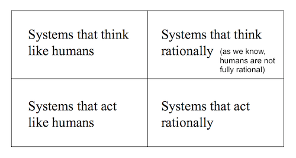

Thinking humanly: The cognitive modeling approach

- Determine how humans think 
  - introspection?
  - psychological experimentation
- Computational theories of the mind
  - symbolic: beliefs, goals, reasoning steps 
  - non-symbolic
- Goal: model that exhibits all and only the behavior observed in humans or animals
- we don't do this in CS - check out cognitive psych courses

Acting humanly: The Turing Test approach

- can a judge tell the difference between a person and an AI machine?
- not used much anymore
- many things wrong, e.g. if they ask to add 100 numbers, the computer would have to be really slow and then give a bad answer — we don't want computers to pretend to be bad at things they're really good at

Thinking rationally: The laws of thought approach

- Emphasis on _thinking_ the right thing 
 - performing correct inferences
- Thinking right means following the laws of thought
- Logic and probabilities as normative theories
- ie if you believe a -> b and you believe a, if you're logical you'd believe b

Acting rationally: The rational agent approach

- Emphasis on _doing_ the right thing 
 - taking the best possible action
- An agent is just something that perceives and acts
- Acting rationally means acting so as to achieve one's goals, given one's beliefs
- Decision theory

### These slides were skipped

Unifying theme: Intelligent agents 

- An agent is anything that can be viewed as perceiving its environment through sensors and acting upon that environment through actuators.
- Concept of agent is a tool for designing and analyzing systems
- Agents include humans, robots, softbots, thermostat, ...
- Agents percieve the environment with sensors, then act on it with acuators

Design space of AI agents (no idea what these things mean)

- Modularity or decomposability 
 - Flat, modular, hierarchical
- Representationscheme 
 - States, features, relations
- Planning horizon
 - Non-planning, finite stage, infinite stage
 Uncertainty
  - Sensing uncertainty: fully observable, partially observable 
  - Effect uncertainty: deterministic, stochastic
- Preferences
 - Goals, complex preferences
- Number of agents
 - Single agent, multiple agents
-Learning
 - Knowledge is given, knowledge is learned
- Computationallimits
 - Perfect rationality, bounded rationality

### A brief history of AI

- 1950's- 1969: Enthusiasm and expectations
 - Samuel's checkers program, neural networks, machine translation,
theorem proving, planning, ...
- 1966 - 1973: A dose of reality, AI winter
 - need for domain knowledge, high computational complexity, computational limits of perceptrons
- 1969 - 1979: Knowledge-based systems (AI got worse, less learning)
- 1980 - 1988: Expert system industry booms (getting better again)
- 1988 - 1993: A dose of reality, another AI winter
 - over-sold, did not meet expectations
- 1986 - present: Return of connectionism
- 1988 - present: AI becomes a science
 - improved methodology and theoretical frameworks
- it's like a roller coaster - things get better, we get really high expectations, we don't meet them, it becomes less hyped — we're in a hype phase right now

Progress

- we've made little success on the grand goal
- but lots of success in restricted domains

Examples

- checkers: Chinook is the World Man-Machine Checkers Champion. It has defeated the best players in the world
 - if it's playing its best, the best you can do is tie the machine (this is proven true)
- chess: "NEW YORK (CNN, 1997) -- He had never lost a chess match. But that all changed after 19 moves Sunday against the Deep Blue IBM computer..."
- Go: DeepMind, a London-based artificial intelligence (AI) company bought by Google for $400m in 2014, challenged Lee Sedol to a five-game Go match, and won the best-of-five series with four wins and one loss.
- assembly line sequencing
 - In what order should different cars be manufactured?
 - if you're building for north america, you don't build on Monday (Monday cars are exported) — the quality isn't as good because people are more sleepy
 - red cars shouldn't be made at the same time as white - the red will mix in with white to make pink cars 
- credit card authorization
 - Handle majority of transactions autonomously.
 - Pass exceptional cases (e.g., unusual travel patterns) to a human along with recommendation and reasons
- mortgage authorization
 - One of the largest mortgage companies in U.S.
 - Refer hard cases to human underwriter
 - this helps reduce bias in decisions to lend money :D
-  medical diagnostic systems
 - Interactive medical decision support software for consumers and health care providers.
 - doesn't replace the doctor, but gives the doctor extra information/second opinion
- customized help
 - Microsoft's Clippy
 - Context-specific help with using software
 - Tailored to individual user
 - "Clippy used AI techniques, but don't hold that against AI"
- interactive entertainment
 - Agent Modeling: modeling and reasoning about your opponent's goals, plans, knowledge, capabilities, and emotions or allowing your creature to make its own decisions and inferences is important for designing realistic games
- automating chores (robomower to cut grass, roomba to vacuum)
- recommender agents 
 - amazon.com
 - Recommendations for purchases tailored to an individual user
-  handwriting recognition
- interplanetary exploration
 - NASA Mars Rover
 - Autonomous decisions in response to the environment
- face recognition
 - Which celebrity do you most closely match?
 - Which parent do you look the most like?
- spam filtering
 - e.g. Mozilla.org, Mozilla Thunderbird email client filters spam
- autonomous driving
 - Automatic road following (driverless driving)
 - scary to think about military applications
 - this would also cost millions of people jobs
- question answering
 - IBM tackling jeopardy
- language translation
 - Yahoos's Babel Fish, Google translate: translate text into many other languages
- speech generation
 - A window 7 characters wide is moved over the text. The network learns to pronounce the middle letter.
 - The sound of a letter depends on its context. For example, the letter "a" is pronounced differently in "mean", "lamb", and "class".

~~~~ _LECTURE 2_ ~~~~~

# Problem-solving using search

Problem-solving agents: Goal-based agents that decide what to do by finding sequences of actions that lead to desirable states.

### Some example problems

Starting with toy problems to get an idea of how to do stuff

- first toy problem: n-queens
 - Place n-queens on an n x n board so that no pair of queens attacks each other.
 - queens can attack on vertical/horizontal/diagonal (as many squares as you wish)

- crossword puzzles
 - you have a grid and words, want to place words so that they fit together on the grid and agree on shared letters

- sliding puzzles
 - 2D grid of tiles with one empty space
 - initial configuration and goal configuration
 - you can slide a tile into the empty space, keep doing this until reach goal config

- river crossing puzzle
 - A father, his two sons, and a boat are on one side of a river. The capacity of boat is 100 kg. The father weighs 100 kg and each son weighs 50 kg. How can they get across the river?
 - coming up with the trips to take back and forth to get accross fastest

"real" problems

- propositional satisfiability
 - Given a formula in propositional logic, determine if the Boolean variables can be assigned in such a way as to make the formula true.
 - (this is the canonical np complete problem - we talked about it in CS341)
 - note that the answer is either yes or no

- partition problem 
 - Given a set of objects with weights, partition the objects into two sets U and V such that the total weights of U and V are as close as possible.
 - optimization problem, where answer is two sets

- travelling salesperson
 - starting at city A, find a route of minimal distance that visits each of the cities only once and returns to A
 - easy to brute force with small example, but big sets of cities is really hard

- set covering problem
 - find a minimum size committee of people that together have the skills necessary to accomplish a task
 - "you could just put everybody on the committee, but you don't need that many people"

### contrasts in problems

- Find a goal state, given constraints on the goal
 - _any goal_ state - e.g. any way of placing the queens on the board so they don't attack is good enough
 - _optimal goal_ - you can do lots of things that satisfy the goal, but you also want to optimize something (the optimality thing can often be hard to verify) - e.g. traveling salesperson, set covering
- Find a sequence of actions that lead to goal state
 - we already know the goal (so we're not trying to find the goal state like above), we want the steps to get there
 - _any sequence_ - we can do anything to get to the goal state 
 - _optimal sequence_ - the number of steps should be as small as possible 

### Graph Search

Methodology

- formulate problem solving as search on a graph
- we're searching a graph - it's implicit (we don't know what the nodes are) and we want to make as little of it explicit before finding the answer (explore as little of the graph as possible)
- we want to find the solution with looking as little of the graph as possible - to make it more efficient
- Given a problem:
 1. nodes: Specify representation of states, specify initial and goal states
 2. arcs: Specify actions (successor function, neighborhood function) that take us from one state to another. Assign a cost to each action
 3. search: Find a path from an initial state to a goal state

#### e.g. river crossing (we did it on the blackboard)

the graph/goals:

- states/nodes: <F, S1, S2, B> (father two sons, boat)
- where F, S1, S2, B are in {L, R} (left side, right side)
- initial: <RRRR>
- goal: <LLL_> (don't care about boat)

arcs/successor states:

- if we're in state RRRR we can get to successors {LRLL, RLLL, RLRL, RRLL}
- if we're in state LRRL we can get to {RRRR}
- in this case, the cost of each move is 1 (so we're just minimizing moves)

The hidden graph made explicit (note he skipped the ones that you can only get to from the goal node)

- note that there are cycles in this graph (even through it's treated as a tree on the slide) because you can go back and forth between states by bringing the boat back and forth

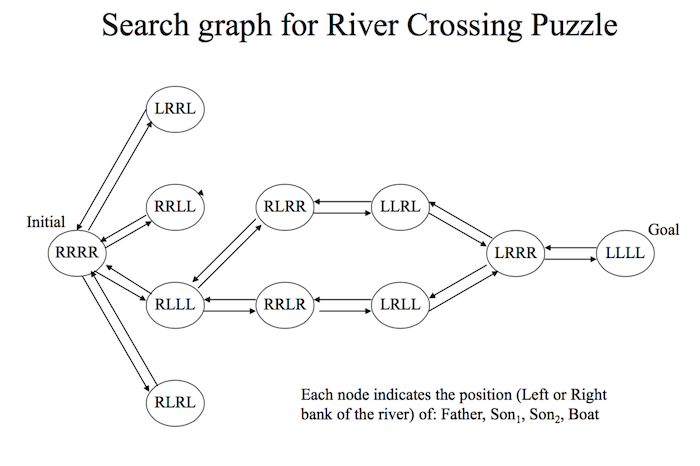

General search algorithm (doesn't account for cycles)

	L <- [start nodes]
	while L not empty do
		select and remove a node from L, call it p
		if p is a goal node, return(success)
		generate all successor states of p, and add them to L
	return(fail)

Kinds of graph searches (review)

- breadth-first search removes from front, adds successors to end of L (FIFO)
- depth-first search removes from front, adds successors to front of L (LIFO)
- Priority queue gives informed search (greedy, A*)
- depth-limited search: depth first search, but with a cutoff on how far you're willing to go (max depth)

New concept: iterative deepening search (IDS)

- for cutoff = 0, 1, .... do a depth limited search with cutoff as bound
- why is it better than breadth first? 
 - BFS has to store a whole layer before it can get to the next layer
 - so it uses less space than BFS, but takes more time than BFS - though not that much more time because a lot of time is from the last layer if the layers grow exponentially in size

terms referred to when talking about graph searches

- b: branching factor (the number of children at each node, the outdegree)
- d: depth of solution
- m: depth of tree

for a graph search, we want to show/know:

- complete: if goal is reachable, will be found
- optimal: will find lowest cost path to goal

	              | BFS       |   DFS  |  IDS
	    ----------|----------------------------
	    time      |  O(b^d)   |  O(b^m)|  O(b^d)
	    space     |  O(b^d)   |  O(bm) |  O(bd)
	    complete  |  yes      |   no   |   yes
	    optimal   |  yes      |   no   |   yes

DFS:

- might need to go all the way to the bottom of one part of the tree before getting to the solution at depth d later on - so O(b^m)
- space it takes up is the path plus a few siblings for each node on the path - O(bm)
- unless m is finite, we might never reach the solution, so not complete
- we might go on a big loop to get the solution first

IDS:

- same order of time as BFS even if we repeat the layers a few times
- space is similar to DFS, but we only go d deep, with maybe some siblings - so space is only O(bd)
- it has all the perks of BFS and all the perks of DFS - combined! cool

what to do about repeated states?

- could do nothing
- could not return to a state that you just came from
- we can record the ancestor path and not go back to any of the ancestors (to avoid cycle)
- ideally we don't generate any state that has been generated before - don't visit any node that's already been visited - this is what we usually do

### revisiting n-queen problem (example with 4 queens)

Alternative 1:

 - states/nodes: 
  - states < C1, C2, C3, C4 > for the columns, values in {1, 2, 3, 4} for the rows they're in 
  - solution is permutation of 1, 2, 3, 4 (since on two queens can be on the same row or column)
 - we can't have them all on the diagonal - we can swap rows to try to find the solution - so an arc is a swap
 - arcs/successors: all ways of picking two queens and swapping their values

Alternative 2:

- build up a solution
- initial state: no queens on the board
- successor: all ways of placing a queen in next free column

~~~~ _LECTURE 3_ ~~~~~

Revisiting using a priority queue (gives informed search - greedy, A*)

### Informed (heuristic) search 

- Assign a cost to each action/rule/arc
- Heuristic function:
 - h(n) = estimated cost of the cheapest path from the state at node n to a goal state.

#### e.g. sliding puzzle

- states/nodes: all permutations of <1, 2, ..., 8, []> where [] is the empty square
- 9! states
- successors/arcs: move empty square up/down/left/right (cost 1)

what moves are better? we're going to use a heuristic function

- h(n) = estimated cost of the cheapest path from the state at node n to a goal state
- the move we pick should lower the h(n) value, but we don't want the cost to be too expensive to compute

h(n) could be number of tiles out of place in node n

- it's a minimum of how many moves it'll take (we'll have to move each of them), but it's usually going to take way more moves

 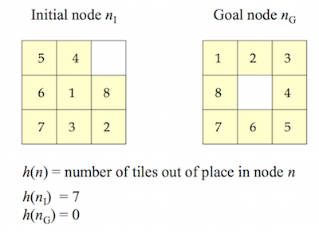

another heuristic:

- h(n) = sum of Manhattan distance of tiles out of place (number of square it'd have to travel to get to where it needs to go)

 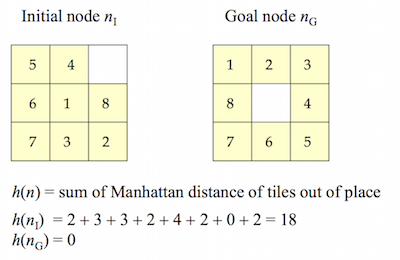

Then we greedy search:

- we explore in the direction with lowest h(n)
- it isn't guarenteed to find optimal path, since h is just a lower bound on moves and a state with lower h isn't necessarily going to give a shorter path
- it might never terminate (for similar reasons as previous point)

		L <-- [start nodes] 
		while L not empty do
			remove node with lowest h(n) value from L, call it p
			if p is a goal node, return(success)
			generate all successor states of p, and add them to L
		endwhile
		return(fail)

### A* search: Minimizing total path cost

- let f\*(n) = g\*(n) + h\*(n) be the cost of an optimal path going through node n, where
 - g\*(n) is cost of an optimal path from initial node to n
 - h\*(n) is cost of an optimal path from n to a goal node
- but f\*(n) is perfect information
 - you'd have to compute it for all the nodes (doesn't make sense)
 - so it's not available to us
 - so we estimate

We drop the star to show we're not optimal anymore

- f(n) = g(n) + h(n)
 - g(n) is cost of path we found from initial state to n, where g(n) >= g\*(n)
  - h(n) is a heuristic estimate of cost from n to a goal, which we hope is a good estimate of h*(n)
- Algorithm A\* for searching a tree is like greedy, but we remove the node with the lowest f(n) value

A* algorithm

		L <-- [start nodes] 
		while L not empty do
			remove node with lowest f(n) value from L, call it p
			if p is a goal node, return(success)
			generate all successor states of p, and add them to L
		endwhile
		return(fail)

#### Revisit example of river crossing

- states: < F, S1, S2, B > where F, S1, S2, B are in {L, R}
- initial: RRRR, goal: LLL_ where we don't care where the boat ends up
- moves: move accross river, cost 1
- g(n) = # moves to get to node n
- h(n) = # objects to get to the left side

work thorugh tree and measure cost of nodes

- root: RRRR 0+4 = 4
- next level: 
 - LRRL 1+2 = 3
 - RRLL 1+2  = 3
 - RLLL 1+1  = 2 (lowest)  
 - RLRL 1+2 = 3
- so we expand on RLLL
 - RRRR 2+4   = 7
 - RLRR 2+3 =5
 - RRLR 2+3 =5
- since all the children of RLLL have higher costs than LRRL in the second level, we expand LRRL (which has the lowest cost) to RRRR (f = 2+4 = 6) - yay, solution

#### Heuristics

Admissible heuristics

- A heuristic function h(n) is admissible if h(n) <= h\*(n), for all n
 - we know g(n) >= g\*(n)
 - 0 <= h(n) <= h\*(n)
 - it has to hold for every single node, if even one h(n) >= h\*(n) it wouldn't work
 - if we do h(n) = 0, it'd almost be greedy, g(n) makes it still optimal path but it's not very good (expands many more nodes than necessary)
- Theorem: If h(n) is admissible, the A* algorithm is guaranteed to find an optimal path to a goal node

Dominating heuristics

- Def: Given admissible heuristics h1(n) and h2(n), h2(n) dominates if h1(n) if
 - for all nodes n, h2(n) >= h1(n),
 - and there exists a node n' such that h2(n') > h1(n')
- Thm: A* with h1(n) expands at least as many nodes as A* with h2(n), iff h2(n) dominates h1(n)
 - the idea is that if you underestimate, you'll expand nodes that are actually not as good as you think they are

#### So how does A* perform?

Complexity results for A*

- Good news:
 - A* is complete, optimal, and optimally efficient
 - no algorithm with the same information can do better
- Bad news:
 - assuming you have a single goal, are searching a tree, and each action is reversible, worst case time complexity is bad
- time complexity is exponential: O((b^ɛ)^d) = O(b^ɛd)
 - b is the branching factor
 - ɛ is the maximum relative error  (h\*(n) - h(n)) / h\*(n)
 - d is the depth of the goal node
 - worst case is when h(n) is always 0, (h\*(n) - h(n)) / h\*(n), would be 1 - so we'd have O(b^d)

#### Example: TSP (travelling salesperson)

- states/nodes: all partial tours
 - e.g. A, AB, AC, ..., ACD, ..., ACDEB
- initial: A
- goal: complete tour of lowest cost
- successor/arc: extend tour by visiting a city not visited yet
- cost: cost of the edge (labelled on the graph)

thinking about g, h

- e.g. g(ABE) = A ->B (cost 7) ->E (cost 10) = 17
- if we do h(n) as the number of nodes left, it's not super great - a better measure is the sum of the n fewest weights left connecting the n nodes left (both of these are admissable though)

#### Iterative-deepening A*

- Amount of memory needed is a problem for A* (just like BFS)
- IDA*
 - each iteration is a complete DFS with a cutoff (so, no priority queue)
 - branch is cutoff (node is not added to L) if f(n) exceeds some threshold
 - next iteration sets threshold to be minimum of values that exceeded old threshold
 - time complexity depends strongly on number of different values the heuristic can take on
- a lot of duplicate work, but the last run dominates the rest so it's not a big deal

~~~~ _LECTURE 4_ ~~~~~

## constraint satisfaction problems (CSP)

- Describe states implicitly in terms of variables and constraints
- More search algorithms:
 - backtracking search
 - local search

Defining a CSP

- set of variables (x1 ... xn)
- set of values for each variable dom(x1), ... dom(xn)
- set of constraints C1, ... Cm 
- A solution to a CSP is a complete assignment to all the variables that satisfies the constraints
- the tricky part is finding a solution where all the constraints are satisfied, each constraint isn't usually that hard to satisfy individually

given a CSP, we can be asked to:

- determine if it has a solution or not
- find one solution
- find all solutions
- find optimal solution, given some cost funciton

example domains and constraints:

- reals, linear constaints
 - linear constraints: e.g. 3x + 4y <= 7, 5x - 3y + z = 2
 - easy, polynomial problem
 - guassian elimination, linear programming
- integers, linear constraints
 - harder - integer linear programming, branch-and-bound
- boolean, propositional sentences
 - this is the satsifiability problem
- Here we are gonna deal with
 - finite domains
 - expressive constraint languages

constraint languages

- we can use arithmetic operators (math stuff), logical operators (and/or/not/implies)
- can also have global constraints which are specified over an artibtrary number of variables 
 - e.g. alldifferent(x1, ..., xn) meaning they all have to have different values
- table constraints (must be an entry in a table, values in some list of tuples of values that work)

#### examples of game CSPs

sudoku

- Each Sudoku has a unique solution that can be reached logically without guessing.
- Enter digits from 1 to 9 into the blank spaces. Every row must contain one of each digit. So must every column, as must every 3x3 square.
- variables: all 81 cells
- domain: digits 1 through 9
- constraints: 
 - alldifferent(row) for each row
 - alldifferent(column) for each column
 - alldifferent(box) for each 3x3 submatrix
 - also constraints include the initial values given in the grid

nqueens

- one way
 - variables: each cell (x_ij for i, j from 1 to 4)
 - domains: queen or noqueen (1, 0)
 - constraints: sum of each row, column, diagonal is 1, sum of all cells is 4
- alternatively:
 - variables: x1, x2, x3, x4 (each queen)
 - domains: dom(xi) = {(1,1),(1,2), ..., (4,4)} for row, column
 - constraints: x1column != x2column (and so on) -- this is hard to write out, not as good
- another possibility:
 - variables: columns x1, x2, x3, x4
 - domains: 1, 2, 3, 4 (row it'll go in)
 - constraints: x1!=x2 and |x1-x2|!=1, x1!=x3 and |x1-x3|!=2, x1!=x4 and |x1-x4|!=3, x2!=x3 and |x2-x3|!=1,  x2!=x4 and |x2-x4|!=2, x3!=x4 and |x3-x4|!=1

example: crossword puzzles

- *this will give a hint for q2 on the assignment*
- one representation
 - each cell is a variable
 - domain: letters
 - constraints: each maximally continuous horizontal or vertical set of variables should be a word in the dictionary --- these are nonbinary constraints
- another
 - variables: 1 accross, 1 down, 2 down, ...
 - domain of each variable is the set of words in dictionary with that length
 - constraints: e.g. 1accross and 1down must agree on the common (first) letter --- these are all binary constraints

### a closer look at constraints

- an _assignment_ (or instantiation) is when you say x=a where a is in dom(x)
- a _tuple_ t over a set of variables {x1,...,xk} is an ordered list of values (a,...,ak) such that each ai is in the dom(xi) - can be viewed as a set of assignments
- given a tuple t, notation t[xi] selects out the value for variable xi, ie t[xi] = ai

vars(C)

- each constraint is a relation
- a set of tuples over some ordered subset of the variables, denoted by vars(C)
- specifies the allowed combinations of values for the variables in vars(C)
- the set vars(C) is called the scope (or scheme) of the constraint

the size of vars(C) is known as the arity of the constraint 

- unary constraint has arity of 1
- binary has arity of 2
- non binary constraint has arity greater than 2
- a _binary_ CSP is a CSP where all constraints are unary or binary

e.g.

- dom(x1) = {1, 2, 3, 4}
- dom(x2) = {1, 2, 3, 4}
- let C be constraint x1 != x2 and |x1 - x2| != 1 ---> this constraint is intensional
- then:
 - vars(C) = {x1,x2}
 - tuples in C = {(1, 3), (1, 4), (2, 4), (3, 1), (4, 1), (4, 2)} ---> the constraint of needing to be in this list of tuples is extensional (table constraint)
- C is a binary constraint 
- if t  = (1, 3), t[x1] = 1, t[x2] = 3

## local consistency: arc consistency

Idea: given a constraint, remove a value from the domain of a variable if it cannot be part of a solution according to that constraint

- given a constraint C, a value a in dom(x) for a variable x in vars(C) has:
 - a _domain support_ for `a` in C if there exists a `t` in C such that t[x] = a and t[y] is in dom(y) for every y in vars(C)
 - ie there exists values for each of the other variables (from respective domains) such that the constraint is satisfied
- a constraint C is arc consistent iff for each x in vars(C) each value a in dom(x) has a domain support in C
- a CSP is arc consistent if every constraint is arc consistent
- A CSP can be made arc consistent by repeatedly removing unsupported values from the domains of its variables

Algorithm:

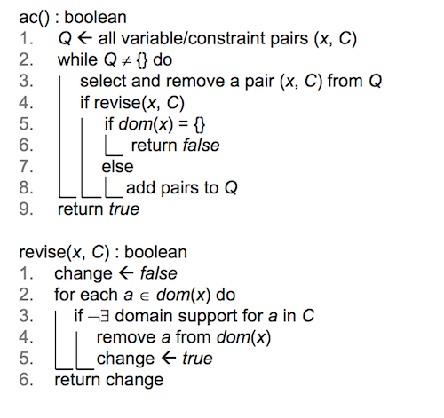

example with x < y < z

- domains of 3 variables -- x: {1,2,3}, y: {1, 2, 3}, z:{1, 2, 3}
- constraint: x < y < z
- look at x < y -> y is at most 3 so x can't be 3, x is at least 1, so y can't be 1
- look at y < z --- z is at most 3, so y can't be 3 (so it must be 2), y is at least 2, so z can't be 1 or 2
- so z is 3, y is 2, so therefore x must be 1
- in this case we get the answer, but the idea is that we can restrict the domains

n queens

- using the CSP we defined earlier, can't eliminate anything

another approach:

- assign X1 = 1 and take 1 out of the domains of everything else
- run arc consistency again
- run it on X2, can't be 1 or 2
- X3 can't be 1 or 3, X4 can't be 1 or 4
- running through more constraints - can't put X3 in 3 because it'd be diagonal with X2 or X4
- continue for more constraints and eventually see that we have no way to put x2, x3, x4 down 
- so we should try with X1 in a different place

~~~~ _LECTURE 5_ ~~~~~

## Local search

- applies to both satisfaction and optimization
- incomplete (non systematic) algorithms
 - complete means will find solution if it exists
 - so it can't be used to find a solution if it exists, and definitely no guarentee that it can find the optimal one
- finds locally optimal solutions that are not necessarily globally optimal

notation and definitions

- S set of states
- c: S->Reals cost function
- N: S -> 2^S  neighbourhood function (like successor function, finds neighbouring states)
- a solution s\* in S is globally optimal iff c(s\*) <= c(s) for all s in S 
 - what we want
- a solution s+ in S is locally optimal iff c(s+) <= c(s) for all s in N(s+) 
 - what we settle for

Graph interpretation

- local search is a walk in a directed, node-labeled graph
 - nodes are the elements of set of states S
 - nodes are labeled with cost values
 - arcs are given by the neighborhood function

local search for CSPs

- some constraints hard (must be satisfied)
 - set of solutions of hard constraints gives set of states S; ie nodes in the search graph
- remaining constraints are soft (moved into cost function) 
 - so make it so the cost is +1 for each constraint not satisfied

#### e.g. 4queen

- variables x1, x2, x3, x4
- domains {1, 2, 3, 4}
- cost function: +1 for each constraint not satisfied
 - soft constraints: all
 - hard constraints: empty
- states: S = {< x1, x2, x3, x4 > | xi in {1, 2, 3, 4}} 
 - 4^4 states
 - e.g. < 1, 1, 1, 1 > has cost 6
 - we're trying to find 0 cost - e.g. < 2, 4, 1, 3 >
- e.g. neighbourhood function: all ways of picking one queen and moving it
 - this can be a lot of different functions - we just chose this one
 - note that we don't want it to be a function that returns all the other states - then we'd be brute forcing
- e.g. so we can go from < 1, 1, 1, 1 > to < 2, 1, 1, 1 > which has cost 4 

another with 4queen:

- separate those 6 constaints into 12 (breaking up the AND clauses)
- it's easier to use the xi != xj constraints than the absolute value ones as hard constraints
- we make the absolute value ones soft constraints
- so now our states are {< x1, x2, x3, x4 > | permutations of 1, 2, 3, 4}
- neighbourhood function: all ways of picking two queens and swapping their values

#### the local search algorithm (to be coded on assignment)

		s <- some initial complete assignment 
		k <- 0
		repeat
			r <- select a neighbor of s
			if c(r) - c(s) < tk then
				s <- r 
			k <- k + 1
		until stopping criteria satisfied 
		return best s

Choices

- stopping criteria
 - can set a max on # iterations (it's fine to run it for a few minutes)
 - can stop when solution of low enough cost is found (once we get low enough it's fine - e.g. hitting 0 for 4queen here)
 - or when number of iterations since last (big enough) improvement is too large
- how to get an initial feasible solution?
 - random or 'good'
 - maybe do some greedy algorithm to find a 'good' starting point
- what neighbourhood function?
 - small is easily explored, but low quality solution might be found
 - large is expensive to explore
- how to select 'r', the neighbour to move to?
 - first improvement (first improving solution - quick/fast decisions, can make a lot more of them)
 - best improvement (solution with lowest cost, fewer overall moves, decisions take more time)

Thresholds

- iterative improvement: only move to neighbour if strictly lower cost (tk=0 for all k)
- threshold accepting
 - worst cost neighbours are accepted, but diminishes: ie tk >=0, tk >= t_{k+1} -- so at first we can go to worse, but eventually we wouldn't
 - variation: stimulated annealing. worst cost neighbours accepted with a probability that is gradually decreased over time
 - variation: tabu search - worst cost neighbours accepted but only if it is a legal neighbour. set of legal neighbours restricted by a tabu list to prevent going back to a recently visited node
  - how many recent do you keep? turns out 20 is a good number

More improvements

- multistarts - restart a bunch of times and randomize where you start, keep best solution from all runs
- multi-level: start the search in a neighbourhood with a solution selected from a different neighbourhood (use different neighbour functions for finding starting point vs running rest of algorithm)

#### Examples

Neighborhoods for 8-queens

- transpose: swap two adjacent queens -- O(n) to generate all neighbours
- insert: move a queen (insert earlier in the list) -- O(n^2) since insert is O(n)
- swap two queens (not necessarily adjacent) -- O(n^2)
- block insert (move a subsequence of queens) -- (On^3)

Local search for TSP

- states/nodes: all permutations of cities that start at A
- cost: cost of tour e.g. ABCDE (below) cost is 38 
- assumption that it's a fully connected graph - if it wasn't, we could add edges with really high weights
- neighbourhood function: 2-opt: pick two edges in a tour (e.g. AE, CD) and delete them and reconnect using other edges (AD, EC)
- greedy way to find a starting point: start at A and pick lowest cost path to a city not travelled to yet (in this case it actually finds the best path hehe)

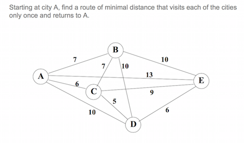

exact neighbourhood

- definition: every local optimum is also a global optimum
- exact neighbourhoods for TSP must be exponential in size
- unless P = NP, polynomially searchable (an improving move can be found in polynomial time) exact neighbourhoods can't exist
- if a neighborhood is not exact, the cost of a local optimum can be arbitrarily far from a global optimum
- if a neighborhood is not exact, local search can take an exponential number of steps to read a local optimum
- but best local search algorithms 
 - can get within 1.5-2.5% of optimal on random and benchmark instances
 - can solve instances with 1m cities in under 1hour

~~~~ _LECTURE 6_ ~~~~~

Solving CSPs: find a solution by making it into a search problem

- initial state/root of tree is empty assignment {} (no variables have values assigned)
- arc assigns a value to the next variable (e.g. staring from x1 and assigning values until xn) 
- goal is to find complete assignment that satisfies all constraints
- backtrack when we go ways that don't work

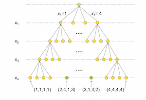

Finding an algorithm

- depth first with iterative deepening doesn't make sense 	because the goal is at the bottom
- BFS isn't great because we have to go all the way down, so we'd need to get to the last layer 
- the problem with DFS before was that the goal could be infinitely deep, here it's not - so DFS is the way to go
- one adjustment to the DFS
 - at each node we try to estimate if there's a solution below that node 
 - once we know there's no solution below a node we don't go further 
 - have to be sure about this - so we can have false positives but no false negatives

## Backtracking search

A backtracking search is a depth-first traversal of a search tree

- search tree is generated as the search progresses
- search tree represents alternative choices that may have to be examined in order to find a solution
- method of extending a node in the search tree is often called a branching strategy

### Popular branching strategies

- Let x be the variable branched on, let dom(x) = {1, ..., 6}
- Enumeration (or d-way branching) 
 - variable x is instantiated in turn to each value in its domain
 - e.g., x = 1 is posted along the first branch, x = 2 along second branch, ...
- Binary choice points (or 2-way branching)
 - variable x is instantiated to some value in its domain
 - e.g., x = 1 is posted along the first branch, x != 1 along second branch, respectively
 - used more because it often is more efficient
- Domain splitting 
 - constraint posted splits the domain of the variable
 - e.g., x <= 3 is posted along the first branch, x > 3 along second branch, respectively

Backtracking search algorithm template

		backtrack( assignment, csp )
		if assignment is complete then solution found
		var <- select next variable
		for each value in dom( var ) do
			save( csp )
		 	assignment union {var = value}
		 if propagate( assignment, csp ) then
		 	backtrack( assignment, csp ) 
		 endif
		 restore( csp ) 
		endfor

- save csp so we can restore after we plunge down, if we fail, back up
- propagate() determines if there's a solution below (never false negative)
 - uses arc consistency

### Constraint propagation

 - Effective backtracking algorithms for CSPs maintain a level of local consistency during the search; i.e., perform constraint propagation
- Perform constraint propagation at each node in the search tree
 - if any domain of a variable becomes empty, inconsistent so backtrack (and undo any of the effects of the most recent constraint propagation)

Backtracking search integrated with constraint propagation has two important benefits

 1. removing inconsistencies during search can dramatically prune the search tree by removing deadends and by simplifying the remaining sub-problem
 2. some of the most important variable ordering heuristics make use of the information gathered by constraint propagation

Some backtracking algorithms

- Naive backtracking (BT): performs no constraint propagation, only checks a constraint if all of its variables have been instantiated -- so no arc consistency
- Forward checking (FC): maintains arc consistency on all constraints with exactly one uninstantiated variable - so wait until only one left
- Maintaining arc consistency (MAC): maintains arc consistency on *all* constraints with at least one uninstantiated variable - this is more work per node but saves us going some paths

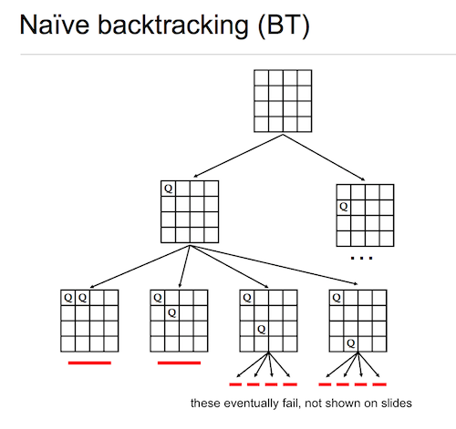

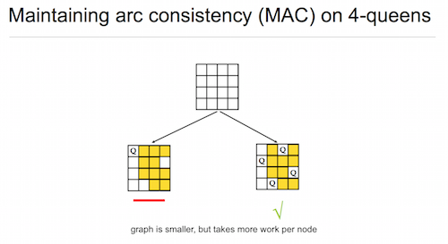

### Heuristics for variable ordering

Basic idea

- Assign a heuristic value to a variable that estimates how difficult it is to find a satisfying value for that variable
- Principle: most likely to fail first 
- work on the hard part first - because the algorithm spends most of its time recovering from mistakes, so don't leave the part that'll be hard to figure out until the end of picking everything else cause we'll fail late and it'll be more expensive
- Examples:
 - dom: choose the variable x with the smallest domain size
 - dom / deg: divide domain size of a variable by degree of the variable

Queens

- dom / deg: for queens the degree is always 3, so it's not interesting
- the queens is a bad example here, because it doesn't matter

example on the board

- x1 .... xn
- dom(xi) = {1, ..., n-1}
- constraints xi < x_{i+1} for i = 1 ... n-1
- there's no solution!
- BT - we go through a lot of possibilities - huge tree
- FC - we prune away the dead end nodes, not much change
- MAC - we recognize no solution right away

# Knowledge-based Agents

~~~~ _LECTURE 7_ ~~~~~

"I'm allowed to give only one lecture that doesn't make sense. I'm using it on this lecture"

- knowledge-based Agents use logic to represnt domain knowledge and inference to reason about that knowledge
- one way to solve a problem is to find + code up an algorithm in programming language + execute
- this way is different - we identify the knowledge needed to solve the problem, write down knowledge in representation language, use logical deduction to solve the problem (like CS245, "your favourite course")

Procedural knowledge 
 
 - "how to" knowlede
 - e.g. programs
 - languages: C, C++, Java...

Declarative knowledge 

- descriptive knowledge
- e.g. databases
- languages: propositional logic, first-order predicate logic, logic programming languages, production systems, relational databases & SQL, ...

Stuff you can do with declarative knowledge

- charge card authorization
 - checking purchase history for common things that might get broken
 - 2/3 of transactions are very routine and just put through
 - extrordinary cases sent to people to check
 - System is able to show the authorizer its reasoning, aiding in a decision
- deciding if you can get a morgage
 - Countrywide Funding (was) one of the largest mortgage companies in U.S.
 - Problem was: increasing number of loans, shortage of underwriters
 - Solution: knowledge-based system: about 1000 rules, processes over 8500 loans per month in 300 branches refers hard cases to human underwriter
 - Benefits: estimated 0.9 million saved annually and rising, consistency, removal of human bias, training tool

### Formal logic

A logic consists of

- syntax (acceptable sentences)
- semantics (what symbols and sentences mean)
- proof procedure (how we construct valid proofs)

syntax of propositional logic  

- alphabet
 - propositional symbols (Boolean variables): p, q, r, ..., 
 - two constant symbols: true, false
 - brackets: (, )
 - propositional connectives: not, and, or, implies, iff
- Syntax
 - a propositional symbol is a sentence (formula)
 - if alpha and beta are sentences (formulas) so are: NOTalpha, (alpha), alpha AND beta, alpha OR beta, alpha => beta, alpha iff beta

syntax of predicate logic 

- added to alphabet: constants, predicates, funtions, quantifiers (for all/there exists)
- added to syntax: 
 - terms are constants, variables, or functions on terms
 - P(t1,...,tn) is a sentence where ti are terms and P is a predicate
 - if alpha is a sentence and x is a variable, then "for all x, alpha" and "there exists x such that alpha" are sentences

Logical implication (deduction)

- A set of sentences Γ logically implies a sentence Φ iff every interpretation that satisfies Γ  also satisfies Φ 
- We write this as Γ ⊨ Φ

proofs in logic

- Many proof procedures
 - transformational proofs
 - natural deduction
 - resolution refutation
- x ⊢ y means there is a proof of y from x
- soundness and completeness shows that if you have one of proof or deduction, you have the other

solving a problem

- given propositions
- axioms
 - general knowledge (rules about setup) 
 - particular knowledge (case specific details)

e.g. 

- Suppose we have the propositions:
 - a = The car has gas.
 - b = I can go to the store. 
 - c = I have money.
 - d = I can buy food.
 - e =  The sun is shining.
 - f = I have an umbrella.
 - g = I can go on a picnic.
- Write axioms to represent the statements:
 1. If the car has gas, then I can go to the store. (a=>b)
 2. I can buy food if I can go to the store and I have money. ((b AND c) => d)
 3. If I can buy food and either the sun is shining or I have an umbrella, I can go on a picnic. ((d AND (e or f)) => g)
 4. The car has gas. (a)
 5. I have money. (c)
 6. The sun is not shining. (not e)
- Example queries
 - I can buy food? Γ ⊨ d ?
 - If I have an umbrella, I can go on a picnic? Γ ⊨ (f=>g) ?
 - If I can go on a picnic, then I don't have an umbrella? Γ ⊨ (g => notf) ?
- we answered those but they're easy (from MATH 135 so I didn't write it down)
- remember contradiction - show a row in the truth table where you get T -> F

#### Holmes scenario

> Mr. Holmes lives in a high crime area and therefore has installed a burglar alarm. He relies on his neighbors to phone him when they hear the alarm sound. Mr. Holmes has two neighbors, Dr. Watson and Mrs. Gibbon.

> Unfortunately, his neighbors are not entirely reliable. Dr. Watson is known to be a tasteless practical joker and Mrs. Gibbon, while more reliable in general, has occasional drinking problems.

> Mr. Holmes also knows from reading the instruction manual of his alarm system that the device is sensitive to earthquakes and can be triggered by one accidentally. He realizes that if an earthquake has occurred, it would surely be on the radio news.

- note that logic doesn't capture this situation 
- alarms don't always mean burglary (cat jumping on table? someone who lives there coming in without turning off alarm?)

Logic-based representation:

- w = Watson calls saying the alarm is going.
- g = Gibbon calls saying the alarm is going.
- a = The alarm is going.
- b = There is burglary in progress.
- r = There is a radio news report about an earthquake.
- e = There is an earthquake happening.
  
### Planning with Certainty

Goal-based agents that decide what to do by finding sequences of actions that lead to desirable states.

Planning

- Given: an agent's ability (actions it can perform), its goal, and the current state of the world
- Find: a sequence of actions to achieve a goal

Initial assumptions:

- Agent's actions are deterministic
- No external events beyond the control of the agent
- World is fully observable
- Time progresses discretely

Actions

- a determnistic action is a partial function from states to states
- STRIPS/PDDL representation
 - preconditions of an action specify set of conditions that must be true for action to have desired effect
 - effects of an action specifies what changes as a result of performing the action:
 - some effects: set of conditions become true (add list)
 - some effects: set of conditions become false (delete list)

#### example: 8 puzzle

- use predicates to represent states (which tiles are on which cells, which are empty, which cells are adjacent)
 - On(x, i, j) means tile x is on cell i, j
 - Clear(i, j) means cell i, j is clear (empty)
 - Adj(i, j, k, l) means cell i, j is adjacent to cell k, l
- an action changes one of the On and the Clear (and nothing else)

STRIPS/PDDL action

- move(x, i, j, k, l) moves tile x from cell i, j to cell k, l
- preconditions are what need to be true for this to happen
 - On(x, i, j), Clear(k, l), Adj(i, j, k, l)
- effects are the changes to the states 
 - On(x, k, l), Clear(i, j), ¬On(x, i, j), ¬Clear(k, l)

Updating state: 

- S\_{i+1} <-- (S\_i - delete(action)) UNION add(action)
- where preconditions are in Si
- note that deleting effects are subset of precondition list

#### example: blocks world

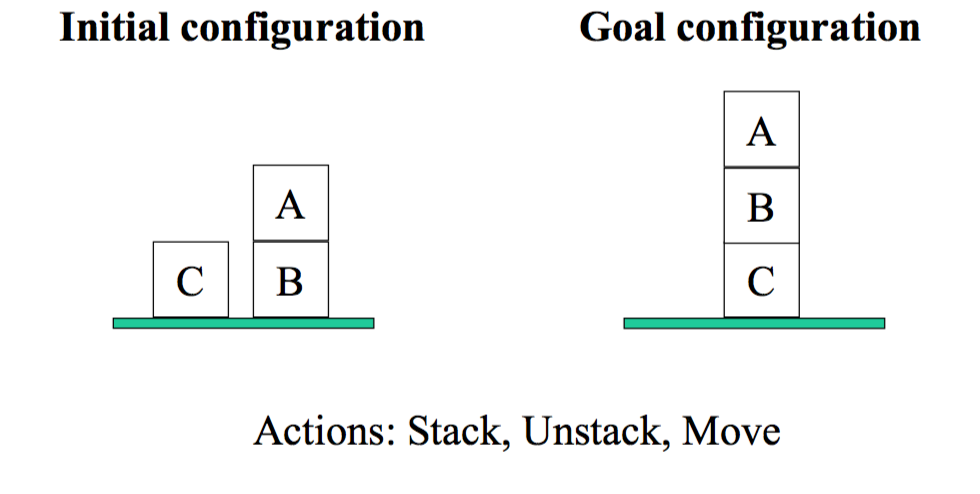

predicates

- Clear(x): x is clear
- On(x, y): x is directly on y
- OnTable(x): x is on the table

actions

- Stack(x,y): pick up x and put it on y
 - preconditions: ontable(x), clear(x), clear(y), x != y
 - adding effect: on(x,y) 
 - deleting effects: !ontable(x) !clear(y) 
- move(x, y, z): move block x from on y to on z
 - preconditions: clear(x), clear(z), on(x, y), y != z != x
 - adding effects: on(x, z), clear(y)
 - deleting effects: !on(x, y), !clear(z)
- unstack(x,y): take x off of y and put it on the table
 - preconditions: On(x, y), Clear(x)
 - adding effects: OnTable(x), Clear(y)
 - deleting effects: !On(x, y)

#### e.g. River crossing

> A father, his two sons, and a boat are on one side of a river. The capacity of boat is 100 kg. The father weighs 100 kg and each son weighs 50 kg. How can they get across the river?

- p1 and p2 are the sides
- we can move boat, S1, S2, F
- At(x, p): object x is on side p of the river
- move1(x, p1, p2) moves x from p1 to p2
 - preconditions: at(x, p1), p1 != p2, at(boat, p1)
 - effects: at(x, p2), at(boat p2), !at(x, p1), !at(boat, p1)
- move2(x, y, p1, p2) moves x and y from p1 to p2

#### Solving planning problems using forward search

Heuristic evaluation function:

- Want: search guided by a heuristic function that is automatically extracted
- Idea: relax a problem P to a simpler problem P', which can be solved efficiently. Use the solution to the simpler problem P' as an estimate for original problem P (like starting local search with greedy solution)
- Here: Relax the planning problem by simply ignoring delete effects
 - actions only add new atoms to the state, never remove any (so it isn't accurate anymore, we're just estimating)
 - problem is "solved" as soon as each subgoal has been added by some action
 - length of an optimal relaxed solution is an admissible heuristic for how long the actual solution will be

Search strategy:

- Use A* and admissible heuristic to find optimal plan
- Use local search and heuristic to find good plans
 - give up on optimality
 - use heuristic to choose best neighbour to move to

~~~~ _LECTURE 8_ ~~~~~

# Uncertainty

- today we'll be using probabilistic inference / probabilistic logic to reason about knowledge
- some problems are totally certain in how they'll work out, but the real world isn't like that
- Agents which use logic to represent domain knowledge, probabilities to capture uncertainty, and probabilistic inference to reason about that knowledge.
- so agents may need to handle uncertainty
 - partial observability - we dont know everything about the real world
 - nondeterminism - actions don't always have their intended consequences

random variables

- variables capture the state of the world - but sometimes we can't be sure of their values
- random variables help capture the state of the world
- A random variable X has a domain of possible values {a1, ..., an} and an associated probability distribution
- e.g. random variable weather with domain {sunny, rain, cloudy, snow}
 - they aren't actually mutually exclusive, but in this example we say they are
 - each has a probability
- we can ask about the probability of any statement

## Probability

shorthand

- If X is a Boolean random variable (i.e., the domain is {true, false}) 
- P(X) is shorthand for P(X=true)
- P(notX) is shorthand for P(X=false)
- e.g. P(X and notY) is shorthand for P(X is true, Y is false)

probabilities

- P(X) - prior/unconditional probability - what is probability X is true with no other given information
- P(X|Y) - posterior/conditional probability - probability X is true given that Y is true
 - equal to P(X and Y) / P(Y), if P(Y) > 0

axioms of probability

1. 0 <= P(A) <= 1
2. in 4 parts

 - P(True) = 1
 - P(False) = 0
 - P(A=True or A=false) = 1
 - P(A=True and A=false) = 0

3. P(A and B) = P(A) + P(B) - P(A or B)

Joint probabiltiy distribution

- probabilistic model of a domain: a set of random variables (describe state of the world)
- atomic event: assignment of value to each random variable in the model (a picture of the world)
- joint probability distribution: assignment of probability to each atomic event
 - all probabilities add to 1
- the catch
 - joint probability distribution can be huge with lots of random variables
 - it's common to have 100+ random variables - even if they're boolean, there are still 2^100 events
 - it's hard to come up with the probability distribution among all these events
 - in practice this strategy is too hard

some important rules

- product rule: P(X,Y) = P(X|Y)P(Y) = P(Y|X)P(X)
- sum rule: P(X=a) = sum P(x=a|Y=b)P(Y=b) for all b in domain of Y
- Bayes' rule: P(Y|X) = P(X|Y)P(Y)/P(X)
- chain rule: P(X1,...,Xn) = P(Xn|Xn-1,...,X1) \* P(Xn-1|Xn-2,...X1) \* ... \* P(X2|X1) \* P(X1) = product i=1..n P(Xi | Xi-1, ..., X1)

#### back to holmes scenario from last class

> Mr. Holmes lives in a high crime area and therefore has installed a burglar alarm. He relies on his neighbors to phone him when they hear the alarm sound. Mr. Holmes has two neighbors, Dr. Watson and Mrs. Gibbon.
> Unfortunately, his neighbors are not entirely reliable. Dr. Watson is known to be a tasteless practical joker and Mrs. Gibbon, while more reliable in general, has occasional drinking problems.
> Mr. Holmes also knows from reading the instruction manual of his alarm system that the device is sensitive to earthquakes and can be triggered by one accidentally. He realizes that if an earthquake has occurred, it would surely be on the radio news.

boolean random variables

- W: watson calls saying alarm is going
- A: alarm is going
- B: burglary in progress

Joint probability distribution 

- P(notW, notA, notB) = p0
- P(notW, notA, B) = p1 
- P(notW, A, notB) = p2
- P(notW, A, B) = p3
- P(W, notA, notB) = p4
- P(W, notA, B) = p5 
- P(W, A, notB) = p6
- P(W, A, B) = p7
- p0+ p1+ p2+ p3+ p4+ p5+ p6+ p7 =1 

We can determine probability of any sentence

- P(B) = sum of all atomic events where B is true = p1 + p3 + p5 + p7
- P(W and B) = p5 + p7
- P(W or B) = 1 - (p0 + p2)
- P(W or notW) = 1
- P(W=>A) = P(notW or A) = 1 - (p4+p5)
- P(B|W) = P(B and W) / P(W) = (p5+p7) / (p1+p3+p5+p7)

How helpful is the alarm?

- B is if burglary is in progress, A is if alarm is going
- suppose alarm is 95% reliable -- P(A|B) = 95%
- and in 97% of cases where there isn't a burglary, the alarm doesn't go -- P(notA | notB) = 0.97
- rate of burglaries is 0.0001 --- P(B) = 0.0001
- so we can fill in some more values that must add up to 1 with what we know so far
 - P(A | notB) = 0.03
 - P(notA | B) = 0.05
- our goal is to calculate P(B|A)
 - = P(A|B) * P(B) / P(A) = 0.95*0.0001/P(A)
 - P(A) = P(A|B) * P(B) + P(A|notB) * P(notB)
 - when you calculate it all, you get P(B|A) = 0.00316
- it seems very small, though it does mean a buglary is 30x more likely once you know there's an alarm
- though an alarm still isn't really that helpful cause the probability is so low

### independence

- X is independent of Y if P(X|Y) = P(X)
- if X is independent of Y iff Y is independent of X
- this is a shorthand for: for all x in dom(X) and for all y in dom(Y), P(X=x | Y=y) = P(X=x)
- sometimes if they're very close to independent we just say they are, for practical purposes

in our example

- is burglary independent of alarm?
 - is P(B|A) = A and P(B|notA) = P(B) and P(notB|A) = P(notB) and P(notB|notA) = P(notB)
 - if any of these don't hold, they're not independent
 - P(B|A) = 0.00316 != 0.0001 = P(A)
 - so, nope
- is Watson independent of Gibbon?
 - intuitively, they both are related to the alarm going off
 - if Gibbon is calling, it is likely there is an alarm going, so Watson will likely also hear it and call
 - so no
- is earthquake independent of burglary?
 - some burglars take advantage of earthquake to loot more
 - so the probability of burglary if there is an earthquake is a bit more likely than the probability of a burglary
 - the change is so small, that it's probaby not worth modelling them as non-independent

conditional independence

- X is conditionally independent of Y given Z if P(X|Y,Z) = P(X|Z)
- if X is cond indep of Y given Z, Y is cond. indep. of X given Z
- shorthand for: for all x in dom(X) and for all y in dom(Y) and for all z in dom(Z), P(X=x|Y=y, Z=z) = P(X=x|Z=z)

in our example

- is Watson conditionally independent of Gibbon given Burglary?
 - so we're wondering if P(W | G, B) = P (W | B) and P(G | W, B) = P(G|B)
 - buglaries don't always call the alarm to go, but if Gibbon is also reporting it's more likely that the alarm is going, so it's more likely Watson calls
 - if the alarm was perfect, then it would be conditionally independent
 - "The joint event of Burglary and Gibbon calling saying the alarm is going constitute stronger evidence for the occurrence of the alarm than burglary alone."
- is Watson conditionally independent of Gibbon given alarm?
 - yes - once the alarm is going, their actions are unrelated to each other
 - Gibbon is an unreliable reporter of the alarm, but we already know it's going so she doesn't given any more information
 - "Gibbon is an unreliable reporter of a fact that we know with certainty (whether the alarm is going or not). So knowing whether Gibbon is calling does not add anything."
- is Watson conditionally independent of Burglary, Earthquake, and Gibbon, given alarm?
 - yes they are
 - watson is an imperfect reporter, so no new information - so all that matters is the alarm
 - you could argue if he hears the alarm and there's an earthquake he might assume there's no burglary -- but we're not going to account for this

next time - why does it matter?

~~~~ _LECTURE 9_ ~~~~~

Importance of independence:

- conditional independence assertions allow chain rule to be simplified
- P(X1 and ... and Xn) = product of P(Xi | Xi-1, ..., X1) for all i from 1 to n 
 - he showed on the board a short proof where he wrote out the formula for P(A|B) and things cancelled out
- reduce number of probabilities that need to be specified
- we can then simplify some of the parts of this product

# Belief networks

- A belief network is a directed acyclic graph (DAG) where
 - nodes are random variables
 - directed arcs connect pairs of nodes (X->Y could mean X has direct influence on Y)
 - each node has conditional probability table specifying effects parents have on the node

e.g. alarm example

- W waton calls
- G gibbon calls
- A alarm
- B burglary
- E earthquake
- R radio report of earthquake

drawing the DAG

- first node is alarm
- add Watson, we decided to draw arrow from alarm to watson (opposite direction could work, but it's less intuitive so better not to)
- add earthquake, earthquakes cause the alarm
- add burglary, burglary causes alarm
- add Gibbon, arrow from alarm to Gibbon
- add radio, earthquake casuses radio
- by cause- we don't mean it always causes, it's more of a loose sense of the word

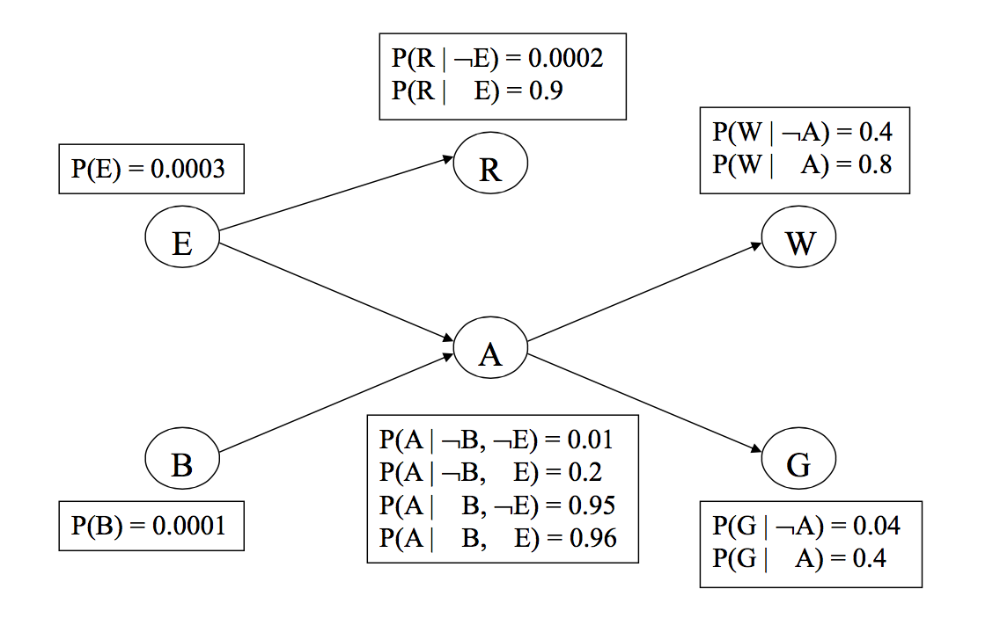

- note that half of the probabilities depend on the other half, so we can simplify right away
- we have 12 probabilities here in the graph which represents the same probability distribution, instead of 2^6 = 64 (if everything was independent) - which is way less!

Variables

- query variables: P(B|evidence), P(E|evidence) - the ones you want to know
- evidence variables: W, G, R - variables you can know
- hidden/latent: A - leftover variables

how do you come up with these probabilities? (help for 3rd question on assignment)

- e.g. for B you can look up the statistics (from what's happened over time) in Waterloo - it's hard to find a good reference point because it'll vary a lot from region to region
- e.g. Watson from alarm - impossible in practice to experiment this - so you guess what seems most reasonable "I think", and you give an explanation for why you think that

### semantics of bayesian networks- two ways to understand them

- as representation of joint probablity distribution
- as encoding of conditional independence assumptions

representation of joint probability

- you can find probablity of query given evidence by finding the arc to that point and using joint probability
- Every entry in the joint probability distribution can be calculated from the network:
 - P(X1,...,Xn) = product of P(Xi | parents of Xi)
 - each Xi can be negated or not negated
- From this, any query can be answered: P( Query | Evidence )
- e.g. P(B false, E false, A true, R false, W true, G true)
 - we choose ordering B, E, A, R, W, G (note that parents always come before children)
 - and we get P(notB) * P(notE) * P(A|notB and notE) * P (notR|notE) * P(G|A) * P(W|A)  = 3.2 * 10^-3

encoding of conditional independence assumptions

- since every entry in the joint probability distribution can be calculated 
 - (1) from the network P(X1,...,Xn) = product of P(Xi | parents of Xi)
 - (2) but also from the chain rule = product i=1..n P(Xi | Xi-1, ..., X1) - this is *always* true
- compare these two values
- e.g. P(B, E, A, R, W, G) =
 - using (1) P(B) * P(E) * P(A|B,E) * P(R|E) * P(W|A) * P(G|A)
 - using (2) P(B) * P(E|B) * P(A|B,E) * P(R|B,E,A) * P(W|B,E,A,R) * P(G|B,E,A,R,W)
- Want resulting joint probability distribution to be a good
representation of the domain
- Equation 1 is a correct representation of a domain only if each node is conditionally independent of its predecessors (in the node ordering), given its parents
- note that this is equivalent because P(E|B) = P(E) and P(R|E) = P(R|B,E,A), etc
- so we're assuming conditonal independence here when we decided what 'caused' what

### coming up with the network

note: we're dropping radio to simplify things

new graph 

- arrows in this graph go from each node to things that might affect it or be related
- W->A, G->A, A->B, B->E, A->E (you can draw it out yourself, or even submit a pull request with the diagram - I don't feel like drawing it and adding it, sorry)
- W->G is because whether or not W is true tells us information about if G is true
- number them W, G, A, B, E as 1, 2, 3, 4, 5
- using (1) we get P(W,G,A,B,E) = P(W)\*P(G|W)\*P(A|W,G)\*P(B|A)\*P(E|B,A)
- using (2) we get P(W,G,A,B,E) = P(W)\*P(G|W)\*P(A|W,G)\*P(B|W,G,A)\*P(E|W,G,A,B)
- conditional indepdence assumptions:
 - P(B|E,G,A) = P(B|A)
 - P(E|W,G,A,B) = P(E|B,A)
- this network is more effect->cause - the other graph was cause->effect
- comparing to the causal network 
 - casual network was more intutive (better)
 - note that the causal one from before (without R) has 20 proabilities, and this graph has 26 - so causual is better in that sense too

another graph

- drop the W->G arc
- now we have P(G) instead of P(G|W) in (1)
- so P(G=true|W=true) is supposedly equal to P(G=true) -- but it's actually much greater, so we need this arc (so this new graph is incorrect)
- if the difference was almost equal, we could drop the arc - but here we can't

for graphs, incorrect ones we just discard, correct ones we want to be inutuitive and have few probabilities (so a better graph is casual and simple - we will *lose marks* if we don't do this, even if the network is technically correct)

~~~~ _LECTURE 10_ ~~~~~

### note about domain

- examples from last class all had boolean domains
- if we had non-boolean domains 
 - e.g. dom(A) = {a1, a2, a3}, dom(B) = {b1, b2, b3}, dom(C) = {c1, c2, c3}
 - and arrows from B and C nodes to A 
 - how many probabilities?
 - 3 associated with B (equal to b1, b2, b3), and C (similarily)
 - A has 3*3*3 = 27, P(A=a1|B=b1, C=c1) ... P(A=a3|B=b3,C=c3)

note - you can count probabilities in a couple different ways (write them all out, write out only what you need at minimum) - we can do it any way as long as it's consistent (though I lost marks on the assignment for not writing them all out, so that might be safer for the exam)

### using the network

- you usually query on evidence variables
- e.g. P(W|A) is strange because we can never know if the alarm is on, and if we did Watson wouldn't be needed - so it's a very hypothetical query (A is not an evidence variable)
- A is latent variable (not query) because we don't really want to know if the alarm is going - we want to know if there's a burglary, or an earthquake

### Inference in belief networks

Basic task: Determine posterior probability of a set of query variables given exact values for some evidence variables -- P(Query|Evidence)

Diagnostic inferences

- inference from effects to causes: P(cause | effect)
 - e.g. burglaries cause alarms, alarms cause watson to call
 - ask: given watson called, what is liklihood of burglary?
- e.g. inference from symptoms to disease: P(disease|symptom)

Causal inferences (same network, different kind of query)

- inference from causes to effects: P(effect | cause)
 - what's the probability that watson will call, given there's a burglary
- inference from diseases to symptoms: P(symptom | disease)
- these might be the statistics available to you, to test the network

Intercausal inferences

- between causes of common effect (e.g. two causes, same effect)
- very hard to reason about
- P(cause1 | cause2, effect)
- P(disease1 | disease2, symptom)
- e.g. P(B|A) >> P(B|E,A) -- we call this "explaining away" E

Mixed inferences

- combining two or all of the previous kinds 
- e.g. P(A | W, notE)

Examples

- in class he showed us the left side
 - we guessed if the probabilities go up or down
 - the amount that they go up or down is usually very unintuitive

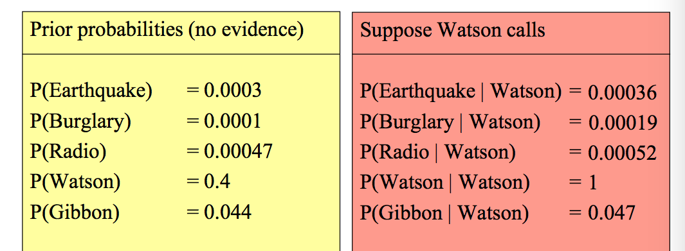

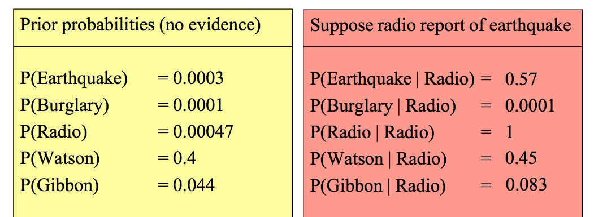

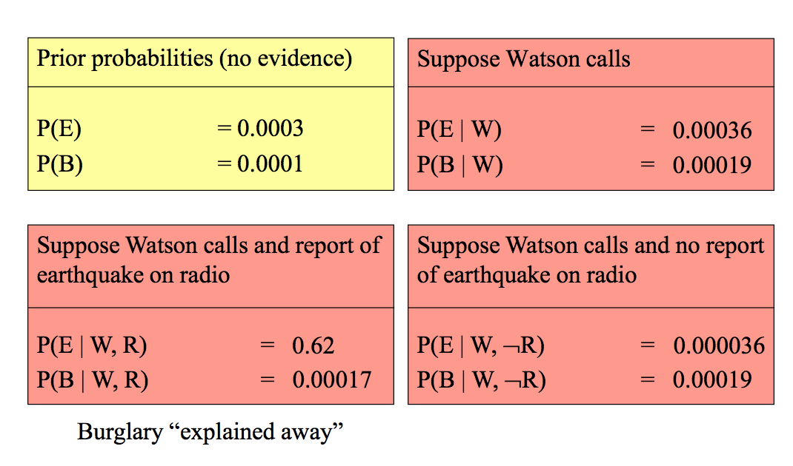

### finding probabilities from the network 

recall the sum rule - we can use this

- P(X=a) = sum P(X=a | Y=b) \* P(y=b)   for all b in dom(Y)
- = sum P(x=a,y=b)/P(y=b) \* P(y=b) for all b in dom(Y)
- = sum of P(X=a, y=b) for all b in dom(Y)

e.g. (disclaimer - I'm so sorry this is in markdown and not a math typeset thing, if you want to fix it I'd be grateful!)

- P(notB | W, G)
- = P(notB, W, G) / P(W,G)
- = P(notB, W, G) / (P(notB, W, G) + P(B, W, G))
- P(notB, W, G) = sum\_over\_dom\_E (sum\_over\_dom\_A(sum\_over\_domR( P(B=false, E=e, A=a, R=r, G=true, W=true)))))
- = sum\_e sum\_a sum\_r P(B=false) * P(E=e) * P(A=a|B=false, E=e) * P(R=r|E=e) * P(G=true|A=a) * P(W=true | A=a) --- using the rule of P(Xi | parents(Xi))
- on the assignment we'll have to do it like this, brute force
- the number of additions in this example are 7 (over the sum of 8 things)
- # multiplications are 8*5 = 40 (multiply 6 things together 8 times)

#### variable elimination algorithms

- reorder computation
- factor
- cache intermediate results
- worst case: inference in #p-complete (harder than np-complete, counting number of solutions)
- the software we're using for the assignment will optimize a lot of this for us, the algorithms have been worked on a lot

specific things we can do in this example

- pull out the P(B=false) since it's constant
 - P(B=false) * [ sum\_a sum\_e sum\_r P(G=true|A=a) * P(W=true|A=a) * P(A=a|B=false, E=e) * P(E=e) * P(R=r|E=e) ]
- push in the sum over R until where we'd use it
 - P(B=false) * [ sum\_a sum\_e P(G=true|A=a) * P(W=true|A=a) * P(A=a|B=false, E=e) * P(E=e) * sum\_r P(R=r|E=e) ]
- note that the sum of P(R=r | E=e) for all r is just 1, because it's over a fixed value for E
 -  P(B=false) * [ sum\_a sum\_e P(G=true|A=a) * P(W=true|A=a) * P(A=a|B=false, E=e) * P(E=e) ]
- then we can push in the sum over E
 - P(B=false) * [ sum\_a P(G=true|A=a) * P(W=true|A=a) * sum\_e P(A=a|B=false, E=e) * P(E=e) ]
- so this narrows it down to 3 adds and 9 mults
- here it takes more effort to simplify the sum of products than to do 40 mults and 10 sums, but when we have big problems and want to save computatoin time it helps a ton

### layers in networks

- sensor outputs are things we can measure (like with sensors)
- arc from gender to age (in second example) because women live longer than men on average
- self report isn't very reliable (how do we measure exercise?)
- root causes are sometimes not evidence (latent/hidden) and we have to guess a probability model
- there were more examples in the slides, I'm just adding pictures of two

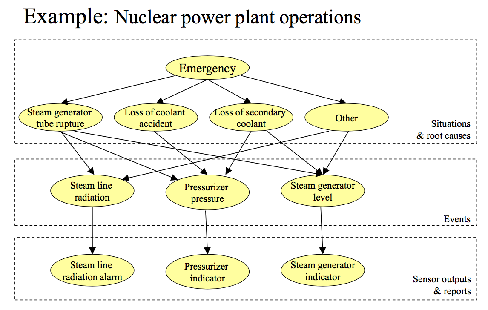

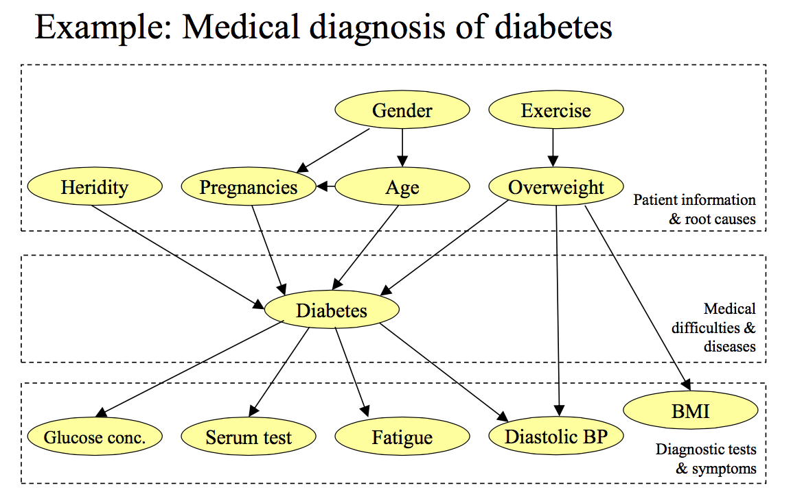

A2 Q3

- we're deciding which of two advertisements are best to show
- we're choosing the advertisements, the context, who we're targeting

~~~~ _LECTURE 11_ ~~~~~

Planning under uncertainty

- to decide among alternative goals and plans of action, an agent's preferences between world states are captured by a real-valued utility function which expresses the desirability of a state
 - e.g. assign 0 to worst posssible outcome, 10 to best

decision theory is probiability + utility

- decision theory: describes what agent should do
- probability theory: describes what an agent should believe on the basis of evidence
- utililty theory: describes what an agent wants

# Decision networks

- bayesian network + actions + utilities
- we're adding decision variables (and we also have the random variables)

Notation

- Wi for 0 <= i < n are states of the world
- A, B, ... (capital letters) are actions
- U(Wi) is the utilitiy of state Wi (from the point of view of the agent making the decision)

Maximum expected utility (MEU) principle

- a rational agent should choose an action that maximizes the expected utility
- EU(A|E) = sum i={0...n-1} P(Wi|E,A)*U(Wi)
- the expected utility of an action given evidence is the sum of the probability of all the states of the world given the evidence and action times the utility of that state

our new running example

> Consider a robot that delivers mail. The robot must choose its route to pickup the mail. There is a short route and a long route. The long route is of course slower, but on the short route there are stairs and the robot might slip and fall down the stairs. The robot can put on pads. This won't change the probability of an accident, but it will make it less severe if it happens. Unfortunately, the pads add weight and slow the robot down.

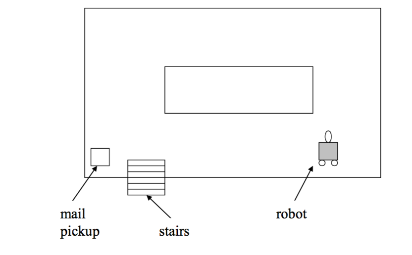

Another example, to show how utility can be measured

- runaway train, and 5 people are on the track
- if you do nothing, the 5 people are killed
- if you hit a lever, the train goes on another track and kills one person
- everyone is a stranger
- but if all lives are equally valuable, having one person die is better than 5
- but if you reduce the number of deaths, you are more actively involved in that death
- another option is to push someone in front of the track to stop the train (same 1 death to save 5 lives)
 - the expected utility is the same, but pushing someone is a bigger moral dilemma
 - if you knew the big guy caused the train problem in the first place, it becomes less of a moral dilemma

### What does a decision network look like?

Decision network: Nodes (3 types)

- chance nodes (ovals) represent random vars (as in Bayesian nets)
- decision nodes (rectangles) represent decision variables (choice of action)
- utility node (diamonds) represent agent's utility function on states
- these shapes are standardized! :p

Arcs

- it must be a directed acyclic graph
- chance nodes' parents are chance and decision variables that directly influence it
- decision nodes' parents are chance and decision variables whose values will be known when decision is made
- utility node parents are chance and decision variables decribing the outcome state that directly affect utility

robot example

- chance (random) variable(s): accident
- decision variable(s): short (if we take the short path,values T/F), pads (if we put on pads, values T/F)
- sometimes decisions have to have an order (decide to be in CS, then decide to take AI), but sometimes (like this example) we pick a random order (so we decided short -> pads) ...or just bunch them together in the network?
- arc from short to accident because it affects chance of accident
- arc from short to pads (see earlier point)
- arc from all variables to u because they all affect the state of the world (accident hurts robot, length of route affects energy, pads affect energy and protection)

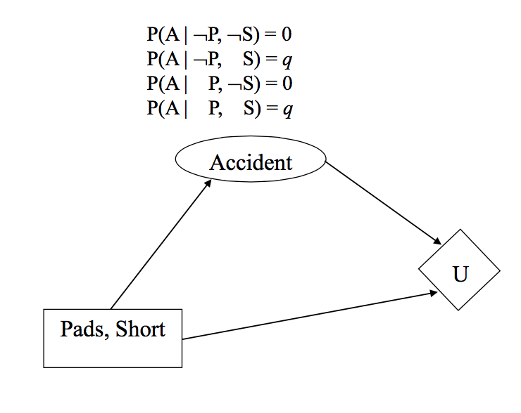

- then we add probabilities for the random variable accident
- then we come up with values for the utility function based on the 8 states of the world - some of them are impossible (like going long path and having an accident) - order them and assign 0 to the worst and 10 to the best and arbitrarily fill in the middle
- note that utility function has no units, it's just a scale of goodness

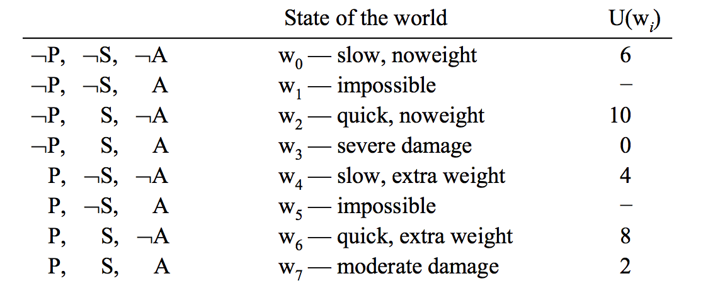

### Evaluating a decision network 

Choose an action by:

1. Set evidence variables for current state
2. For each possible value of decision node
  - a. set decision node to that value
  - b. calculate posterior probability for parent nodes of the utility node
  - c. calculate expected utility for the action
3. Return action with highest expected utility

special case: 

- when there's no evidence, we can simplify EU based on just an action
- EU(A) = sum i={0..n-1} P(Wi|A)*U(Wi)
 - some of these might be 0 if they're impossible and P(Wi|A)=0

e.g. no evidence, action is notP and notS

- EU(notP, notS) 
- = P(W0 | notP, notS) * U(W0) + P(W1 | notP, notS) * U(W1) + 0 + 0 + 0.... (we only count rows with notP and notS, otherwise probability is 0)
- = P(notP, notS, notA | notP, notS) * U(W0) + P(notP, notS, A | notP, notS) * U(W1)
 - (theorem P(A,B|B,C) = P(A|B,C))
- = (1)(6) + (0)(-)
- = 6

see slides for a more in depth walk through of that as well as getting the following results:

- EU(notP, S) = 10 − 10q
- EU(P, notS) = 4
- EU(P,S) = 8 - 6q

then he graphed the EUs

- as 4 lines
- some depend on the variable q, some were horizontal to the the x axis
- so depending on q, different ones would be higher
- conclusion is 
 - if q <= 2/5 then choose notP, S
 - otherwise choose notP, notS

#### robot example (expanded)

- suppose that sometimes there is a small oil slick at the top of the stairs and that the probability that the robot will have an accident is directly influenced by the presence or absence of an oil slick
- new arc is oil to accident (you *could* do accident to oil because probability of accident affects probability of oil, but this is less intuitive and therefore not as good)
- the oil doesn't affect any of the state of world from before, so no arc from oil to u

~~~~ _LECTURE 12_ ~~~~~

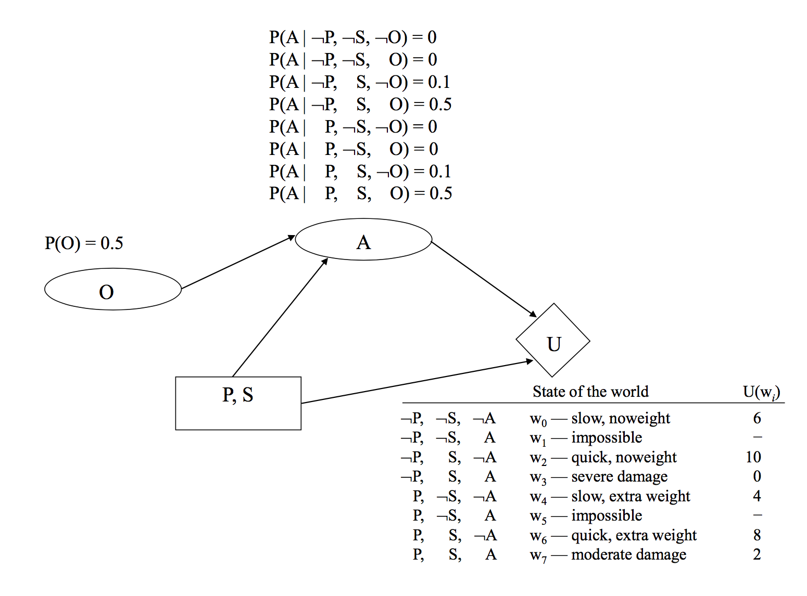

Let's find what the best decisions are

- EU(notP, notS) 
 - = P(W0|notP, notS)U(W0) + P(W1|notP, notS)U(W1)
 - = P(notP, notS, notA | notP, notS)U(W0) + P(notP, notS, A | notP, notS)U(W1)
 - = P(notA | notP, notS)\*U(W0) + P(A | notP, notS)\*U(W1)
- theorem: P(X=a|Z=c) = [sum over all b in dom Y] P(X=a | y = b, Z=C)\*P(Y=b | Z=C)
- so we can continue by making it into
 - [P(notA | O, notP, notS)\*P(O| notP, notS) + P(notA | notO, notP, notS)\*P(notO| notP, notS)]\*U(W0) + [P(A | O, notP, notS)\*P(O| notP, notS) + P(A | notO, notP, notS)\*P(notO| notP, notS)]\*U(W1)
 - = [P(notA | O, notP, notS)\*P(O) + P(notA | notO, notP, notS)\*P(notO)]\*U(W0) + [P(A | O, notP, notS)\*P(O) + P(A | notO, notP, notS)\*P(notO)]\*U(W1)
 - = [(1)(0.5) + (1)(0.5)]*6 + 0 + 0 = 6
- and we can also find that EU(notP, S) = 7, EU(P, notS) = 4, EU(P, S) = 6.2
- so our policy will be to choose notP, S with EU 7 which is decent

#### another addition - we have the option of installing an oil slick detection sensor

why would we *not* want to add it?

- value is different to different people
- e.g. asking directions has very high cost for some people despite it making finding the place easier

Value of information, the basic idea

- One of the most important aspects of decision-making is knowing what information to gather, what questions to ask.
 - e.g., A doctor decides which tests to perform 
 - e.g., Asking directions
- How to decide? Evaluate by the effect on subsequent actions.
- value of information = [expected utility of optimal policy chosen using the new information] minus [the expected utility of optimal policy chosen without new information]
- Notes:
 1. Information has value to the extent that it is likely to cause a change of
plan, and to the extent that the new plan is better than the old plan.
 2. Usually assume that exact information is obtained about the value of
some random variable. May need to average over all possible values of the random variable.

adding the sensor to the network

- adds an arc from O to P,S
- everything else in the network stays the same

Recall: Evaluating a decision network - we choose an action by:

1. Set evidence variables for current state
2. For each possible value of decision node
  - a. set decision node to that value
  - b. calculate posterior probability for parent nodes of the utility node
  - c. calculate expected utility for the action
3. Return action with highest expected utility

case 1: evidence that oil is there

- EU(notP, notS | O) 
 - = P(Wo | notP, notS, O) * U(W0) + P(W1 | notP, notS, O) * U(W1)
 - = (1)\*6 + 0\*- = 6
- EU(notP, S | O) = 5
- EU(P, notS | O) = 4
- EU(P, S, | O) = 5
- so choose not P, notS (EU 6)

case 2: evidence that oil is false

- calculations are very similar
- EU(notP, notS | notO) = 6
- EU(notP, S | notO) = 9
- EU(P, notS | notO) = 4
- EU(P, S, | notO) = 7.5
- so choose not P, S with EU 9

summary:

- without sensor, choose notP, S with EU 7
- with sensor - if oil choose notP, notS with EU 6 and if not oil choose notP, S with EU 9
- what's the expected utility of the new policy with the sensor? 
 - P(O) * 7 + P(notO)*9 = 7.5
- so value of information is 7.5 - 7 = 0.5
- if we add uncertainty to the sensor, the gain might not be enough to be worth it

### Basis of utility theory (don't need to know in great detail)

- can come up with a utility function for any state of the world
- e.g. money somone has vs utility/happiness/satisfaction -- it actually levels out after around 75k

Notation

- A, B, C (states of the world)
- [p, A; 1-p, B] a lottery with two possible outcomes: state A with probability p, state B with probability 1-p
- A > B means outcome A is preferred to B (even though a million gives similar happiness to half a million, most people would still say A > B - so it's preference, not reality)
- A ~ B means agent is indifferent between A and B

Axioms of utility theory

- orderability (A>B) or (B>A) or (A~B)
- transitivity (A>B) and (B>C) => (A>C)
 - if you disagreed with this, and preferred A to B, B>C, C>A
 - suppose you have C, someone can sell you B, then they sell you A, then they sell you C, etc.
- there more axioms on the slides we didn't talk about 

Consequences of axioms

- if an agent's preferences obey the axioms of utility, there exists a real-valued function U such that 
 - U(A) > U(B) iff A > B
 - U(A) = U(B) iff A ~ B
- note that the scale is arbitrary for utility functions, we scale it up or down evenly and it'd be the same (can have really big utilities or negative ones or whatever)

#### example

choose:

- A: 80% chance of $4000 -- [0.8, $4k; 0.2, $0]
- B: 100% chance of $3000 -- [1.00, $3k, 0.00, $0)]
- most people B > A

another lottery:

- C: 20% chance of $4000
- D: 25% chance of $3000
- C > D

combining them to see if we're consistent:

- B > A : U(B) > U(A)
 - U([1.00, $3k, 0.00, $0)]) > U([0.8, $4k; 0.2, $0])
 - so U($3k) > 0.8\*U($4k) + 0.2\*U($0) 
 - so we get U($3k) > 0.8\*U($4k)
- for C > D we do the same thing
 - 0.2\*U(4k) + 0.8\*U($0) > 0.25\*U($3k) + 0.75\*($0)
 - 0.2\*U($4k) > 0.25\*U($3k) ---- multiply both sides by 4
 - 0.8\*U($4k) > U($3k)
- these are inverses! why are we irrational people?
 - B is certainty, we're guarenteed money despite having less average gain -- if you picked A instead of B, there might be regret (emotions aren't really accounted for in the utility function)

~~~~ _LECTURE 13_ ~~~~~

## Sequential Decisions

A sequential decision problem is a sequence of decisions, where for each decision we consider:

- what actions are available to the agent
- what information is, or will be, available to the agent when it will perform the action
- effects of the actions
- desirability of the actions

in robot example

- short, pads, accident, u (state of the world)
- if P(A|notS) = 0, P(A|S) = 3/4 then we'd go the long way
- (accident) points to < u >, short points to (accident) and < u >
- [short] has an arrow to [pads], which means we make the short decision first (though the order of decisions don't really matter for our example)
- let's program an algorithm for this

dynamic programming algorithm:

	repeat:
		consider last decision node
			find optimal decision for every value of the parent node
		replace decision node with a chance node
			- assign probability 1 to optimal choice
			- assign probability 0 to non-optimal choice
	until no more decision nodes
	read policy in forward direction

e.g. on this network: 

- iteration 1
 - if short: EU(Pads|Short) = 3.5, EU(notPads|Short) = 2.5 (note these are different numbers than earlier in the example)
 - if not short: EU(Pads|notShort) = 4, EU(notPads|notShort) = 6
- now we change the box around pads to an oval and give it probability distribution
 - P(Pads|Short) = 1 (since it's always the better choice if we know short)
 - P(notPads|Short) = 0
 - P(Pads|notShort) = 0
 - P(notPads|notShort) = 1
- iteration 2:
 - EU(short) = 3.5
 - EU(notshort) = 6
 - so short becomes a random variable with P(short) = 0, P(notshort) = 1
- then we get notshort, notpads

what is the expected utility of going short?

- P(notP, notA | S) * U(W2) + P(notP, A | S) * U(W3) + P(P, notA | S) * U(W6) + P(notP, notA | S) * U(W7)
- Recall theorem: P(X,Y|Z) = P(X|Y,Z)*P(Y|Z)
- = P(notA | notP, S) * P(notP | S) * U(W2) 
 - \+ P(A | notP, S) * P(notP | S) * U(W3)   
 - \+ P(notA | P, S) * P(P | S) * U(W6)  
 - \+ P(notA | notP, S) * P(notP | S) * U(W7)  
- note that pads don't affect accident given the path, so we can cross that out
- = P(notA | S) * P(notP | S) * U(W2) 
 - \+ P(A | S) * P(notP | S) * U(W3)   
 - \+ P(notA | S) * P(P | S) * U(W6)  
 - \+ P(notA | S) * P(notP | S) * U(W7) 
- = (1/4)\*0\*10 + (3/4)\*0\*0 + (1/4)\*1\*8 + (3/4)\*1\*2
- = 3.5

### Decision processes (feels like we only kinda glossed over this)

- indefinite and infinite horizon problems
 - ongoing processes or it is unknown how many actions are required
- Wide range of applications
 - robotics (e.g., control)
 - investments (e.g., portfolio management)
 - computational linguistics (e.g., dialogue management) - operations research (e.g., inventory management)

Markov Decision Process (MDP)

- set of states S
- set of actions (ie decisions): A
- transition model:  P(S\_t | A\_t-1, S\_t-1) -- given an action and current state, what's the new state we're in
- reward model (i.e., utility): R(S\_t, A\_t-1, S\_t-1)
- discount factor: between 0 and 1 inclusive (10 dollars now and 10 years from now have different values, we value things that are more immediate and over time it loses value)
- horizon (ie # of time steps): h
- goal: find optimal policy

e.g.

Transition model

- note that P(S3 | A2, S2) = P(S3 | A2, S2, S1, S0, A0) because the whole history is apparently stored in the current state S2 (though this is not always true in real life)
 - Markov assumption: P(S\_t+1 | S\_t, ..., S\_0) = P(S\_t+1| S\_t)
- Stationary: the transition probabilities are the same for
each time point
 - P(S\_0) specifies initial conditions
 - P(S\_t+1 | A\_t, S\_t) specifies the dynamics, which is the same for each t >= 0

Why so many utility nodes in decision network?

- U(S0, S1, S2, ...)
 - states keep going infinitely into future, infinite process -> infinite utiltity function
- so we assume that they're additive preferences
 - R(S\_t, A\_t-1, S_t-1) is immediate reward from doing action A\_t-1 and transitioning from state S\_t-1 to state S\_t
 - so we say the utility is the sum of all the individual rewards leading up to it

Discounted Rewards

- if process is infinite, isn't the sum of rewards infinite? so how do we pick the right policy
- e.g. if we get 1$ at each state, the infinite sum is same as if we got $100 at each
- so we use discounted rewards
 - finite utility is a geometric sum
 - if the discount is less than 1, it converges
 - the discount is like inflation rate
 - intuition is that we prefer utility sooner than later

Policy

- choice of action at each time step
- formally:
 - mapping from states to actions
 - ie delta(state) = action
 - assumption that we have fully observable states (which allows next action to be chosen only based on current state) even though we don't usually know the full state we're in
- optimal policy
 - policy delta* with highest expected utility
 - EU(delta) <= EU(delta*) for all delta

#### Example

- a robot is in a grid world
- set of states is S = {s11, s12, ...., S34}
- initial state: s11 -- aka the square at coordinate 1,1
- goal states: s24 or s34
- process ends when it enters a good state
- square 2,2 is surrounded by a wall so robot can't get there
- set of actions A = {up, down, left, right}
- transition model:
 - P((S'| S, A) = 0.8
 - so 0.8 chance of going the right way (forward), 0.1 of going left or right instead
 - if bumps into wall, stays in same square
- reward model:
 - s24 gives -1
 - s34 gives +1
 - all other states give -0.04 (including if you stay in that state after a "move")
- discount factor is 1 (no discount over time)

intuitively:

- to the left of the +1, we'd want to go to the right
- everything on the bottom row wants to go to the right
- 11 and 21 go down
- 12 and 13 and 14 go left (to avoid the possibility of ending up on 24 with -1)
- 23 goes down

if we do +0.04 for every attempt

- we avoid the final states and try to move around elsewhere counting up an infinitely high score
- 14 goes up, 23 and 33 goes left, everything else can go any direction

#### there was another example on the slides instead of this one but pretttyy sure we didn't talk about it in lecture

### other representations for decision processes

- dynamic decsion networks
 - MDP is a state based representation
 - so we describe states in terms of random variables
 - replace each state node with baysean network to represent that state
- partially observable Markov decision process (POMDP)
 - states not fully observable
 - partial/noisy observations of the state

~~~~ _LECTURE 14_ ~~~~~

# Multiagent systems

- To cooperate or compete with other agents, an agent must reason about other agents' preferences and knowledge of the world, as well as its own preferences and knowledge.

Multiagent framework

- multiple agents, each with 
 - its own info about the world and other agents
 - its own utility function 
- each agent decides what to do, depending on their value and also other agent's values
 - outcome depends on the actions of all agents
- two ends of the spectrum 
 - fully cooperative: agents have same utility function
 - fully competitive: win-lose (zero-sum games) 
- most frameworks are between these two extremes - agent's utilities are synergistic in some aspects, competing in some, independent in others

Applications of Multiagent Systems

- Board games: checkers, chess, backgammon, Go
- Card games: Poker
- Interactive computer games
- Planning and control
- Bankruptcy proceedings
- Bidding for wireless spectrum rights
- ...

Game Theory: Framework

- studies what agents should do in mutli-agent setting
- strategic (normal) form of a game
 - finite set of agents I={1,...,n} -- we'll usually use 2
 - set of actions A\_i for each agent i in I
 - a utility function u\_i for each agent i in I
- each agent chooses an actoin without knowing what the other agents choose
- joint action of all agents produces the outcome

Strategies

- a strategy for an agent is either pure or stochastic
 - pure: they pick one action
 - stochastic (mixed): probabiltiy distribution over the actions for this agent (more than one action has a non-zero probability)
- strategy profile is an assignment of a strategy to each agent
 - if sigma is a strategy profile, let sigma\_i be the strategy of agent i in sigma and let sigma\_-i be the strategies of the other agents, ie sigma is (sigma\_i)(sigma\_-i)

### Example

- two people: Fred and Barney
- I = {F, B}
- A_F = {home, beach}
- A_B = {home, beach}
- if Fred an Barney both stay home, utility is (0,0) ie the utility is 0 for both of them
- if Fred goes to each and Barney stays home, utility is (1, 0) ie utility for Fred is 1 and Barney is 0
- if Barney goes and Fred doesn't, utility is (0, 1)
- if they both go, they have a friend, so utility is (2,2)

strategy profile:

- Fred, Barney
- (home, home)
- (home, beach)
- (beach, home)
- (beach, beach)

let's look at sigma = (home, beach)

- sigma_fred = (home)
- sigma_barney = (beach)
- sigma_-barney = (home)
- utility(sigma, fred) = 0
- utility(sigma, barney) = 1

what should they do?

- no matter what the other does, it's better for them to go to the beach, so they'll probably both go to the beach

### Nash equilibrium

- strategy profile sigma has a utility for each agent
 - let utility(sigma, i) be the (expected) utilty of a strategy profile sigma for agent i
- the best response for an agent i to the strategies of other agents is a strategy that has maximal utility for agent i
- a strategy profile is a nash equilibrium if for each agent i, strategy sigma\_i is a best response to sigma\_-i
 - every finite game has at least one nash equilibrium
 - there is not necessarily pure strategy that is nash, though

is sigma(beach, beach) a nash equilibrium?

- if barney goes to the beach, is fred choosing the beach the best option? yes
- if fred goes to the beach, is barney choosing the beach the best option? yes

is (home, beach) nash?

- utility ((home, beach), Fred) >= utility ((beach, beach), Fred)? 0 >= 2? noppe
- Barney is making the best decision, but Fred isn't

### pareto optimal 

- An outcome is Pareto optimal if there is no other outcome that makes every player at least as well off and at least one player strictly better off
- every finite game has at least one pareto optimal outcome
- not necessarily a nash equilibirum though
- in the prev example, the only pareto optimal one is the one that's nash 

#### another example

- Fred and Wilma can each stay home or go to pool
- Wilma is the left axis, Fred is top axis of table
- Wilma home, Fred home (2, 0)
- Wilma pool, Fred home (3, 0)
- Wilma home, Fred pool (2, 1)
- both pool - (1, 2)

nash for this example

- (home, home), not nash - Fred's best response to Wilma staying home is pool
- (home, pool), yes
- (pool, home), not nash 
- (pool, pool), better for wilma to stay home

pareto optimal

- (home, home) - no because Fred would be happier at the pool
- for all the rest, they're pareto optimal

### dominated strategies

- strategy sigma\_i strictly dominates strategy sigma'\_i for agent i if for all strategy profiles sigma\_-i of the other agents, sigma\_i has higher utility
- ie sigma\_i is better than sigma'\_i no matter what other player agents do

Computing Nash Equilibriums

- Iterated elimination of dominated strategies
- eliminate any pure strategy dominated by another strategy
- the dominating strategy can be a randomized strategy
- this is done repeatedly

### Stochastic (mixed) strategies

computing nash equilibrium

- If a stochastic (mixed) strategy is a best response, then each of the pure strategies involved in the mix must itself be a best response; i.e., each must yield the same expected utility
- Forms a set of constraints that can (sometimes) be solved to give a Nash equilibrium

#### new example

> Consider Fred and Barney. They each would prefer to be in the same place (the swim or the hike), but their preferences differ about which it should be. Fred would rather go swimming, and Barney would rather go hiking. 

- strategy is now stochastic (mixed): probabiltiy distribution over the actions for this agent (more than one action has a non-zero probability)
 - sigma\_Fred = [p, swim; 1-p, hike]
 - sigma\_Barney = [q, swim; 1-q, hike]
- (swim, swim) and (hike, hike) are both nash, pareto and none others are

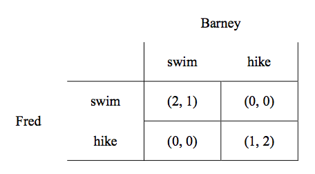

what values of p and q would make nash equilibrium?

- If Fred swims, Barney rolls the dice (might go swimming, might not)
 - what's Fred's utility? --> probability q (if Barney swims) * 2 (utility) + probabilty 1-q (he doesn't swim) * 0 (utility) = 2q
 - what's Barney's utility? --> q\*1 + (1-q)\*0 = q
 - so if Fred swims, utility (2q, q) 
 - if Fred hikes, utility (1-q, q(1-q))
 - if Barney swims, (2p, p)
 - if Barney hikes (1-p, 2(1-p))

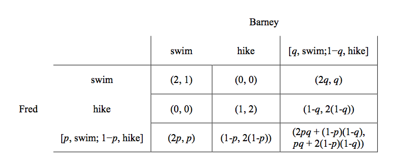

when we combine all this it gets really complex (the bottom right corner of the above pic) but that equation doesn't matter

Consider from Fred's point of view

- EU\_Fred(swim) = 2q
- EU\_Fred(hike) = 1-q
- we want to make them equal, so no matter what we pick, EU is (better than or) equal to the other option
- Both swim and hike must be best responses from Fred's point of view to Barney's strategy. For both swim and hike to be best responses, they must give the same expected utility (they must be equal)
- if EU_Fred = EU_Fred(hike), 2q = 1-q so q = 1/3
- Suppose, for example, that hike was not a best response for Fred, given Barney's strategy; i.e., it had a lower expected utility. Then Fred could drop hike from his stochastic (mixed) strategy and improve his expected utility. Therefore, each of the pure strategies in the stochastic strategy must be a best response; i.e., have the same expected utility.
- To summarize, if Fred is mixing on both swim and hike in a Nash equilibrium, then both swim and hike must yield the same expected utility. Thus, Barney must be following the mixed strategy: sigma\_barney = [1/3, swim; 2/3, hike]

now consider similiarly Barney

- EU\_B(swim = p), EU\_B(hike) = 2(1-p)
- make them equal, p = 2(1-p)
- p = 2/3

so

- the total expected utility is (2/3, 2/3)
- but note that even though it's nash, it's not pareto -- (1, 2) and (2,1) are both better for both
- it's tricky - hard to make a good decision without knowing what the other person will choose

another example, divorce

- jack (left) and jill (top) can both be concilatory and aggressive
- if they're both concilatory (50, 50)
- if jack is concilatry and jill agressive (20, 80)
- if opposite, (80, 20)
- if both agressive, (30, 30)
- the only nash equilbrium is both agressive, but that's not pareto optimal

I got a question around this wrong on the assignment - TODO add explanation here

~~~~ _LECTURE 15_ ~~~~~

# learning (and supervised learning)

Agents that learn rather than programming them by hand, and agents that learn to improve their performance over time.

Applications

- Medicine (diagnosis)
- Text classification (spam filtering)
- Game playing (move heuristics)
- Vision (face recognition)
- Speech (speech understanding)
- Character recognition (handwriting recognition)

How can "learning" be defined?
- Learning is an increase in "knowledge"
- Depends on definition of "knowledge"

taxonomy of learning systems

- rote learning (learning by being told) - memorize facts e.g. database
- speedup learning (learning by practice) - become more efficient over time e.g. caching
- inductive learning (learning by generalizing) - evaluate by correctness of new knowledge

Evaluating learning systems

- Rote learning: evaluate by system's ability to exploit the new knowledge
- Speed up learning: evaluate by measuring increase in efficiency
- Inductive learning: evaluate by correctness of the new knowledge

inductive learning: supervised learning of an unknown function f

- input: collection of training examples 
 - each training example is tuple (xi, yi)
 - where xi is an array of features (also called attributes) 
 - yi is the outcome f(xi) 
- other input is hypothesis space H (could be all neural networks, or in linear regression H could be all possible lines) 
 - can be infinitely big
- output: hypothesis h in H that approximates f (a method of classifying subsequent, unseen examples)

example of regression

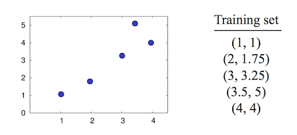

- we played around in class on matlab with plotting curve to points - linearish data, line looks good, degree 2 similar to line, cubic/quartic seem to overfit
- if we want 0 error in training set, it would go through all the points, this is not great

exam analogy

- if exam is exact same as assignments, we'd get 100% (if we knew assignments well)
- test set is same as train set 
- we do well but this doesn't show we understand course content well
- so we want to be able to generalize and do well on data we haven't seen before, need separate test set apart from the train set

#### jeeves tennis example

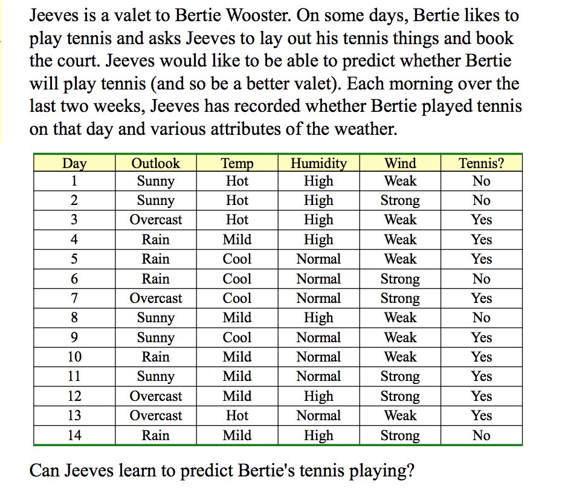

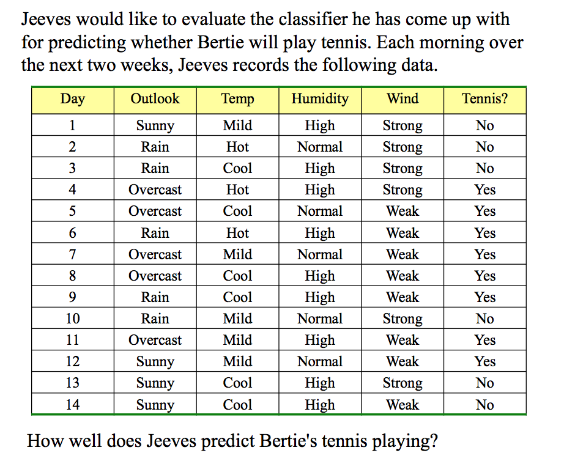

features can be

- real-valued
- discrete, finite set
 - also called categorical or nominal
 - can be binary or (ordered, unordered) multivariate 

outcome -> machine learning problem type

- outcome real valued -> regression problem
- outcome discrete -> classification problem

### issues in learning these functions:

choice of training data

- choice of features/attributes
 - we tend to gather as many features that seem relevant
 - then we reduce it down to the ones we use (using careful methodology)
- constructing new features
 - like ratio of 2 features
 - max, log, and other transformations
- is it representative?
 - e.g. with tennis data if those 2 weeks of data were the only 2 weeks on vacation, we can't really generalize to the rest of the year
- balance of positive and negative examples
 - e.g. collecting data about very rare disease, most of the data is for not having it - we could just say 'no you dont have it' which is really accurate but not what we want
 - one way of fixing this is just duplicate the data for having it
 - keep in mind the cost of the mistake of false positive vs false negative

choice of hypothesis space H

- cost of learning hypothesis h 
 - could take months, the problem is already np complete with just one hidden layer, deep neural networks have multiple hidden layers and need lots of computing power
- amount of training data need to learn h 
 - need lots of data usually to be good
- does representation make sense given domain knowledge and data (is it capable of fitting/representing the data?) 
 - e.g. a line can't model a plot that looks like a curve

choice of hypothesis h in H

- simplicity of learned function h 
 - Ockham's razor: Suppose there exist two explanations for an occurrence. In this case the simpler one is usually better. Another way of saying it is that the more assumptions you have to make, the more unlikely an explanation is.
 - in regression example before, the line was pretty good so we prefer that, even if degree 2 is slightly better
 - we always prefer simpler
- performance on training set - data it's seen before
- performance on test set - ie ability to generalize (data it hasn't seen before)
- judging performance - measuring errors

Judging performance (measuring errors)

- we are trying to minimize total error, which is the sum of error in each example
- measuring error for discrete classification: e.g. error could equal 0 if we classify wrong, 1 if right 
 - false positive is if you say yes but it's actually no
 - false negative is if you say no but it's actually yes
 - eventually we'll factor in different cost for false positive and false negative, but not talking about it now
- for continuous error: 
 - could take absolute difference between prediction and actual value
 - or could take the squared error - minimizing variance
 - if sum of error (total error) is 0, h is said to be _consistent_ with the data

choice of hypothesis (ct'd)

- definition: given the hypothesis space H, and hypothesis h is said to *overfit* the training data if there exists some hypothesis h' in H such that
 - h has smaller error than h' over the training set
 - BUT  h' has smaller error than h over the entire distributions of instances
- as the complexity of hypothesis h increases
 - error on training set keeps going down
 - error on test set starts high (underfitting), goes down, but then starts to go up (overfitting)
- solution is to keep a test set that is completely independent - you learn h and then check it against test set to see how good it was

~~~~ _LECTURE 16_ ~~~~~

## Learning Bayesian networks for classification

- Use a Bayesian network to infer the probability distribution of some class variable
 - specifies the probability the class variable will take on each of its possible values given available evidence
 - e.g. P(Tennis = "yes" | evidence), P(Tennis = "no" | evidence)

strategies (from simplest to hardest)

- (1) given data and naive bayes (fixed structure) of network, learn probabilities 
 - naive because it assumes a lot of conditional independences that don't hold - but it still works often
- (2) given data and structure of network (we come up with it), learn probabilities 
 - polynomial
- (3) given data and node for each attribute and class variable, learn arcs and probabilties 
 - NP complete (e.g. local search in A1Q3)
- (4) given data and node for each attribute and class variable, learn hidden nodes, arcs, probabilities
- now whenever someone publishes a fancy new thing, they compare it naive bayes to show that it's better than that simple baseline (turns out some things ppl used to come up with weren't really much better than naive bayes)

### (strategy 2) designing a network for tennis:

- tennis node
- outlook node goes into tennis (we could have tennis to outlook, but that's less intuitive)
- same for the other nodes, they all go into tennis
- humidity isn't conditionally independent of outlook, need an arc there
- same with outlook and temperature
- starting to have a lot of arcs and probabilities now

### (strategy 1) Naive Bayes

- drop temperature because it didn't fit on the slides
- we have tennis -> each of outlook, humid, wind
- we can fill out the probabiltiy tables using the data (e.g. out of the 9 times tennis is yes, how many have outlook sunny?)

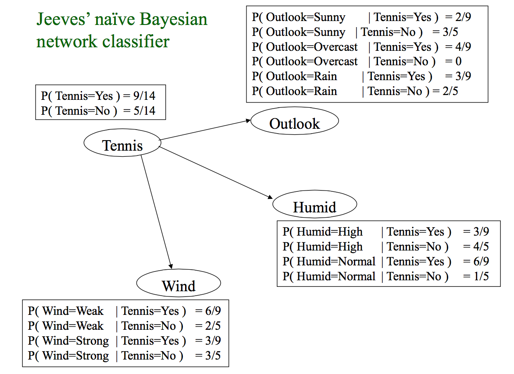

Is this network a good model? 

- consider the conditional independence assumptions in the naive bayes classifier
 - using the two equations (formula for network and chain rule) we see we're making some assumpitons 
 - P(Tennis, Outlook, Humid, Wind) = P(Tennis) P(Outlook | Tennis)
P(Humid | Tennis) P(Wind | Tennis)
 - P(Tennis, Outlook, Humid, Wind) = P(Tennis) P(Outlook | Tennis)
P(Humid | Tennis, Outlook) P(Wind | Tennis, Outlook, Humid)
 - not all of those should be equal e.g. P(Humid | Tennis) isn't really equal to P(Humid | Tennis, Outlook)
- consider empirically - P(Humid=high | Tennis = yes) should equal sum of P(humid high | tennis yes and outlook = sunny/overcast/rainy) -- not even close to equal (though to really show this we'd need more data and some chi squared or t distribution type thing we learned in stats class that the prof didn't actually research before this class)
- so it's not that accurate, but often works well enough - in this example it actually gets all but 2 correct in the test set
- and it's easy to calculate!

#### How to use the naive Bayesian classifier

- let the domain of class variable be {c1,...,cl}
- given a new instance with feature values a1,...,ak, determine value of class variable with highest probability
- argument ci that maximizes P(class=ci|a1,...,ak)
- = argmax\_ci P(class=ci, a1, ..., ak) / P(a1,...,ak)
- = argmax\_ci P(class=ci, a1, ..., ak) (since the denomator stays constant)
- = argmax\_ci P(class=ci) * product j=1..k P(aj | class=ci)

Given outlook=sunny, humidity=high, wind=strong... tennis?

- yes? P(Tennis = yes) * P(outlook = sunny | Tennis = yes) * P(humidity = high | tennis = yes) * P(wind = strong | tennis = yes) = 0.01587
- no? P(Tennis = no) * P(outlook = sunny | Tennis = no) * P(humidity = high | tennis = no) * P(wind = strong | tennis = no) = 0.1029
- 0.1029 > 0.01587, so tennis won't be played
- we can calculate the denominator we dropped before 
 - 0.01587/alpha + 0.1029/alpha = 1, so alpha = 0.11877
- so probability of tennis given the features = 0.01587/0.11877 = 0.13
- probability of not tennis is 0.87

Handling missing values

- suppose outlook = ?, humidity = high, wind = strong 
- tennis?
- just omit the outlook in calculation
- for Tennis yes: P(Tennis yes) * P(humidity high | tennis yes)*P(wind strong|Tennis yes) = 0.071
- for Tennis = no, we get 0.171

#### Learning probabilities

- we estimated for example that P(Outlook sunny | Tennis yes) = n\_a/n = 2/9
- where n = 9 is number of instances for which Tennis=Yes
- n\_a = 2 is number of instances for which Outlook=Sunny using just the instances where Tennis=Yes
- This will be a poor estimate when na is small or zero
 - we'd say the event is impossible but that's not true, it's just unlikely

solution (or rather, hack) to the n\_a = 0 problem

- m-estimate of probability
- probability = (n_a + m\*p) / (n+m)
 - E.g., for P( Outlook = Overcast | Tennis = No )
 - Assume p = 1/3 (equally likely to be Overcast, Sunny, Rain)
- where p is prior estimate of probability
- m is 'equivalent sample size weighting' (the fudge factor, usually 1 or 2) -- this is kind of random and the prof didn't have a good explanation for why certain values work - there's just been done a lot of research on it and this apparently works
- e.g. spam network
 - spam node, points to k words and tokens
 - a token isn't a word in a dictionary, but a maximal string of symbols (sometimes email address, symbol)
 - let p be 1/size_vocab
 - here m is |vocab| cause that works best apparently
 - P(word\_i | spam) = (n\_i + 1) / (n + |vocabulary|) 
 - ^ this is used in ThunderBird

### (strategy 3) learning arcs and probabiltiies 

- steps
 1. for each feature/variable and class variable, determine parent sets and score (like A1Q3) (example BIC - Bayesian information criterion - can do this) - we want it to fit the data well but not be too complex (don't want to overfit), so BIC penalizes complexity
 2. pick a parent set that (1) has no cycles and (2) minimizes total score and solve with local search (more efficient, allows more complex network) or A* (guarentees optimal)
- turns out the solution for our example is
 - humidity points to tennis and temperature, outlook ad wind and on their own
 - we have so little data so we shouldn't read into it that much
 - it's not that outlook and wind have no influence, it's just low enough that it's not worth the cost
- another solution with equal cost is temp->humidity->tennis and outlook and wind on their own

~~~~ _LECTURE 17_ ~~~~~

# Decision trees

- start at the root
- at each node in the tree, a feature is tested
 - arcs labeled with the values of the feature
- leaves contain the classification

e.g. for jeeves

- root has 9 positive examples, 5 negative
- root we choose to branch on outlook - children are sunny, overcast, rain
- sunny has 2 p, 3 n
 - we branch on humidity
 - high goes to no
 - normal goes to yes
- overcast has 4 p, 0 n so we put yes in that node
- rain has 3 p, 2 n
 - branch on wind
 - strong gives no, weak gives yes

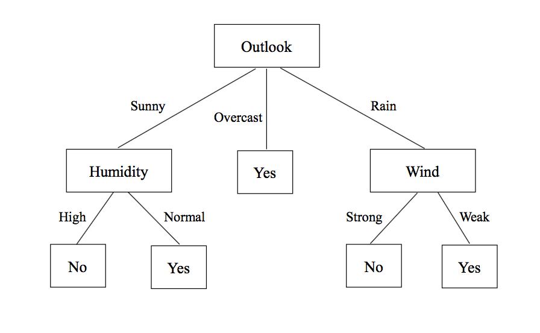

the tree could be a lot more complicated if we branch on other things

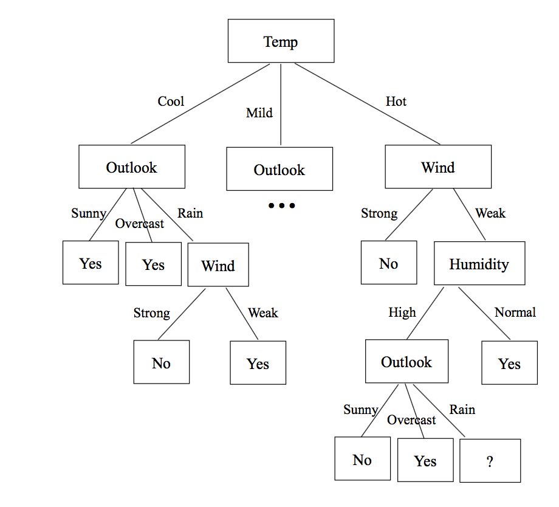

- each node is a sentence in prop logic - e.g. outlook=strong and humidity=high => tennis=no
- note that temperature hot and wind weak and humidity high and outlook rainy has no data
 - so what would we put there? maybe the answer that shows up more (he plays tennis more than not, so we could say yes there)

what makes a good tree?

- the first, simpler tree is easier to parse
- generally, as the tree becomes more complex, the error on the test set will start going up agin (overfitting)
- our more complex tree gets about half of the test set wrong

#### ID3 algorithm

- input: set of S positive and negative examples, set F of features
- recursive algorithm

		ID3(F,S):
			if S contains only positive examples, return yes
		 	if S contains only negative examples, return no
		 	else:
		 		choose best feature f in F
		 		for each value v of f:
		 			add arc to tree with label v 
		 			add subtree ID3(F - {f}, {s in S | f(s) = v})

Which is the *best* feature?

- assumption: simplest decison tree generalizes best
 - NP complete in general to find the smallest decision tree
- approximate using greedy, heuristic approach
- heuristics attempt to distinguish necessary features from extraneous features
 - simplest decision tree is least likely to include unnecessary feature tests

choosing a feature:

- the k children of a feature with p positive and n negative examples each have some number of positive and negative examples p1 n1, p2 n2, ..., pk nk
- worst possible feature is if pi = ni for all i
- best possible feature is if pi=0 or ni=0 for all i (so we get a perfect leaf)

### information theory

- suppose there are l outcomes c_1, ..., c_l each with probability P(c_1), ..., P(c_l) respectively 
- The information content of knowing the actual
outcome is given by:
- I(P(c1),...,P(cl)) = sum i=1..l ( - P(ci) \* log\_2(P(ci)))
- consider the case with two possible outcomes heads/pos or tails/neg
- by defintion, I(1,0) = 0, I(0,1) = 0 
 - because there's no information gained from flipping the coin, we always know it'sll be heads or tails
- more generally, consider I(p, 1-p) for p in [0,1]
 - maximum I at p = 1/2

e.g. consider the flip of a coin

- fair coin
 - I( 1⁄2, 1⁄2 ) = -(1⁄2)\*log2(1⁄2) - (1⁄2)\*log2(1⁄2) = 1 bit
 - Being told the result of the flip gives you 1 bit of information
- unfair coin
 - I(1/100, 99/100) = 0.08 bits
 - a lot less information than fair coin (you know it was likely to be that outcome)

using this

- Before testing a feature, two possible outcomes 
 - example is positive with probability p / (p + n)
 - example is negative with probability n / (p + n)
- the information content (how much more we'd know) of knowing the actual outcome is I(p/(p+n), n/(p+n))
 - the two paramaters we pass are probability it's a yes and probability it's a no
 - if n or p is 0, knowing the actual outcome gives us no more information - since we already know for sure what the answer is
- now we can test a feature f for how much information we've gained
 - gain(f) = I(p/(p+n), n/(p+n)) - sum i=1..k (pi+ni)/(p+n)\*I(pi/(pi+ni), ni/(pi+ni))
 - we weight the information of each child with (pi+ni)/(p+n)
 - Choose feature with largest information gain

Example - picking the root of the tree

- if we pick outlook, gain(outlook) = I(9/14,5/14), [5/14 * I(2/5, 3/5) + 4/14 * I(4/4, 0/4) + 5/14 * I(3/5, 2/5)] = 0.247 bits
- gain(temperature) = 0.029 bits
- gain(humidity) = 0.151 bits
- gain(wind) = 0.048 bits
- so we want to branch on outlook because it has biggest gain
- if you want to see the whole tree getting decided with all the calculations, check out the very long example in the slides

### extending decision trees - tricky things

- numeric (real-valued) attributes (so can't split into buckets of each value) -- we'll look at this one today, the rest next lecture
- missing attribute values
- discrete attributes with many values (will skew gain towards these attributes)
- attributes with cost - e.g. if you're testing for something, you start with things like temperature that are less invasive, and then would do something like surgery later on only if needed, surgery has higher cost
- multiclass (non-binary) class variable
- noise and overfitting

#### numeric (real-valued) attributes

- Many real-world problems contain numeric attributes
- E.g.: Jeeves data with temperature recorded using real-valued attribute

solution 1: 

- discretize 
- e.g. temperature < 20.8 is cool, between 20.8 and 25 is mild, more than 25 is hot

solution 2: 

- branch on real valued attributes in decision tree
- dynamically pick a split point c and branch on temp < c and temp >= c)
- how to pick the threshold c though?
 1. sort instances according to the real valued attribute
 2. possible c's are those that are midway between two values that differ in their classification
 3. determine the information gain for each of the possible c's and choose the c with the largest gain

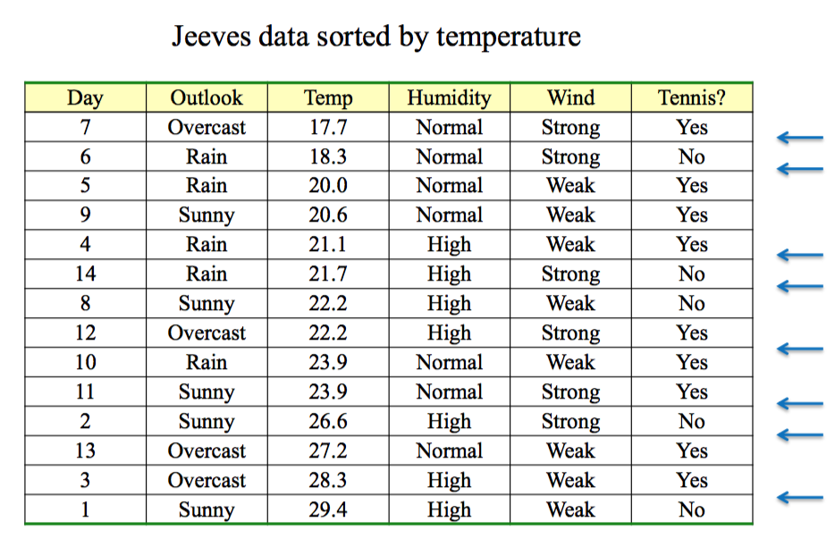

 - note that there's a splitpoint before and after the two 22.2 points because they have same temperature but both answers (so we treat it like new yes/no category that 22.2 belongs in)
 - e.g. split on c = 21.95 (midway between 21.7 and 22.2)
  - gain(temp < 21.95) 
  - = I(9/14, 5/14) - [6/14 * I(4/6, 2/6) + 8/14 * I(5/8, 3/8)] 
  - = 0.00134 bits

additional complication

- on any path from root to leaf, discrete attribute is tested at most once but real valued attribues can be tested *many* times
- result: large trees, and trees that are difficult to understand (if your goal is just to do well at prediction, this is fine - if you want to understand and explain the decision then it becomes an issue)

NOTE: we want the smaller tree *not* because of efficiency (computers are fast at evaluating no matter the size of the tree, we're just going down the tree linear to the height) - it's because simpler trees tend to perform better on data it hasn't seen before

~~~~ _LECTURE 18_ ~~~~~

Recap

- build with train set, check with test set
- complex trees do well on train set but not test set
- information gain
- extending decision trees - last time we talked about real valued attributes

#### Missing attribute values

- real world data often has missing attribute values 
 - maybe values not recorded or maybe too expensive to obtain
- two cases where this comes up
 - data when constructing tree
 - data when using tree

solution when constructing decision tree

- we're trying to build the tree but are missing training data
- one solution is using other instances to estimate missing attribute (use mode)
- or divide example into fractional examples weighted according to frequency of value of attributes
- e.g. suppose outlook value for day 1 was missing in training data
 - majority: it rained more than anything else, we so can just say it rained
 - fractional: or we could make 3 different subrows with each value (one row with sunny, one with overcast, one with rain) and then in all the rows in the data we'd assign weights - weight=1 for rows we know are right, the sunny guess row would have weight = (#occur of sunny) / (total data points) and similarly for overcast, rain

solution when using decision tree

- we want a prediction from the tree but don't have all data
- pretend example has all possible values for the missing variable
- follow all possible branches for those values
- weight answer from each branch by the probailty of that value
- return most probable answer
- e.g. don't know outlook
 - if sunny, prediction is no
 - if overcast, prediction is yes
 - if rain, prediction is no
 - 5/14 liklihood of humidity (from training data) etc.
 - so 10/14 would have no, 4/14 would have yes - so we pick no

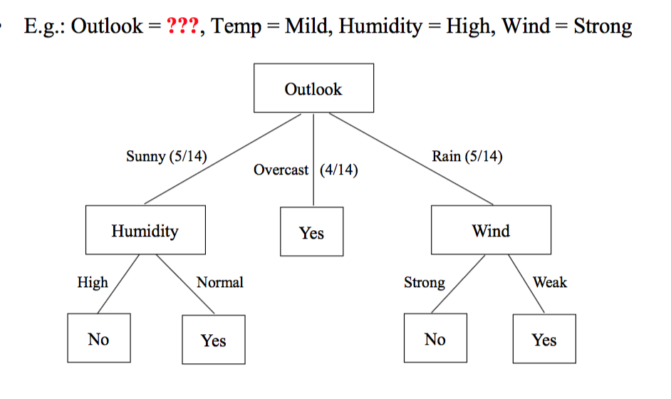

#### discrete attributes with many values

- Recall: choose the attribute to split on that gives maximum information gain
- Problem: If an attribute has many values, gain will select it
- e.g. imagine day in the training data is an attribute (
 - has 14 values in domain as opposed to others with 2 or 3 
 - so the gain formula will definitely pick this one (because the sum we subtract off in the gain formula will be 0, so gain would be highest)
 - but it wouldn't work at all in the test set

solution: 

- pick an attribute that maximizes gainratio
- Suppose that attribute A splits a set of examples S into k different subsets: S1, ..., Sk
- gainratio(A) = gain(A) / I(|S1|/|S|, ..., |Sk|/|S|)

#### attributes with costs

- In some learning tasks, attributes may have costs 
- E.g.: Medical setting
 - Temperature <- less costly, non-invasive
 - Pulse <- less costly, non-invasive
 - Biopsy <- costly, invasive
 - Blood test <- costly, invasive
- so we want high accuracy *and* low cost
- one solution: GainCost(A) = Gain(A)^2 / Cost(A)
- "when it comes to heuristics, it always looks like a big hack and it is"
- some intuition for why we square it: to give the gain more weight over cost

#### multiclass (non-binary) class variable

- So far: class variable is binary (Tennis = Yes, Tennis = No)
- Suppose class has L possible values {c1, ..., cL}
- update ID3 to check for leaf with all values of class value (and not just positive/negative values as before)
- when we choose the best feature to branch on, instead of I(p/p+n, n/p+n) we'd do I(|C1|/|S|, |C2|/|S|, ..., |Ck|/|S|)
- we have a lot of optimizing for binary variables though, so that's preferred

#### noise and avoiding overfitting

- Attributes may be based on measurements or subjective judgements
- E.g., Suppose Outlook for Day 1 incorrectly recorded as Overcast
- training examples may be misclassified
- e.g. suppose class of day 3 is misclassified as no
 - tree becomes different, and a lot more complicated! 
 - 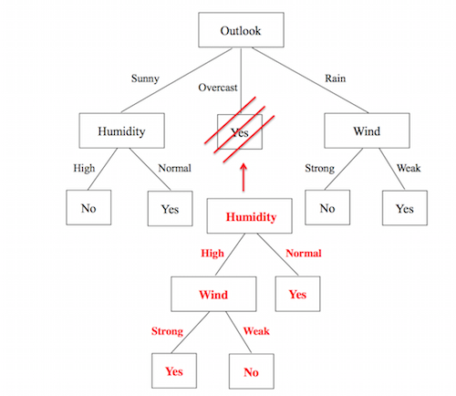
- problem: ID3 algoithm grows each branch just deeply enough to perfectly classify the training examples
- can't use test set to tell us when to stop (it would corrupt our training)
- solutions:
 - stop growing the tree early (using chi-square statistical test- something something stat 231)
 - post-prune the tree (using a validation set)
- validation set: split up training data into 2/3 training set and 1/3 validation set and prune after 
 - (we don't know how this pruning works, he'll look into it)
 - the 2/3, 1/3 ratio is standard but it doesn't have to be exactly that

when we decide to make something a leaf that isn't 100% pure, we can:

- put majority answer
- put probability the answer is yes

# Neural Nets

The basic idea: 

- "The strategy has been to develop simplified mathematical models of brain-like systems and then to study these models to understand how various computational problems can be solved by such devices."
- computers (von Neumann architectures)
 - serial
 - powerful processors (measured in MIPS)
- our brain
 - massively parallel
 - but slow processors (10 "instructions" per second)

arguments for the approach

- some tasks have resisited automation with tranditional achritectures
 - vision, speech, other tasks with high volumes of information
- fault tolerance, graceful degredation
 - every day a few neurons die, but if processors die in your computer the computer is toast

a brief history 

- McCulloch & Pitts, 1943
 - brain as a computational organism
- Rosenblatt, 1950s
 - model of neurons called perceptrons
- Minsky & Papert, 1969
 - limitations of perceptrons
 - intelligence is symbol processing 
 - result: funding dries up
- Exploding interest, 1980s
 - backpropagation learning rule
 - fast computers for simulating networks
- Hinton, Osindero, and Teh, 2006
 - a fast learning algorithm for deep belief nets

~~~~ _LECTURE 19_ ~~~~~

Modeling a neuron

- output of a neuron 
 - either on ("fires", modelled as 1) or off (0)
 - depends only on inputs
- inputs
 - come in different strengths, depending on the efficiency of the synapses
 - synapse controls how much of the signal gets through
 - learning/memory/etc is adjusting synapses
 - synapses are modelled by weights in neural nets
- learning changes the efficiency of the synaptic junctions

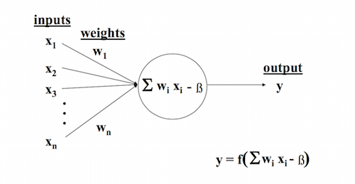

Thresholding functions

- we want to adjust the sum of weighted inputs to be an output between 0 and 1 by applying some function f(x)
- could be step function: 0 if x <=0, or 1 if x > 0
- or sigmoid function: a curve between 0 and 1
 - 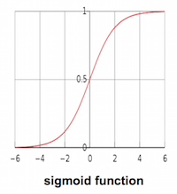

single layered network

- we get some inputs, and draw a line/hyperplane using those weights to carve the space
- 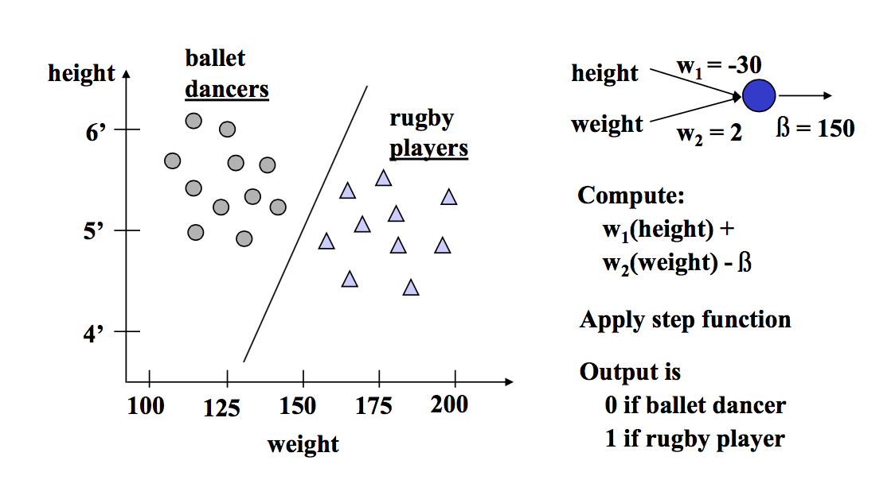

multi-layered, feed-forward networks

- essentially we have similar thing but multiple layers
- multi-layered:
 - a layer of input units 
 - one or more layers of hidden units
 - a layer of output units
- Feed-forward:
 - information flows from input layer, to hidden layer, to output layer
 - the activity of a unit cannot influence its own inputs (no loops)
- Each unit uses the sigmoid threshold function
- note that this network is fully connected between any two adjacent layers

In the assignment 

- there'll be 64 input lines, some number of input units in a hidden layer, and some number of ouptut units (we want to label a handwritten digit as one of 0 through 9)
- we could have one output and divide up the interval between 0 and 1 to be 0-0.1 means 1, 0.1-0.2 means 2, etc
- alternatively (and this is what we'll do) we can have an output vector v with v[i] a number between 0 and 1 that is like "probability" the number is i (but the "probabilities" won't sum to 1)

#### example: XOR function

- input x1 and x2
- output y
- 0 0 -> 0
- 0 1 -> 1
- 1 0 -> 1
- 1 1 -> 0
- we can graph this where there's a 1 at (0,1) and (1,0) and a 0 at (0,0) and (1,1)
 - so there's no line that we can draw between the two classes 0 and 1
 - we need a hidden layer

the network

- inputs is x1, x2
- middle layer is h1, h2
- define f(x) = 0 if x<=0, 1 if x>0
- h1 = f(x1+x2-0.5)
- h2 = f(x1+x2-1.5)
- o1 (output1) = f(h1-h2-0.5)
- h1 is computing x1 or x2
- h2 is computing x1 and x2
- o1 is computing h1 and not h2 
 - (x1 or x2) and not(x1 and x2) 
 - aka xor
- sorry, I really should have taken a picture of this XD

### training a neural network

- the networks must learn to solve a problem
 - learn the weights which allow it to solve the problem
 - programming the weights by hand is impossible
- Supervised learning:
 - network is provided with a set of training examples
 - each example is an input/output pair
 - modifies its weights to give the right output for an input

supervised learning

- initiaize with random weights
- repeat until the error is acceptably small:
 1. present an example
 2. calculte the actual output
 3. calculate error (difference between desired and actual output)
 4. if there is error, determine which weights were at fault and adjust those weights
- pass through training data tons of times until all examples seem to be fine

adjusting weights to account for error: backpropagation learning rule

- the problem is to determine which weights in the entire network were at fault for the error
- backpropagation
 - most popular learning rule for updating the weights in a network
 - updates a weight in proportion to the degree to which changes in the weight will lead to changes in the error

some terms and stuff we'll be using

- sigmoid function, f(x) = 1 / (1 + e^(-kx)) -- gives a value between 0 and 1
- x is input layer with elements x1 to xA
- h is hidden layer with elements h1 to hB
- w1 is the vector of weights on layer one
- w2 is vector of weights on hidden layer
- hj = f((sum i=1..A (w1\_ij * xi)) - beta\_j
 - beta\_j is the threshold
 - we need to learn threshold and weights

We can just treat threshold as another weight

- rewrite as h\_j = f(sum i=0..A  w1\_ij * xi)
 - sum starts at 0 now
 - where x0 = -1 (always)
 - w1_0j is the threshold bj
- same for output units, o\_j = f(sumi=0..B) w2\_ij * h\_i)  where j = 1...c
 - where h1 = -1 (always)
 - and w2\_0j is the threshold for unit o\_j

error:

- 1/2 sum j=1..c (yj-oj)^2
- where yj is desired output, oj is actual output

~~~~ _LECTURE 20_ ~~~~~

assignment note:

- you have to inclue the math flag if you compile with gcc `gcc nn.c -lm`

Multi-layer, feed-forward network

- more recently people have been using 20-100 layers, so 2 layers would be called a shallow network
- many hidden layers is called deep neural network
- we reviewed diagram of network (sorry, I shoulda taken a pic), definition of hj and oj and error
- we want to reduce error - how do we adjust weights to minimize error?

#### Backpropagation

you probably want to read through the latex's details in slides20.pdf

1. initialize all weights and thresholds to small random values on either side of 0 (between -0.5 and 0.5), so no strong bias, fairly linear, and assign x0=-1 and h0=-1
2. choose an input/output pair (xbar, ybar) where xbar = (x1,...xA), ybar = (y1,...,yB)
3. determine activation levels of hidden layer: hj = f(sum i=0..A W1\_ij * xi) for j=1...B
4. and activation levels of outupt units: oj = f(sumi=0..B W2\_ij * hi) for j=1...C
5. determine how to adjust weights between input and hidden layer to reduce error for this training example: E2\_j = k\*oj(1-oj)(yj-oj) for j=1...C ---- note that we get this expression of how to minimize error from the derivative of the sigmoid function --- k is the multiplicative constant from f(x)
6. then minimize error between input and hidden layer: E1\_j = k\*hj\*(1-hj) sum i=1..C E2_i\*W2\_ji for j=1..B
7+8. then adjust weights, using learning some learning rate (can adjust faster or slower): W2\_ij = W2\_ij + LearningRate\*E2\_j\*hi and W2\_ij = W2\_ij + LearningRate\*E1\_j\*xi
9. If stopping criteria (which you have to decide on) is not met, goto step 2 and repeat

this is all on a handout thing called "backpropagation learning algorithm", posted with slides - seriously just read it, it'll be a lot clearer than this markdown stuff

#### XOR example

- remember there's no way to do this without a hidden layer
- look at the slides (slides20.pdf to see how the classification changes through multiple runs of the backpropogation algorithm
 - between the two lines we'd classify as 0, outside of them we'd classify as 1
- suppose we end up with the table:
 - x1 x2 | y1 | o1
 - 0  0  | 0  | 0.33->0
 - 0  1  | 1  | 0.67->1
 - 1  0  | 1  | 0.75->1
 - 1  1  | 0  | 0.25->1
- here we decided to map (0,0.5] -> 0 and (0.5,1) -> 1

parameters (we have to decide what values to assign them)

- learning rate 
 - how much we update the weights to adjust for error
 - if it's too high, we might step over global min and oscilate back and forth
 - if it's too low, it'll take forever
 - learning rate is usually good between 0.05-0.35
 - constant vs dynamic - you can use the same k throughout or can change it throughout starting big and getting smaller (e.g. 1/#epochs)
- multiplicative constant k for f(x)
 - if k is higher, more steep
 - if lower, more level
 - what you want depends on the problem
- hidden units size of hidden layer) 
 - if you only have one, error won't converge over many epochs (iterations of the algorithm), will just wander around doesn't really get lower
 - as you have more hidden units - over more epochs, training error goes down but somewhere along the way the test error goes up (overfitting)
 - same kind of graph for #epochs (eventually you're overfitting

stopping criteria

- can have a max number of epochs
 - epoch is one time through the training set
 - this is more of a safety - it might not converge, so we'd have to stop at some point
- can stop when error is 'acceptably small' (better than using max #epochs)
 - acceptably small error on training set, or on separate validation set (traditonally 1/3 validation set, 2/3 training set)
 - classification error (did you get it right or did you get it wrong), or continuous error (how close did you get - even if it's classification we'll use this kind of error because of how neural nets give us a continuous value always)
- can distinguish between training and deployment level
 - e.g. train strictly so that [0, 0.2]->0  and [0.8,1]->1 (needs to be more accurate to be correct when training) and then when we deploy and test [0,0.5]->0 and [0.5->1]->1

preventing overfitting

- early stopping
 - split training set into training and validation set
 - stop learning when error on validation set increases for a specified number of iterations
- regularization
 - add a penalty term to the error function that penalizes large weights (we want to keep weights small so that it still learns)
 - error = 1/2 sum (yj-oj)^2 + penalty
 - e.g. penalty = sum(weight_i)^2

## architectures

- scale inputs/outputs
 - map inputs/outputs to [0, 1], *or* can use mean zero, standard deviation of one
- unary, binary, and discretized real-valued encodings

#### unary encoding (e.g. with jeeves)

- 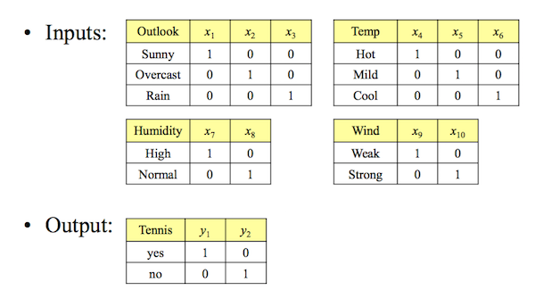
- 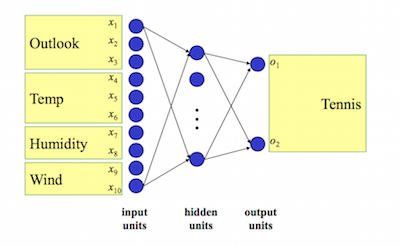

#### binary encoding

- we start at 1 instead of 0 because 0 0 isn't great input to neural networks apparently
- 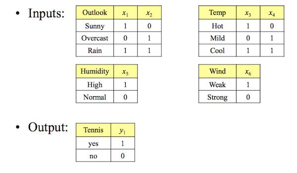
- 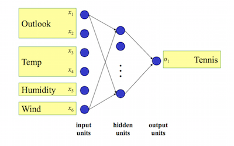

#### real valued encoding

- now each input/output only represented with one variable
- e.g. sunny is 0.833 and overcast is 0.5 and rain is 0.167
- for 2 values he chooses 0.833 and 0.167 because 0 and 1 are hard to learn (stretched out on the ends of the sigma function) and these values are easier

#### how do these different architectures do?

- the real valued encoding didn't work that well, test error didn't go down very far and then just stayed constant - hard to tell when you're overfitting

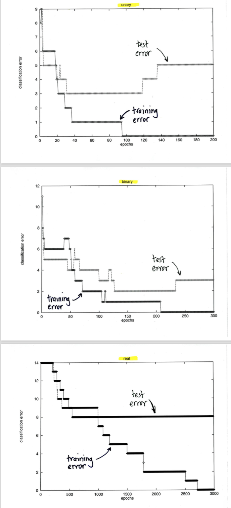

### Practical Considerations

Training Data

- Size of the data must be large
 - if the problem lacks adequate data, the use of neural networks is not recommended
- Training data must be representative
- Divide data into training set, validation and test set

Network Sizing

- input layer
 - how many units?
 - decide on features
 - decide on unary, binary, or discretized real-valued inputs
- How many hidden units are needed?
 - use as few as possible, it'll be a small fraction of input units
 - if learning doesn't converge, try with more units
- output layer
 - how many units?
 - decide on unary, binary, or discretized real-valued outputs

Training the Network

- The weights are initialized to small random values in the range -0.5 to 0.5
- Many iterations through training set (millions) may be needed before stable solution found
 - each iteration through the training set is called an epoch

Local minima

- The learning rule is not guaranteed to converge
- The network may settle into a local minima, where learning ceases
- If learning ceases and error is still too high:
 - start again with new random weights
 - add more hidden nodes to the network
- experiment with various learning parameters
 - learning rate
 - "squashing" the sigmoid function 
 - momentum ??? TODO ask about this
- In general, much experimentation is needed before the network converges to an acceptable solution

### Example Applications of Neural Networks

NETtalk for pronouncing English text (Sejnowski & Rosenberg '87)

- Input layer: 203 units (7 x 29) (7 for the window size, 29 because 26 letters and comma period space)
- A window 7 characters wide is moved over the text. The network learns to pronounce the middle letter
- The sound of a letter depends on its context. For example, the letter "a" is pronounced differently in "mean", "lamb", and "class"
- sample input: " a cat "
- Hidden layer: 80 units
- Output layer: 26 units
 - one for each phoneme in English (a phoneme is a basic sound in a language)
 - only by chance that this is the same as # letters
- Once trained, the network achieves:
 - 90% correct pronounciation for training set
 - 80%-87% correct on new data

Paint-quality inspection

- Inspection of painted surfaces such as car body panels
- Method:
 - reflect laser beam off panel onto projection screen
 - poor paint job (ripples, orangepeel, lowshine) will give a diff use image
 - neural network to categorize using 20 categories ranging from best possible finish to worst possible finish
- Input layer: 900 units (30x30 pixels)
 - each pixel has one of 256 values
 - scaled to a floating point number in the range 0 to 1
- Hidden layer: 50 units
- Output layer: 1 unit
 - a floating point number in the range 0 to 1
 - subdivided into 20 subintervals ranging from the best possible finish to the worst possible finish
- Network was trained on 130,000 patterns
- Results consistent with human experts

Vision-based autonomous driving (Carnegie-Mellon University)

- ALVINN: Autonomous Land Vehicle In a Neural Net
- Automatic road following (driverless driving) using color vision
- Input to the network: image information from a video camera (30x32 vieo input retina)
- 9 hidden units
- Output of the network: 45 vehicle headings (ranging from sharp left to straight ahead to sharp right) such that the vehicle stays on the road
- The ALVINN network is trained "on-the-fly" as the van is driven by a person down a highway
 - road images give input
 - desired output is the person's steering actions
- ALVINN has been successfully driven on various types of road (paved, dirt, single-lane, multi-lane) and in various weather conditions
- Experiment: autonomous driving at 55 mph for more than 90 miles on a highway near Pittsburgh

~~~~ _LECTURE 21_ ~~~~~

# Support Vector Machines (quick overview)

- recall the ballet, rubgy example where we found a line to separate the data
- 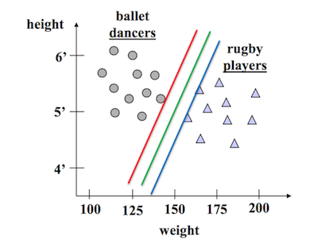
- there are different lines that could separate the given data 
- which separate the data best? and predict future data
- answer: the decision boundary with largest posible distance to example points (so the green line)
- the data points closest to the line/hyperplane are the support points

What if the data are not linearly seperable? (xor is an example)

- answer: Kernal functions
- Data that are not linearly separable in the original space are separable (almost always) in a higher dimensional (non-linear) space
- the kernel function is a function that maps the original space to the higher demension vector that is seperable
- example
 - original trainig data had input weight and height (and output ballet or rugby), this time not linear separable
 - if we use weight^2, height^2 and root2*weight*height then we can draw a hyperplane to separate the points
 - Q: ... how do you know to do that?
 - A: the squared, squared, root2 thing is a known kernel (so, experimentation)

# Ensembles of classifiers

The Basic Idea

- The accuracy of supervised learning can be improved by learning an ensemble of classifiers: a set of classifiers whose individual decisions are combined in some way (typically by voting) to classify new examples.

Improved accuracy

- can be more accurate than its component classifiers if:
 - individual classifiers disagree with each other (errors made by classifiers are uncorrelated)
 - error rate less than 1/2 each (if it's not, you can just inverse it)
- example
 - 21 classifiers, each with error rate 0.3, majority vote -
 - probability that 11 or more classifiers are simultaneously wrong is 0.026 
 - this is assuming they're perfectly uncorrelated, which isn't true - but ensembles still help

Technique 1: bagging

- learning algorithm is run multiple times, each with a different subset of training examples
 - each run uses a training set of m examples drawn randomly with replacement from original training set (TODO ask about m used twice on this slide - slide 11)
 - on average: 63.2% of original training set (TODO ask what this means, on average *what* is 63.2%?), with some training examples appearing multiple times

Technique 2: cross-validated committees

- learning algorithm is run multiple times, each time with a different subset of training examples
 - divide original training set of m examples into k DIFFERENT sets (difference from bagging, which is with replacement)
 - construct k overlapping training sets by dropping out a different one of the k subsets

Technqiue 3: boosting

- learning algorithm is run multiple times, each time with a different probability distribution p\_l(x) over training examples (this is probability those elements are chosen for the set)
 - in iteration l, training set of m examples drawn randomly with replacement from original set of m examples according to probability distribution p\_l(x)
 - learning algorithm applied to construct classifier h\_l
 - error rate on training set used to determine p\_{l+1}(x) 
- the idea is to place more wieght on misclassified examples, so in subsequent iterations we progressively have more difficult learning problems and are solving tricky things once we're better learners

Technique 4: Injecting randomness

- neural networks: multiple runs based on different initial random weights
- decision trees: when choosing a feature, randomly choose from among the top 10% or 15% of the top information gain

combining classifiers

- unweighted voting
- weighted voting 
 - e.g. weight proportional to how well a classifier does in validation set
- stacking 
 - given classifiers h1,...,hl 
 - learn a classifier h which takes as input the outputs h1,...,hl and figures out how to best choose the 'right' output
 - h could be a neural network, or a decision tree - we feed in inputs (what each classifier predicts) and it tells us its overall guess of a more accurate prediction

# steps in supervised machine learning 

(some of these steps used on assignment)

#### (1) choose features

- to use suprevised learning techniques, problem first has to be phrased as a classification problem
- choice of distinguishing features is critical to successfully learning a classifier
- begin with many features that are felt to be promising
- possibly sythesize new features from exisiting features 
 - e.g. compare two features, max or two features, ratio often works well, average of some set of features

#### (2) collect data

- data must be representative of what will be seen in practice
- let S be the set of correctly labeled data, and let n = |S|

#### (3) Filter features

- goal of filtering is to select most important features- the ones we use for learning
- motivation: 
 - efficiency
 - good performance
 - many learning methods do poorly if there are redundant or irrelevant features
- example: prune feature if... 
 - single feature (so just that features) decision tree classifier using this feature is not much better than random guessing 
 - AND all two feature classifiers using this feature are not much better than random guessing

#### (4) (we start here in assignment) Select classifier - model selection

- given S, the set of correctly labeled data, select (learn) classifier h from hypothesis space H
- if lots of data available:
 - split data into data used for training and data used for testing
 - learn hypothesis h (select classifier) using training data, evaluate h on test data, where there is enough test data for the resuts to be signficant
- if not
 - use cross validation or bootstrapping
 - repeatedly learn hypothesis h (select classifier) using different training data, evaluate h on different test data

Setting parameters

- for each choice of paramater settings, evaluate classifier h learned from trainig data with current choice of paramater settings
- return parameter settings that give best performances on cross validation set
- examples: 
 - setting number of hidden units in neural network
 - setting min examples at leaf in decision tree
- learning may involve splitting data into training and validation sets

#### (5) evaluate classifier (model assessment)

- estimate classifier performance by:
 - applying classifier to test data,
 - use estimate from cross-validation, or
 - use estimate from bootstrapping
- If using cross-validation or bootstrapping, after estimate is obtained, combine all of the data into one large training set to obtain final classifier TODO ? "obtain final classifier" from all the training data combined?

### Evaluating classifiers

Cross validation:

- use this when amount of data is limited

		partition data S into k disjoint subsets S1, ..., Sk 
		for i = 1 to k
			train on S - Si to obtain hi (select hi using S - Si)
			test hi on Si
		average the k performance estimates to give an
		  overall performance estimate

- we use different subsets as test sets and take average performance
- k = 10 is shown to be pretty good (ten-fold cross-validation)

Bootstrapping:

- also used when amount of data is limited

		for i = 1 to m
			sample with replacement n times from S to give Si
			train on Si to obtain hi (select hi using Si)
			test hi on S - Si (unpicked instances)
		average the m performance estimates to give an overall performance estimate

- On average, training set will contain 63% of instances
- Peter prefers cross validation because it's the CS way

Cost of classification errors:

- cost of false negative and false positive may be unequal
- e.g. for spam the cost of false positive is much higher than false negative
- for the assignment, all digits are equally weighted

~~~~ _LECTURE 22_ ~~~~~

# Natural Language For Communication (a brief overview)

Applications: agents for

- summarization
- computer-aided instruction - machine translation
- sentiment analysis
- speech understanding
- interface search engines 
- ...

Levels of analysis in understanding natural language

- prosody
 - rhythm and intonation (like sarcasm) 
 - also how you convey it in written language 
- phonology
 - basic sounds and how they combine to form words
- morphology
 - rules for formation of words (e.g. plurals, verb tense)
- syntax
 - rules for forming phrases and sentences
 - though grammar is a lot more fluid than the official rules
- semantics 
 - meaning of words and how these combine to form meaning of sentences
- pragmatics
 - study of how language is used, role of context in meaning

We can put these into categories

- prosody, phonology -- speech recognition
 - "how to recognize speech", "how to wreck a nice beach" (sound the same)
 - recognizing the words and word boundaries is hard
 - need context to know what words are being said
- morphology, syntax - surface form
 - the actual text
- semantics and pragmatics - meaning
- surface form + meaning => natural language understanding
- speech understanding is the whole thing

communication as action

- speech actions:
 - inform other agents about what it knows
 - query other agents to gather knowledge
 - answer questions
 - request or Command other agents to perform actions 
 - promise or offer to do actions
 - acknowledge requests and offers
 - share feelings and experiences
- when actually listening, trying to figure out what you're trying to say and what your communication plan is - an active listener recognizes what you're trying to say

what makes it hard?

- in formal languages (prop logic) 
 - there's no ambiguitiy at sentence level 
 - if we know the meaning of the pieces we know the meaning of the whole
 - ^ compositional semantics
- natural languages:
 - highly ambiguous
 - not necessarily 'grammatical'
 - constantly evolving
 - semantics or meaning is non-compositional and very context-dependent

e.g. to fully understand pragmatics (role of context in meaning of language) you'd need

- beliefs & goals of participants
- culture
- current situation
- conventions
- background knowledge - world knowledge
- language knowledge
- shared knowledge
- ...

there's this idea of AI-complete

- if you can solve an AI-complete problem you can solve all of AI
- not as rigourously defined as NP-complete

### examples of ambiguity

lexical (word sense) ambiguity

- the man went to the bank to get some cash
- the man went to the bank and jumped in
- (the bank is a palce for money or the side of the river)

syntactical ambiguity

- John saw the Rockies flying to Vancouver (is John or the Rockies flying?
- He saw her duck (is duck a verb or a noun?)
- Salespeople sold the dog biscuits 
 - synantic ambiguity leads to semantic ambiguity 
 - is it dog buscuits we're selling, or selling biscuits to dogs?

referential ambituity

- I took the cake from the table and ate it 
 - what was eaten? the table or the cake? 
- I took the cake from the table and _cleaned_ it 
 - the noun we're referring to changed

Intersentencial referential ambiguity
- After John proposed to Alex, they found a justice of the peace and got married. For the honeymoon, they went to Hawaii.
 - Who is in the group that the pronoun “they” refers to?

Figure of speech

- metonymy 
 - e.g. Let me have your ear.
 - A thing or concept is not called by its own name, but by the name of something closely associated with it
- metaphor
 - e.g. The inside of the car was a refrigerator.
 - A phrase with one literal meaning is used to suggest a different meaning by way of an analogy

pragmatic ambiguity

- I'll meet you at the coffee shop next Friday
- suppose it's Saturday. 
 - What day is 'next Friday'? 
 - the closest one or the 'next' after one? 
 - if it's Thursday and you say 'next Friday' you probably mean the next week

conventions, knowledge of culture

- Q: 'are you sure you don't mind?' 
 - A: 'oh, no' (don't mind) 
 - A: 'well, yes' (I actually do mind)
 - A: 'yes' (yes, I don't mind)
- shared background knowledge: 
 - "who do you like tonight, Toronto or Montreal?" 
 - "Leafs. You?" 
 - requires knowledge of hockey

#### examples of pragmatics

- e.g. Consider the word “open” in the window of a store (store is open at that time) and on a large banner hanging outside a store (the store just opened for the first time)

conventions on cooperative answers (e.g. how do you automize a CS advisor?)

- Q can I switch to the other section of the course, because I don't like the prof? 
 - A1: yes (not very helpful) 
 - A2: yes, but you should know that is taught by the same professor (more helpful)
- Q How many students failed CS 586 last term? 
 - Bad Answer: none 
 - Better Answer: It wasn't offered last term

Situation, knowledge of the other agent's knowledge

- e.g. 'can you open the door' means 'please open the door'

goals, beliefs, shared knowledge

- e.g. 'do you know what time it is?' 
- if child is coming home late, means "you should have been home hours ago" 
- if your friend is taking forever to get ready means "please hurry up"
- in other contexts could just be curiosity

syntax grammar (wasn't gone over in detail, I don't remember what the symbols stand for)

- S -> NP VP | aux NP verb NP
- NP -> pronoun | noun | det NP | det NP PP
- VP ->  verb | aux verb | VP adj | VP NP | VP PP
- PP -> prep NP | prep NP PP

lexicon (vocab)

- pronoun -> me | you | I | it |they
- noun -> dog | biscuits | gold | salespeople | east 
- det -> the | a
- aux -> is | are
- verb -> see | smell | shoot | sold | is
- prep -> to | in | on | near
- adj -> right | left | east | south| dead | smelly

grammar (order these words could be in)

- idea is, we translate the phrase into logical form
- then if we assume semantics are always compositional (it *usually* is) we can get the basic idea of what it means

### Semantics

- Assume compositional semantics is adequate
 - ie semantics of any phrase is a function of the semantics of its sub-phrases
- Basic idea
 - parsing drives translation into meaning representation (logical form)

Noun phrase (NP) semantics

- Basic paradigm: construct a meaning representation for set of all possible referents of NP in domain
- For each noun, adjective, and PP that appears in the NP, and recursively for each embedded NP
 - build / retrieve logical from 
 - add to existing logical form

example sentence semantics

- existential (there exists) with a bang after it means "there's only one" (translation of "the")
- The smelly wumpus in the living room is dead.
 - (exists)!x (Wumpus(x) AND Location(x, livingroom) AND Smelly (x) AND Dead(x))
 - smelly and dead the are filters on the nouns (wumpus, living room)
- Is the smelly wumpus in the living room dead?
 - Query <-- (exists)!x (Wumpus(x) AND ... )
- Is there a dead wumpus in the living room?
 - (exists)x such that (Query(x) <-- Wumpus(x) AND ... )

## Review

coverage: the primary focus for the exam is lectures and assignments, but you can check out the textbook if you want (not all chapters and all parts of chapter has stuff we covered, but there's more examples and sample exercises)

check out slides23 (review pages)

he strongly hinted that stuff not covered on assignments won't show up on the exam, though you can still study it for ~~knowledge~~

random notes:

- casual networks are *better* than non casual (even if they're both "correct")
- "worthwhile" means what's the value of it
- as soon as validation set stops decreasing as much or goes up or even just plateaus STOP there